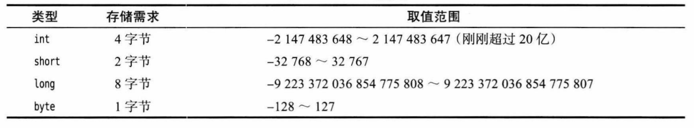
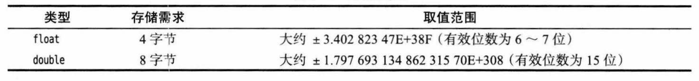
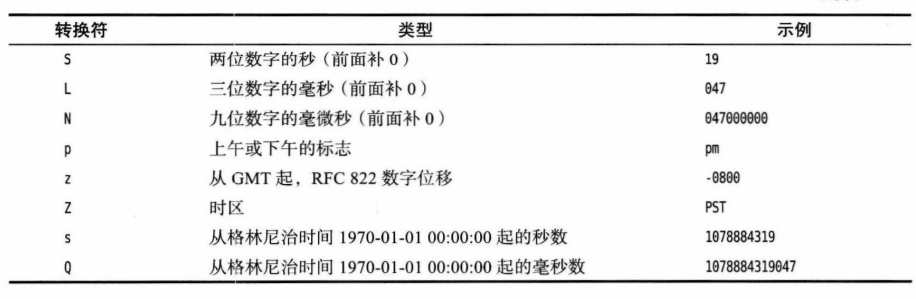
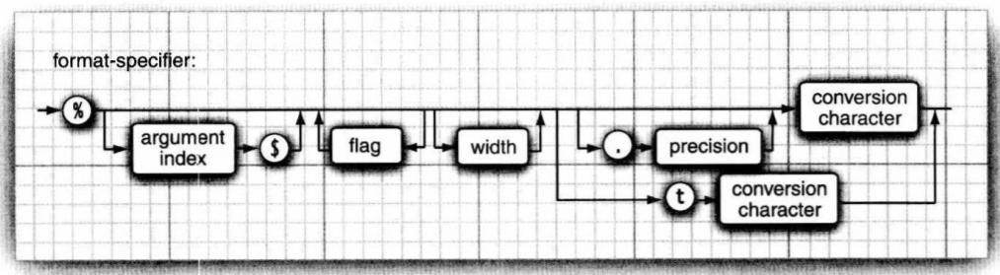

[TOC]


# Java程序概述

## Java关键术语

| 1.简单性       | 7.可移植性 |
| -------------- | ---------- |
| 2.面向对象     | 8.解释性   |
| 3.分布式       | 9.高性能   |
| 4.健壮性       | 10.多线程  |
| 5.安全性       | 11.动态性  |
| 6.体系结构中立 |            |

# 基本概念

## 数据类型

  Java是一种强类型语言。这就是意味着必须为每一种类型。在Java中，一共8种基本类型(primitive type)，其中有4种整型，2种浮点类型，1种字符类型char(用于表示Unicode编码的代码单元)和一种用于表示真值的boolean类型

### 整型



在Java当中，整型的范围与运行Java代码的机器无关。这就解决了软件从一个平台移植到另一个平台的，或者在同一个平台中的不同操作系统之间进行移植给程序员带来的诸多问题。


长整型数值有一个后缀L或l(如4000000000l)。十六进制属猪有一个前缀0x或0X(0xCAFE)。八进制有一个前缀0.

### 浮点类型

浮点类型用于表示有小数部分的数值。在Java中有两种浮点类型。



float类型的数值有一个后缀F或f(例如：3.14f)。没有后缀F的浮点数值(如3.14)总是默认为double类型。

### Char类型

char类型原本用于表示单个字符。不过，现在情况已经有所变化。如今，有些Unicode字符可以用一个char值描述，另外一些Unicode字符则需要两个char值。

char类型的字面量值要用单引号括起来。例如：‘A’是编码值为65的字符常量。它与“A”不同。char类型的值可以表示为十六进制值，其范围从\u000到\uFFF。

### boolean类型

boolean(布尔)类型有两个值：false和true，用来判定逻辑条件。整数值和布尔值之间不能相互转换。

# 变量和常量

## 声明变量

在Java中，每个变量都有一个类型(tpye)。在声明变量是，先制定变量的类型，然后是变量名。例如：

​    double salary;

​    int vacationDays;

变量名必须是一个以字母开头并且由字母或数字构成的序列。

注意：大小写敏感！！！(同时不能使用Java保留字作为变量名)

## 变量初始化

声明一个变量之后，必须用赋值语句对变量进行显式初始化，千万不要使用未初始化的变量的值。

在Java中，变量的声明尽可能地靠近变量第一次使用的地方，这是一种良好的程序编写风格。

## 常量

在Java中，利用关键字final指示常量。

关键字final表示这个变量只能被赋值一次。一旦被赋值之后，就不能再更改了。习惯上，常量名使用全大写。

在Java中，经常希望某个常量可以在一个类的多个方法中使用，通常将这些常量称为类常量(class constant)。可以使用关键字static final设置一个类常量。

需要注意，类常量的定义位于main方法的外部。因此，在同一个类的其他方法中也可以这个常量。而且，如果一个常量被声明为public，那么其他类的方法也可以使用这个常量。

## 枚举类型

有时候，变量的取值挚爱一个有限的集合内。例如，销售的服装或者披萨只有小，中，大和超大这四种尺寸。

针对这种情况，可以自定义枚举类型。枚举类型包括有限个命名的值。例如：

enum Size {SMALL, MEDIUM, LARGE, EXTRA_LARGE};

现在可以声明这种类型的变量：

Size s = Size.MEDIUM；

Size类型的变量只能储存这个类型声明中给定的某个枚举值，或者特殊值null，null表示这个变量没有设置任何值。

## 运算符

### 算术运算符

Java的算数运算符有+ - * /。当参与 / 运算的两个操作数都是整数时，表示整数除法，否则表示浮点除法。整数的求余操作(又是被称为取模)用%表示。

注意：整数被0除以会产生一个异常，而浮点数被0除将会得到无穷大或NaN结果。

### 数学函数与常量

在Math类中，包含了各种个样的数学函数。在编写不同类别的程序时，可能需要的函数也不同。

想要计算一个数值的平方根，可以使用sqrt方法：

double x = 4;

Double y = Math.sqrt(x);

System.out.println(y);//prints 2.0

> println方法和sqrt方法存在微小的差异。println方法处理System.out对象。但是，Math类中的sqrt方法并不处理任何对象，这样的方法被称为静态方法。

在Java中，没有幂函数，因此需要借助与Math类的pow方法。例如：

double y = Math.pow(x,a);

将y的值设置为x的a次幂。pow方法有两个double类型的参数，其返回结果也为double类型。

Math类提供了一些常用的三角函数；

Math.sin

Math.cos

Math.tan

Math.atan

Math.atan2

还有指数函数以及它的反函数——自然对数以及以10为底的对数：

Math.exp

Math.log

Math.log10

最后，Java还提供了连个用于表示PI和E常量的最接近的近似值：

Math.PI

Math.E

### 数值类型之间的转换


实现箭头表示无信息丢失的转换；另外有3个虚线箭头，表示可能有精度损失的转换。

### 强制类型的转换

在必要的时候，int类型的值将会自动转换为double类型。但另一方面，有时候也学需要将double转换成int。在Java中，允许这种数值之间的类型转换，不过这个操作可能会丢失一些信息。这种可能损失信息的转化要通过强制类型转换(cast)来完成。强制类型转换的语法格式为：

double  x = 9.997;

int nx = (int) x;

这样，变量nx的值为9，因为强制类型转换通过截断小数部分将浮点值转换为整数。

### 结合赋值和运算符

可以在赋值中使用二元运算符，这是一种很方便的简写形式。例如：

x += 4;

等价于：

x = x + 4;

(一般来说，要把运算符放在=号左边，如*=或%=)

> 如果运算符得到一个值，其符号与左侧操作数的类型不同，就会发生强制转换。例如，如果x是一个int，则下面语句：
>
> x += 3.5;
>
> 是合法的，将把x设置为(int)(x+3.5)

### 自增与自减运算符

Java中提供了自增，自减运算符(n++,n--)。也有前缀形式：++n/--n。后缀和前缀形式都会使变量值加1或者减1.但用在表达式中时，二者就有区别了。前缀形式会先完成+1；而后缀形式会使用变量原来的值。

int m = 7;

int n = 7;

int a = 2 * ++m //now a is 16, m is 8

int b = 2 * ++n  //now b is 14, n is 8

建议不要在表达式中使用++，因为这样的代码很容易让人困惑，而且会带来烦人的bug

### 关系和boolean运算符

&& 与

||    或

！   非

### 位运算符

处理整数类型时，可以直接对组成整数的各个位完成操作。这意味着可以使用掩码技术得到整数中的各个位。位运算符包括：

&： and

| ： or

^:  xor

~:  not

这些运算符按位模式处理。

> 应用在布尔值上时，&和|运算符也会得到一个布尔值。这些运算符和&&和||运算符很类似，不过&和|运算符不采用“短路”方式来求值，也就是说，得到计算结果之前两个操作数都需要计算

另外，还有>>和<<运算符可以将位模式左移和右移。需要建立位模式来完成位掩码时，这两个运算符为很方便。

最后，>>>运算符会用0填充高位，这与>>不同，它会用符号填充高位。不存在<<<运算符。

### 运算符优先级

| 运算符                                 | 结合性   |
| -------------------------------------- | -------- |
| [] . ()(方法调用)                      | 从左向右 |
| ！ ~ ++ -- + （） （强制类型转换） new | 从右向左 |
| * 、 %                                 | 从左向右 |
| + -                                    | 从左向右 |
| <<  >>  >>>                            | 从左向右 |
| < <= >= instanceof                     | 从左向右 |
| == !=                                  | 从左向右 |
| &                                      | 从左向右 |
| ^                                      | 从左向右 |
| \|                                     | 从左向右 |
| &&                                     | 从左向右 |
| \|\|                                   | 从左向右 |
| ?:                                     | 从右向左 |
| = += -= *= %= &= \|= ^= >>= <<= >>>=   | 从右向左 |

## 字符串

从概念上讲，Java字符串就是Unicode字符串序列。Java额米有内置的字符串类型，而是在标准Java类库中提供了一个与定义类，很自然就叫做String。每个用双引号括起来的字符串都是String类的一个实例。

### 字串

String类的substring方法可以从一个较大的字符串提取出一个子串。例如：

String s = greeting.substring(0,3); //截取字符串greeting 0~2 的字符串

substring方法的第二个参数是不想**复制**的第一个位置。这里要复制位置为0，1和2的字符。在substring中从0开始计数，直到3为止，但不包含3.

substring的工作方式有一个优点：容易计算字串的长度。字符串s.substring(a,b)的长度为b-a。

### 拼接

与绝大多数程序设计语言一样，Java语言允许使用+号连接(拼接)两个字符串。

当将一个字符串与一个非字符串的值进行拼接时，后者会转换为字符串。

### 不可变字符串

String类没有提供*修改*字符串中某个字符的方法。如果希望修改greeting中的内容，可以提取想要保留的字符串(用substring)，再与希望替换的字符拼接。

由于不能修改Java字符串中的单个字符，所以在Java文档中将String类对象称为是不可变的(immutable)，如同数字3永远是3一样，字符串“Hello”永远包含字符H,e,l,l和o的代码单元序列。字符串不可以变的设置有一个优点：编译器可以让字符串共享。

为了弄清具体的工作方式，可以想象将各个字符串存放在公共的存储池中。字符串变量指向存储池中相应的位置。如果复制一个字符串变量，原始字符串与复制的字符串共享公共相同的字符串。

总而言之。Java的设计者认为共享带来的共享率远远胜过于提取字串，拼接字符串所带来的低效率。我们发现，大多数情况下，我们都不会修改字符串，而只是需要对字符串进行比较。

### 检测字符串是否相等

可以使用equals方法检测两个字符串是否相等。对于表达式：

s.equals(t)

如果字符串s与字符串t相等，则返回true；否则，返回false。需要注意的是，s与t可以是字符串变量，也可以是字符串字面量。

想要检测两个字符串是否相等，而不区分大小写，可以使用equalsIgnoreCase()方法。

**一定不要使用==运算符检测两个字符串是否相等！！！**这个运算符只能够确定两个字符串是否存放在同一个位置上。当然，如果字符串在同一个位置上，它们必然相等。但是，完全有可能将内容相同的多个字符串副本放置在不同的位置上。

如果虚拟机始终将相同的字符串共享，就可以使用==运算符检测是否相等。但是实际上只有字符串字面量是共享的，而+或substring等操作得到的字符串并不共享。因此，千万不要使用==运算符测试字符串的相等性，以免在程序中出现这种最糟糕的bug，看起来这种bug就像随机产生的间歇性错误。

### 空串与Null串

空串“”是长度为0的字符串。可以调用.length()来检查一个字符串是否为空(也可以用equals)。

空串是一个Java对象，有自己的串长度(0)和内容(空)。不过，String变量还可以存放一个特殊的值，名为null，表示目前没有任何对象与该变量关联。要检查一个字符串是否为null，要使用以下条件：

if (str = null)

<<<<<<< HEAD
### 码点与代码单元

### String API
Java中的string类包含了50种方法。经常会使用到的有：

- char cahrAt(int index)

  返回给定位置的代码单元。除非对底层的代码单元感兴趣，否则不需要调用这个方法

- int codePointAt(int index)

  返回从给定位置开始的码点

- int offsetByCodePoints(int startIndex, int cpCount)

  返回从startIndex码点开始，cpCount个码点的码点索引

- boolean empty()

- boolean blank()

  如果字符串为空或者由空格组成，返回true

- boolean equals(Object other)

  如果字符串与other相等，返回true

- boolean equalsIgnoreCase(String other)

  如果字符串与other相等（忽略大小写），返回true

- String replace(CharSequence oldString, CharSequence newString)

  返回一个新字符串。这个字符串用newString代替原始字符串中所有的oldString。可以用String或StringBuilder对象作为CharSequence参数

- String substring(int beginIndex)

- String substring(int beginIndex, int endIndex)

  返回一个新字符串。这个字符串包含原始字符串中从beginIndex到字符串末尾或者endIndex-1的所有代码单元

- String toLowerCase()

- String toUpperCase()

  返回一个新字符串。这个字符串将原始字符串中的大写字母改为小写，或者将原始字符串中的所有小写字母改为大写字母

- String trim()

- String strip()

  返回一个新字符串。这个字符串将删除原始字符串头部和尾部小于等于U+0020的字符(trim)或空格(strip)

- String join(CharSequence delimiter, CharSequence... elements)

  返回一个新字符串，用给定的定界符链接所有元素

- String repeat(int count)

  返回一个字符串，将当前的字符串重复count次

### 构建字符串

有些时候，需要由较短的字符串构建字符串，例如，按键或来自文件中的单词。使用StringBuilder类就可以很好的解决这个问题

首先构建一个空的字符串构建器：

StringBuilder builder = new StringBuilder();

当每次需要添加一部分内容时，就调用append方法

builder.append(ch); //appends a single character

builder.append(str); //appends a string

在字符串构建完成时就调用toString方法，讲可以得到一个String对象，其中包含了构建器中的字符序列。

String completedString = builder.toString();

## 输入与输出

### 读取输入

首先需要构造一个与“标准输入流”System.in关联的Scanner对象

Scanner in = new Scanner(System.in);

> 因为输入时可见的，所以Scanner类不适用从控制台读取密码。Java6专门引入了Console类来实现这个目的。想要读取一个密码，可以使用下列代码：
>
> ```java
> Console cons = System.console();
> String username = cons.readLine("User name:");
> char[] passwd = cons.readPassword("Password:");
> ```
>
> 为安全起见，返回的密码存放在一个字符数组中，而不是字符串中。在对密码处理完成后，应该马上用一个填充值覆盖数组元素
>
> 采用Console对象处理输入不如采用Scanner方便。必须每次读取一行输入，而没有能够读取单个单词或数值的方法

### 格式化输出

例如：

System.out.printf("%8.2f"，x)；

会以一个字段宽度(field width)打印x：这包括8个字符，另外精度为小数点后2个字符。也就是说，这会打印一个签到的空格和7个字符，如下所示：

 3333.33

每一个以%字符开始的格式说明符都用相应的参数替换。格式说明符尾部的转换符指示要格式化的数据的类型。


另外，还可以指定控制格式化输出外观的各种标志。


可以使用静态的String.format方法创建一个格式化的字符串，而不是答应输出

String message = String.format("Hello, %s. Next year, you'll be %d", name. age);

基于完整性的考虑，下面简略地介绍printf方法中日期与时间的格式化选项。对于新的代码，应当使用卷||第6章中介绍的Java.time包的方法。不过你可能会在遗留代码中看到Date类和相关的格式化选项。这个格式包括两个字母，以t开始，以表中的任意字母结束。例如

System.out.println("%tc", new Date());




printf的所有特性：



### 文件输入与输出

想要读取一个文件，需要构造一个Scanner对象，如图所示：

Scanner in = new Scanner(Path.of("myfile.txt"), StandardCharsets.UTF_8);

如果文件名中包含反斜杠符号，就要记住在每个反斜杠之前再加一个额外的反斜杠转义：

```java
"c:\\mydirectory\\myfile.txt"
```

现在，就可以利用前面介绍的任何一个Scanner方法对文件进行读取

想要写入文件，就需要构造一个PrintWriter对象。在构造器(constructor)中，需要提供文件名和字符编码：

PirntWriter out = new PrintWriter("myfile.txt", StandardCharsets.UTF_8);

如果文件不存在，创建该文件。可以想输出到System.out一样使用print，println以及printf命令

> 可以构造一个带有字符串参数的Scanner，但这个Scanner会把字符串解释为数据，而不是文件名。例如：
>
> ```java
> Scanner in = new Scanner("myfile.txt");
> ```
>
> 这个Scanner会将参数看作包含10个字符的数据。

## 控制流程

### 块作用域

块(即复合语句)是指由若干条Java语句组成的语句，并用一对大括号括起来。块确定了变量的作用域。一个块可以嵌套在另一个块中。

```java
public static void main(String[] args){
    int n;
    ...
    {
        int k;
        ...
    }//k is only defined up to here
}
```

### 条件语句

在Java中，条件语句的形式为：

if (condition) statement

这里的条件必须用小括号括起来

### 循环

当条件为true时，while循环执行一条语句(也可以是一个块语句)。一般形式如下：

while (condition) statement

while循环语句在最前面检测循环条件。因此，循环体中的代码有可能一次都不执行。如果希望循环体至少执行一次，需要使用do/while循环放在最后。它的语法如下：

do statement while (condition);

这种循环语句先执行语句(通常是一个语句块)，然后再检测循环条件。如果为true，就重复执行语句，然后再次检测循环条件，以此类推。

### 确定循环

for循环语句是支持迭代的一种通用结构，由一个计数器或类似的变量控制迭代次数，每次迭代后这个变量就会更新。例如：

for(int i = 1; i <= 10; i++)

​    System.out.println(i);

> 在循环中，检测两个浮点数是否相等需要格外小心。
>
> ```java
> for (double x= 0; x != 10; x += 0.1) ...
> ```
>
> 可能永远无法结束。由于舍入的误差，可能永远打不到精确的最终值。例如，在循环中，因为0.1无法精确地用二进制表示，所以，x将从9.99999999999998跳到10.09999999999998


### 多重选择：switch语句

在处理多个选项时，使用if/else结构显得有些笨拙。Java有一个和C/C++完全一样地switch语句。

```java
switch(choice)
{
    case1:
        ...
        break;
    case2:
        ...
        break;
    default:
        //bad input
        ...
        break;
}
```

switch语句将从与选项相匹配地case标签开始执行，直到遇到break语句，或者执行到switch语句地结束处为止。如果没有相匹配的case标签，而有default子句，就执行这个子句

> 有可能触发多个case分支。如果在case分支语句的末尾没有break语句，那么就 会接着执行下一个case分支语句。这种情况相当危险，常常会引发错误。

case标签可以是：

- 类型是char，byte，short，或int的常量表达式
- 枚举常量
- 从Java7开始，case标签还可以是字符串字面量

### 中断控制流程的语句

尽管Java的设计者将goto作为保留字，但实际上并没有打算在语言中使用它。Java设计者在Java语言中增加了一条新的语句：带标签的break


上面的示例说明了break语句的工作状态。注意：标签必须放在希望跳出的最外层循环之前，并且必须紧跟一个冒号

如果输入有误，执行带标签的break会跳转到带标签的语句块末尾。与任何使用break语句的代码一样，然后需要检测循环是正常结束，还是由break跳出

最后，还有一个continue语句。与break语句一样，它将中断正常的控制流程。continue语句将控制转移到最内层循环的首部。

## 大数

如果基本的整数和浮点数精度不能满足需求，那么可以使用java.math包中两个很有用的类：BigInteger和BigDecimal。这两个类可以处理包含任意长度数字序列的数值。BigInteger类实现任意精度的整数运算，BigDecimal实现任意精度的浮点数运算。

使用静态的valueOf方法可以将普通的数值转换为大数：

```java
BigInteger a = BigInteger.valueOf(100);
```

遗憾的是，不能使用人们熟悉的算术运算符(如：+和*)处理大数，而需要使用大数类中的add和multiply方法。

```java
BigInteger c = a.add(b);//c = a+b
BigInteger d = c.multiply(b.add(BigInteger.valueOf(2)));//d = c*(b+2)
```

## 数组

数组存储相同类型值的序列

### 声明数组

数组是一种数据结构，用来存储同一类型值的集合。通过一个整型下标（index，或称索引）可以访问数组中的每一个值。

声明如下：

int[] a = new int[100];

一旦创建了数组，就不能在改变它的长度（不过，当然可以改变单个的数组元素）。如果程序运行中需要经常扩展数组的大小，就应该使用另一种数据结构——数组列表（array list）

### 访问数组元素

数组元素的下标从0开始。一旦创建了数组，即可以在数组中填入元素。

创建一个数字数组时，所有元素都初始化为0。boolean数组的元素都会初始化为false。对象数组的元素则会初始化为一个特殊值Null，表示这些元素还未存放任何东西。初学者对此可能有些不解。

​    String[] names = new String[10];

会创建一个包含10个字符串的数组，所有字符串都为null。

想要获得数组中的元素个数，可以使用array.length。例如，

​    

```java
for(int i = 0; i < a.length; i++){
    System.out.println(a[i]);
}
```

### for each 循环

Java有一种功能很强的循环结构，可以用来一次处理数组（或者其他元素集合）中的每个元素，而不必考虑指定下标值。

格式：

​    for (variable : collection) statement

它定义一个变量用于暂存集合中的每一个元素，并执行相应的语句（语句块）。collection这一集合表达式必须是一个数组或者是一个实现Iterable接口的类对象（例如ArrayList）。例如：

```java
for (int element : a){
    Sysetm.out.println(element);
}
```

> **注释：** for each 循环语句的循环变量将会遍历数组中的每个元素，而不是下标值


### 数组拷贝

在Java中，允许将一个数组变量拷贝到另一个数组变量。这时，两个变量将引用***同一个数组***：

```java
int[] luckyNumbers = smallPrimes;
luckyNumbers[5] = 12; //now smallPrimes[5] is also 12
```


如果希望将一个数组的所有值拷贝到一个新的数组中去，就要使用Array类的copyOf方法：

```java
int[] copiedLuckyNumbers = Arrays.copyOf(luckyNumbers, luckyNumbers.length);
```

第2个参数是新数组的长度。这个方法通常用来增加数组的大小：

```java
luckyNumbers = Arrays.copyOf(luckyNumbers. 2*luckyNumbers.length);
```

如果数组元素是数值型，那么额外的元素将被赋值为0；如果数组元素是布尔型，则将赋值为false。相反，如果长度小于原始数组的长度，则只拷贝前面的值。

### 命令行参数

每个Java应用程序都有一个带String arg[]参数的main方法。这个参数表明main方法将接受一个字符串数组，也就是命令行上指定的参数。

```java
public class Message
{
    public static void main(String[] args)
    {
        if (args.length == 0 || args[0].equals("-h"))
            System.out.print("Hello,");
        else if (args[0].equals("-g"))
            System.out.print("Goodbye,");
        for (int i = 1; i < args.length; i++)
            System.out.print(" "+ args[i]);
        System.out.println("!");
    }
}
```

如果使用下面这种形式调用这个程序：

java Message -g cruel world

args 数组将包含以下内容：

args[0]: "-g"

args[1]: "cruel"

args[2]: "world"

这个程序会显示下面这个消息：

Goodbye, cruel world!

### 数组排序

想要对数值型数组进行排序，可以使用Arrays类中的sort方法：

```java
int[] a = new int[10000];

...

Arrays.sort(a);
```

这个方法使用了优化的快速排序（QuickSort）算法。快速排序算法对于大多数数据集合来说都是效率比较高的。Arrays类还提供了另外一些很快捷的方法。

### 多维数组

多维数组将使用多个下标访问数组元素，它适用于表示表格或更加复杂的排列形式。

在Java中，声明一个二维数组：

```java
double[][] balances;
```

初始化：

```java
balances = new double[NYEARS][NRATES];
```

如果直到数组元素，可以不使用new，而是直接简单形式对多维数组进行初始化。

```java
int[][] magicSquare=
{
    {16，3，2，13}，
    {5，10，11，8}，
    {9，6，7，12}，
    {4，15，14，1}
}；
```

一旦数组初始化，就可以利用两个中括号访问各个元素，例如，

```java
balances[i][j]
```

### 不规则数组

***Java实际上没有多维数组，只有一维数组。多维数组被解释为“数组的数组”***

例如，balances数组：


还可以方便地构造一个“不规则”数组，即数组的每一行有不同的长度。例如：

1

1  1

1  2  1

1  3  3  1

1  4  6  4  1

1  5 10  10  5  1

1  6  15  20  15  6  1

# 第四章：对象与类

这一章主要介绍内容如下：

- 面向对象程序设计入门
- 如何创建标准Java类库中类的对象
- 如何编写自己的类

## 4.1 面向对象程序设计概述

面向对象程序设计（object-oriented programming， OOP）是当今主流的程序设计范型，它取代了20世纪70年代的“结构化”或过程式编程技术。

面向对象的程序是由对象组成的，每个对象包含对用户公开的特定功能部分和隐藏的实现部分。从根本上说，只要对象能够满足要求，就不必关心其功能到底是如何实现的。

传统的结构化程序设计通过设计乙烯类的过程（即算法）来求解问题。一旦确定这些过程，就要开始考虑存储数据的适当方式。因此：

> 算法 + 数据结构 = 程序： Algorithms + Data Structure = Programs

对于一些规模较小的问题，将其分解为过程的开发方式比较理想。面向对象更加适合解决规模较大的问题。想要实现一个简单的Web浏览器可能需要大约2000个过程，这些过程可能需要对一组全局数据进行操作。采用面向对象的设计风格，可能只需要大约100个类，每个类平均包含20个方法。或者更加容易程序员掌握，也容易找到bug。


### 4.1.1 类

类（class）是构造方法的模板或蓝图。我们可以将类想象成制作小甜饼的模具，将对象想象为小甜饼。由类构造（construct）对象的过程称为创建类的实例（instance）。

封装（encapsulation。有时称为数据隐藏）是处理对象的一个重要概念。从形式上看，封装就是将数据和行为组合在一个包中，并对对象的使用者隐藏具体的实现方式。对象中的数据成为实例字段（instance field），操作数据的过程称为方法（method）。作为一个类的实例，特定对象都有一组特定的实例字段值。这些值就是这个对象的当前状态（state）。无论何时，只要在对象上调用一个方法，它的状态就有可能发生改变。

实现封装的关键在于，绝对不能让类中的方法直接访问其他类的实例字段。程序只能通过对象的方法对对象数据进行交互。封装给对象赋予了“黑盒”特征，这是提高重用性和可靠性的关键。这意味着一个类可以完全改变存储数据的方式，只要依旧使用同样的方法操作数据，其他对象就不会直到也不用关心这个类所发生的变化。

OOP的另一个原则会让用户自定义Java类变得更为容易，这就是：**可以通过扩展其他类来构建新类**。事实上，在Java中，所有的类都来源于Object类。

### 4.1.2 对象

想要使用OOP，一定要清楚对象的三个主要特性：

- 对象的行为（behavior）——可以对对象完成哪些操作，或者可以对对象应用哪些方法
- 对象的状态（state）——当调用那些方法时，对象会如何响应
- 对象的标识（identity）——如果区分具有相同行为与状态的不同对象

对象的行为时用可调用的方法来定义的。每个对象都保存着描述当前状况的信息。这就是对象的状态，对象的状态可能会随着时间而发生改变，但这种改变不会是自发的。对象状态的改变必须通过调用方法实现。

对象的状态并不能完全描述一个对象。每个对象都有一个唯一的标识（identity，或者身份）。对象的这些关键特性会彼此相互影响。

### 4.1.3 识别类

在面向对象程序设计时没有所谓的“顶部”。最好：***首先从识别类开始，然后为各个类添加方法***。

识别类的一个简单经验是在分析问题的过程中寻找名词，而方法对应这动词。

例如，在订单处理系统中，由这些名词：

- 商品（Item）
- 订单（Order）
- 送货地址（Shipping address）
- 付款（Payment）
- 账户（Account）

从这些名词就可以得到类 Item，Order等。

### 4.1.4 类之间的关系

在类之间，最常见的关系有：

- 依赖（“uses-a”）
- 聚合（“has-a”）
- 继承（“is-a”）

依赖（dependence），是一种最明显，最常见的关系，例如，Order类使用Account类是因为Order对象需要访问Account对象查看信用状态。但是Item类是不依赖Account类，因为Item对象不需要考虑客户账户。因此，如果一个类的方法使用或操纵另一个类的对象，我们就说一个类依赖另一个类。

应该尽可能地将相互依赖的类减少至最少。这里的关键在于，如果类A不知道B的存在，它就不会关心B的任何改变。用软件工程的术语来说，就是尽可能减少类之间的耦合。

聚合（aggregation），即“has-a”关系，很容易理解，因为这种关系很具体。例如，一个Order对象包含一些Item对象。包容关系意味着类A的对象包含类B的对象。


继承（inheritance），即“is-a”关系，表示一个更特殊的类与一个更一般的类之间的关系。例如，RushOrder类由Order类继承而来。在更加特殊的RushOrder类中包含了一些用于优先处理的特殊方法，还提供了一个计算运费的不同方法。一般而言，如果类A扩展类B，类A不但包含从类B继承的方法，还会有一些额外的功能。

## 4.2 使用预定义类

不是所有的类都表现出面向对象的典型特征。例如，Math类。不必了解它具体是如何实现的，只需要直到方法名和参数。这正是封装的关键所在。

### 4.2.1 对象与对象变量

想要使用对象，首先必须构造对象，并指定其初始状态。然后对对象应用方法。

在Java程序设计语言中，要使用构造器（constructor，或者构造函数）构造新实例。构造器是一种特殊的方法，用来构造并初始化对象。

构造器的名字应该与类名相同。因此Date类的构造器名为Date。想要构造一个Date对象，需要在构造器前面加上new操作符，例如：

```java
new Date()
```

这个表达式构造了一个新对象。这个对象被初始化为当前的日期和时间。同时，也可以将这个对象传递给一个方法：

```java
System.out.println(new Date());
```


在Java中，任何对象变量的值都是对存储在另外一个地方的某个对象的引用。new操作符的返回值也是一个引用。下面的语句：

```java
Date deadline = new Date();
```

有两个部分。表达式new Data()构造了Date类型的对象，它的值是对新创建对象的一个引用。这个引用存储在变量deadline中。

可以显式地将对象变量设置为null，指示这个对象变量目前没有引用任何对象。

```java
deadline = null；
...
if (deadline != null)
    System.out.println(deadline);
```

### 4.2.2 Java类库中的LocalDate类

Date类对于处理人类记录日期的日历信息并不是很有用，例如，“December 31，1999”不适合中国或希伯来的阴历来描述。

类库设计者决定将保存与给时间点命名分开。所以标准Java类库分别包含了两个类：一个是表示时间点的Date类；另一个是用大家熟悉的日历表示法表示日期的LocalDate类。

**将时间度量与日历分开是一种很好的面向对象设计。通常，最好使用不同的类表示不同的概念。**

不要使用构造器来构造LocalDate类的对象。实际上，应当使用静态工厂方法（factory method），它会代表你调用构造器。下面的表达式：

```java
LocalDate.now()
```

可以提供年，月和日来构造对应一个特定日期的对象：

LocalDate.of(1999,12,31)

当然，通常我们都希望将构造的对象保存在一个对象变量中；

```java
LocalDate newYearsEve = LocalDate.of(1999,12,31);
```

一旦有了一个LocalDate对象，可以使用方法getYear, getMonthValue和getDayOfMonth得到年，月和日：

```java
int year = newYearEve.getYear();
int month = newYearEve.getMonthValue();
int day = newYearEve.getDayOfMonth();
```

看起来似乎没有多大意义，因为这正是构造对象时使用的值。不过，有时可能有一个计算得到的日期，然后你希望调用这些方法来了解它的更多的信息。例如，plussDays方法会得到一个新的LocalDate，如果把应用这个方法称为当前对象，这个新日期对象则是距离当前对象指定天数的一个新日期：

```java
LocalDate aThousandDaysLater = newYearEve.plusDays(1000);
year = aThousandDaysLater.getYear();
month = aThousandDaysLater.getMonthValue();
day = aThousandDaysLater.getDayOfMonth();
```

LocalDate类封装了实例字段来维护所设置的日期。如果不查看源代码，就不可能知道类内部的日期表示。当然，封装的意义就在于内部表示并不重要，重要的是对外提供的方法。


## 4.3 用户自定义类

现在来学习如何编写复杂应用程序所需的主力类（workhorse class）。通常，这些类没有main方法，却有自己的实例字段和实例方法。想要构建一个完整的程序，会结合使用多个类，其中只有一个类有main方法。

### 4.3.1 Employee类

在Java中，最简单的了定义形式为：

```java
class ClassName
{
    field1
    field2
    ...
    constructor1
    constructor2
    ...
    method1
    method2
    ...
}
```

### 4.3.2 多个源文件的使用

一个源文件中可以包含两个类。许多程序员习惯于将每个类存放在一个单独的源文件中。例如，将Employee类存放在文件Employee.java中，将EmployrrTest类存放在文件Employee.java中。

如果喜欢这样组织文件，可以有两种编译源程序的方法。一种是使用通配符调用Java编译器：

javac Employee*.java

这样一来，所有与通配符匹配的源文件都将被编译成类文件。或者键入以下命令：

javac EmployeeTest.java

使用这个方法时，并没有显式地编译Employee.java。不过，当Java编译器发现EmployeeTest.java使用了Employee类时，他会查找Employee.class文件。如果没有这个文件，就会自动地搜索Employee.java，然后，对它进行编译。更加重要地是：如果Employee.java版本较已有地Employee.class文件版本更新，Java编译器就会自动地重新编译这个文件。

### 4.3.3 剖析Employee类

在Employee中，包含了一个构造器和4个方法：

```java
public Employee(String n, double s, int year, int month, int day);
public String getName();
public double getSalary();
public LocalDate getHireDay();
public void raiseSalary(double byPercent);
```

这个类地所有方法都被标记为public。关键字public意味着任何类的任何方法都可以调用这些方法（共有4种访问级别）。

> 可以用public标记实例字段，但是这是一种很不好的做法。public数据字段允许程序中的任何方法对其进行读取和修改，这完全破坏了封装。任何类的任何方法都可以修改public字段，从我们的经验来看，有些代码将利用这种存取权限，这是我们最不希望看到的。因此，强烈推荐将实例字段标记为private

## 4.4 静态字段和静态方法

### 4.4.1 静态字段

如果将一个字段定义为static，每个类只有一个这样的字段。对于非静态的实例字段 ，每个对象都有自己的一个副本。例如，假设需要给每一个员工赋予唯一的标识码。

```java
class Employee
{
    private static int nextId = 1;
    private int id;
    ...
}
```

每一个Emploee对象都有一个自己的id字段，但这个类的所有实例将共享一个nextId字段。只有一个静态字段nextId。即使没有Employee对象，静态字段nextId也存在。它属于类 ，而不属于任何单个的对象。

### 4.4.2 静态常量

### 4.4.3 静态方法

静态方法是不在对象上执行的方法。例如，Math类的pow方法就是一个静态方法。

### 4.4.4 工厂方法

静态方法还有另外一种常见的用途。类似LocalDate和NumberFormat的类使用静态工厂方法(factory method)来构造对象。工厂方法LocalDate.now和LocalDate.of。

## 4.4 方法参数

按值调用（call by value）表示方法接收的是调用者提供的值。而按引用调用（call by reference）表示方法接收的是调用者提供的变量地址。

**Java程序总是采用按值调用。也就是说，方法得到的是所有参数值的一个副本。具体来讲，方法不能修改传递给它的任何参数变量的内容。**

# 第五章： 继承

## 5.7 反射

### 5.7.1 Class 类

在程序运行期间，Java运行时系统始终为所有对象维护一个*<u>运行时类型标识</u>*。这个信息会跟踪每个对象所属的类。虚拟机利用运行时类型选择要执行的正确的方法。这些信息的类名为Class。Object类中的getClass()方法会返回一个Class类型的实例。

```java
Employee e;
Class cl = e.getClass();
cl.getName();
```

Class对象会描述一个特定类的属性。最常用的Class方法就是getName，这个方法会返回类的名字。

还可以使用静态方法forName获得类名对应的Class对象。

```java
String className = "java.util.Random";
Class cl = Class.forName(className);
```

获得Class类对象的第三种方法是：

```java
Class cl1 = Random.class;
Class cl2 = int.class;
Class cl3 = Double[].class;
```

虚拟机为每个类型管理一个唯一的Class对象。因此，可以利用==运算符实现两个类对象的比较。

### 5.7.4 利用反射分析类的能力

在java.lang.reflect包中有三个类Field, Method和Construction分别用于描述类的字段，方法和构造器。这三个类都有一个叫做getName的方法，用来返回字段，方法或构造器的名称，

Field类有一个getType方法，用来返回描述字段类型的一个对象，这个对象的类型同样是Class。Method和Constructor类有报告参数类型的方法，Method类还有一个报告返回类型的方法。

Class类中的getFields，getMethods和getConstructors方法将分别返回这个类支持的公共字段，方法和构造器的数组，其中包括超类的公共成员。Class类的getDeclareFields，getDeclaremethods和getDeclaredConstructors方法将分别返回类中声明的全部字段，方法，和构造器的数组。

# 第六章：接口、lambda表达式与内部类

## 6.1 接口

### 6.1.1 接口的概念

在java程序设计语言中，接口不是类，而是对希望符合这个接口的类的一组需求。

```java
public interface Comparable{
  int compareTo(Object other);
}
```

这说明，任何实现Comparable接口的类都需要包含compareTo方法，这个方法有一个Object参数，并且返回一个整数。

接口中的所有方法都是*<u>自动是public</u>*方法。

为了实现一个接口，需要完成下面两个步骤：

1. 将类声明为给定的接口
2. 对接口中的所有方法提供定义

```java
class Employee implements Comparable
{
  public int comparaTo(Object otherObject){
    Employee other = (Employee) otherObject;
    return Double.compare(salary, other.salary);
  }
}

```

## 6.2 lambda表达式

### 6.2.1 为什么引入lambda表达式

lambda表达式是一个可传递的代码块，可以在以后执行一次或多次。

### 6.2.2 lambda得表达形式

```java
(String first, String second)->
{
  if (first.length() < second.length()) return -1;
  else if (first.length() > second.length()) return 1;
  else return 0;
}
```


# 第七章：异常、断言和日志

# 第八章：泛型程序设计

# 第九章：集合

# 第十章：图形用户界面程序设计

# 第十二章：并发


