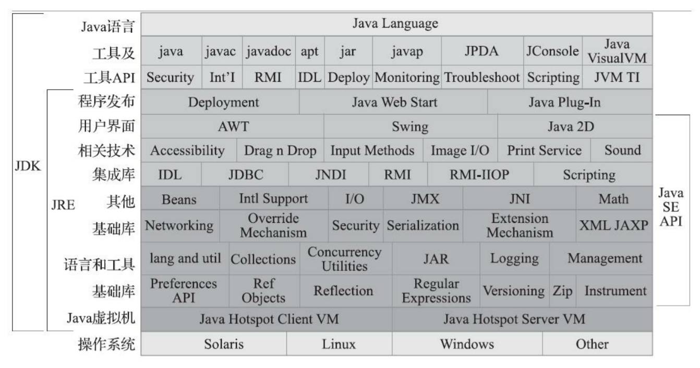
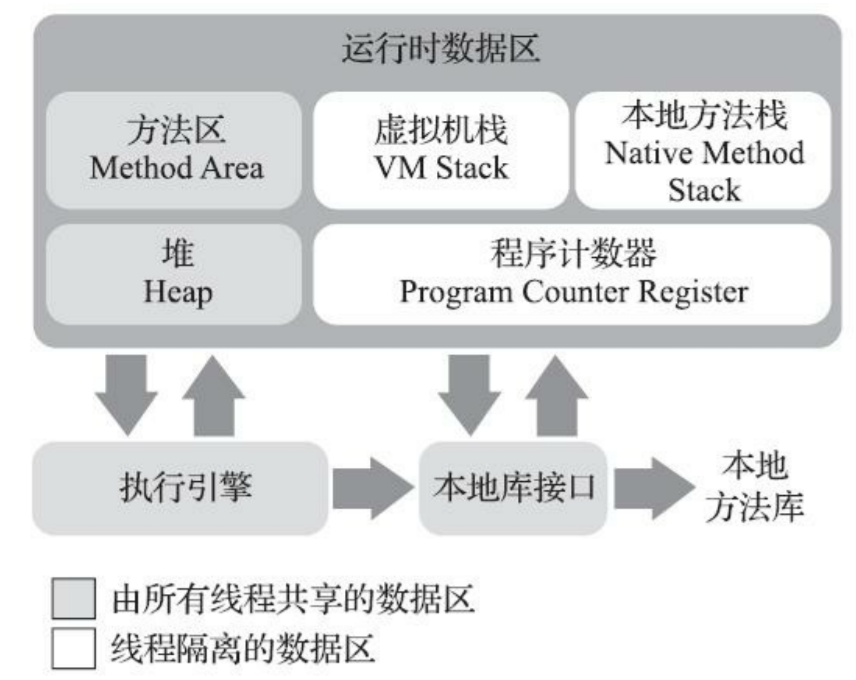

# 前篇

Java能获得如此广泛的认可，除了它拥有一门结构严谨，面对对象的编程语言之外，嗨哟许多不可忽视的优点：

- 它摆脱了硬件平台的束缚，实现了“一次编写，到处运行”的理想
- 它提供了一种相对安全的内存管理和访问机制，避免了绝大部分内存泄漏和指针越界问题
- 它实现了**热点代码检测和运行时编译及优化**，这使得Java应用能随着运行时间的增长而获得更高的性能
- 它有一套完善的应用程序接口，还有无数来自商业机构和开源社区的第三方类库来帮助用户实现各种各样的功能

## Java技术体系

从广义上来说，Kotlin，Clojure，JRuby，Groovy等运行于Java虚拟机上的编程语言以及相关的程序都属于Java技术中的一员。如果仅从传统意义上来看，JCP官方所定义的Java技术体系包括了以下几个组成部分：

- Java程序设计语言
- 各种硬件平台上的Java虚拟机实现
- Class文件格式
- Java类库API
- 来自商业机构和开源社区的第三方Java类库

我们可以把Java程序设计语言，Java虚拟机，Java库类这三部分统称为JDK（Java Development Kit），JDK时用于Java程序开发的最小环境。可以把Java类库API中的Java SE API子集和Java虚拟机这两个部分统称为JRE（Java Runtime Environment）。JRE是支持Java程序运行的标准环境。

如果按照技术关注的重点业务来划分的话，那Java技术体系可以分为以下四条主要的产品线：

- Java Card：支持Java小程序（Applets）运行在小内存设备（如智能卡）上的平台
- Java ME（Micro Edition）：至此Java程序运行在移动终端（手机，PDA）上的平台，对Java API有所精简，并加入了移动终端的针对性支持
- Java SE（Standard Edition）：支持面向桌面级应用（Windows下的应用程序）的Java平台，提供了完整的Java核心API
- Java EE（Enterprise Edition）：支持使用多层架构的企业应用（如ERP，MIS，CRM应用）的Java平台，除了提供Java SE API外，还对其做了大量有针对性地扩充，并提供了相关地部署支持

# 第2章 Java内存区域内存溢出异常

Java和C++之间有一堵由内存动态分配和垃圾收集技术所围成地高强，墙外面地人想进去，墙里面的人却想出来。

## 2.1 概述

对于从事C，C++的开发人员来说，在内存管理中，他们拥有最高权力——既拥有每一个对象的“所有权”，又负担着每一个对象生命从开始到终结的维护责任

对于Java程序员来说，在虚拟机自动内存管理机制的帮助下，不再需要为每一个new操作去写配对的delete/free代码，不容易出现内存泄漏和内存溢出问题，但是一旦出现内存泄露和溢出方面的问题，如果不了解虚拟机是怎么使用内存的，那排查错误，修正问题将成为一项异常艰难的工作

## 2.2 运行时数据区域

Java虚拟机在执行Java执行的过程中会把它所管理的内存划分为若干个不同的数据区域。

### 2.2.1 程序计数器

程序计数器(Program Counter Register)是一块较小的内存空间，它可以看作是当前线程所执行的字节码的行号指示器。在Java虚拟机的概念模型里，字节码解释器工作时就是通过改变这个计数器的值来选取下一条需要执行的字节码指令，它是程序控制流的指示器，分支，循环，跳转，异常处理，线程恢复等基础功能都需要依赖这个计数器来完成。

由于Java虚拟机的多线程是通过线程轮流切换，分配处理器执行时间的方式来实现的，在任何一个确定的时刻，一个处理器（对于多核处理器来说是一个内核）都只会执行一条线程中的指令。因此，为了线程切换后能恢复到只能正确的执行位置，每一个线程都需要有一个独立的程序计数器，各条线程之间的计数器互不影响，独立储存。我们称这类内存区域为“线程私有”的内存

### 2.2.2 Java虚拟机栈

与程序计数器一样，Java虚拟机栈（Java Virtual Machine Stack）也是线程私有的，它的生命周期与线程相同。虚拟机栈描述的是Java方法执行的线程内存模型：每个方法被执行的时候，Java虚拟机都会同步创建一个栈帧（Stack Frame）用于存储局部变量表，操作数栈，动态链接，方法出口等信息。每一个方法被调用直至执行完毕的过程，就对应这一个栈帧在虚拟机中从入栈和出栈的过程

### 2.2.3 本地方法栈

本地方法栈（Native Method Stacks）与虚拟机栈所发挥的作用是非常相似的，其区别指示虚拟机栈为虚拟机执行Java方法（也就是字节码）服务，而本地方法栈则是为虚拟机使用到的本地（Native）方法服务

### 2.2.4 Java堆

对于Java应用程序来说，Java堆（Java Heap）是虚拟机所管理的内存中最大的一块。Java堆是被所有线程共享的一块内存区域，在虚拟机启动时创建。此内存区域的唯一目的就是存放对象实例。

Java堆是垃圾收集器管理的内存区域，因此一些资料中它也被称作“GC堆”（Garbage Collected Heap）

如果从分配内存的角度看，所有线程共享的Java堆中可以划分处多个线程私有的分配缓冲区（Thread Local Allocation Buffer， TLAB），以提升对象分配时的效率。不过无论从什么角度，无论如何划分，都不会改变Java堆中存储内容的共性，无论是哪个区域，存储的都只能是对象的实例，将Java堆细分的目的只是为了更好地回收内存，或者更快地分配内存

根据《Java虚拟机规范》的规定，Java堆可以处于物理上不连续的内存空间中，但逻辑上它应该被视为连续的，这点就像我们用磁盘去存储文件一样，并不要求每个文件都连续存放。但是对于大对象（典型的如数组对象），多数虚拟机实现出于实现简单，存储高效的考虑，很可能会要求连续的内存空间

### 2.2.5 方法区

方法区（Method Area）与Java堆一样，是各个线程共享的内存区域，它用于存储已被虚拟机加载的类型信息，常量，静态变量，即时编译器编译后的代码缓存等数据

### 2.2.6 运行时常量池

运行时常量池（Runtime Constant Pool）是方法区一部分

