# Java面向有哪一些特征

## 封装：说明一个类行为和属性和其他类的关系

封装（encapsulation。有时称为数据隐藏）是处理对象的一个重要概念。从形式上看，封装就是将数据和行为组合在一个包中，并对对象的使用者隐藏具体的实现方式。对象中的数据成为实例字段（instance field），操作数据的过程称为方法（method）。作为一个类的实例，特定对象都有一组特定的实例字段值。这些值就是这个对象的当前状态（state）。无论何时，只要在对象上调用一个方法，它的状态就有可能发生改变。

实现封装的关键在于，绝对不能让类中的方法直接访问其他类的实例字段。程序只能通过对象的方法对对象数据进行交互。使用者按照既定的方法调研方法，不必关心方法的内部实现，便于使用；便于修改，增强代码的可维护性。封装给对象赋予了“黑盒”特征，这是提高重用性和可靠性的关键。这意味着一个类可以完全改变存储数据的方式，只要依旧使用同样的方法操作数据，其他对象就不会直到也不用关心这个类所发生的变化。

## 继承：是父类和子类的关系

可以基于已有的类创建新的类。创建已经存在的类就是复用(继承)这些类的方法，而且可以增加一些新的方法和字段，使新类能够适应新的情况。在本质上是一般～特殊的关系。使用extends关键字继承了父类之后，实现类就具备了这些相同的属性。

父类通过private定义的变量和方法不会被继承，不能在子类中直接操作父类通过private定义的变量以及方法。继承避免了对一般类和特殊类之间共同特征进行的重复描述，通过继承可以清晰地表达每一项共同特征所适应的概念范围，在一般类中定义的属性和操作适应于这个类本身已经它以下的每一层特殊类的全部对象。

## 多态：是类与类之间的关系

封装和继承最后归于多态，多态指的是类与类之间的关系，两个类由继承，存在有方法的重写，故而可以在调用时有父类引用指向子类对象。多态必备三个要素：继承，重写和父类引用指向子类对象。


# Java 容器

## 一、概览

容器主要包括Collection和Map两种，Collection存储着对象的集合，而Map存储着键值对（key-value）的映射表。

### Collection

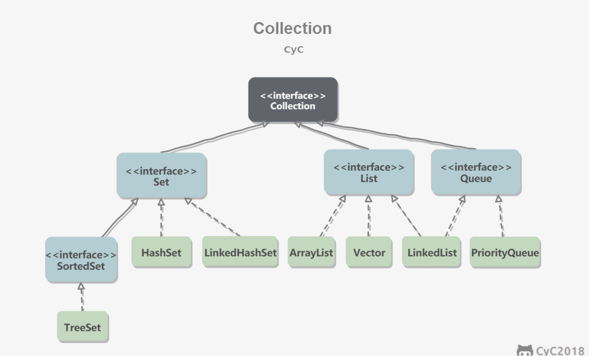

#### 1. Set

- TreeSet：基于红黑树实现，支持有序操作。但是查找效率不如HashSet，HashSet查找的时间复杂度为O(1), TreeSet则为O(logN)。？？？为什么HashSet时间复杂度为O（1）？？？怎么用红黑树实现的？？？
- HashSet：基于哈希表实现，支持快速查找，但不支持有序性操作。并且失去了元素的插入顺序信息，也就是说使用Iterator遍历HashSet的到的结果是不确定的。？？？怎么用哈希表实现？？？
- LinkedHashSet：具有HashSet的查找效率，并且内部使用双向链表维护元素的插入顺序。？？？具体怎么实现的

#### 2. List

- ArrayList：基于动态数组实现，支持随机访问。
- Vector：和ArrayList类似，但是它是线程安全的。
- LinedList：基于双向链表实现，只能顺序访问，但是可以快速的在链表中间插入和删除元素。不仅如此，LinkedList哈可以作为栈，队列和双向队列。

### Map

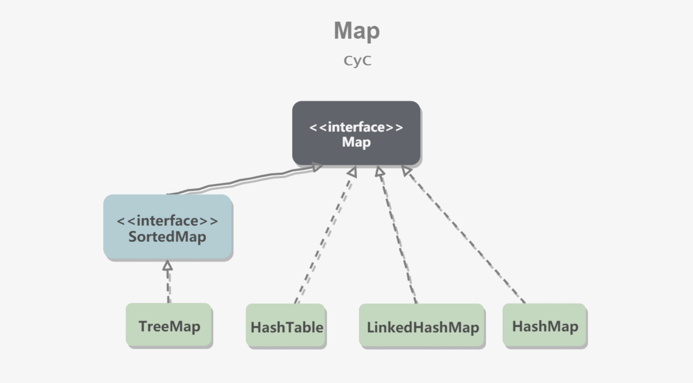

- TreeMap：基于红黑树实现。
- HashMap：基于哈希表实现。
- HashTable：和HashMap类似，但是它是线程安全的，这意味着同一时刻多个线程同时写入HashTabe不回导致数据不一致。它是遗留类，不应该去使用它，而是使用ConcurrentHashMap来支持线程安全，ConcurrentHashMap的效率会更高，因为ConcurrentHashMap引入了分段锁。？？？具体怎么实现，锁又是什么，怎么保证线程安全？？？

## 二、容器中的设计模式

### 迭代器模式

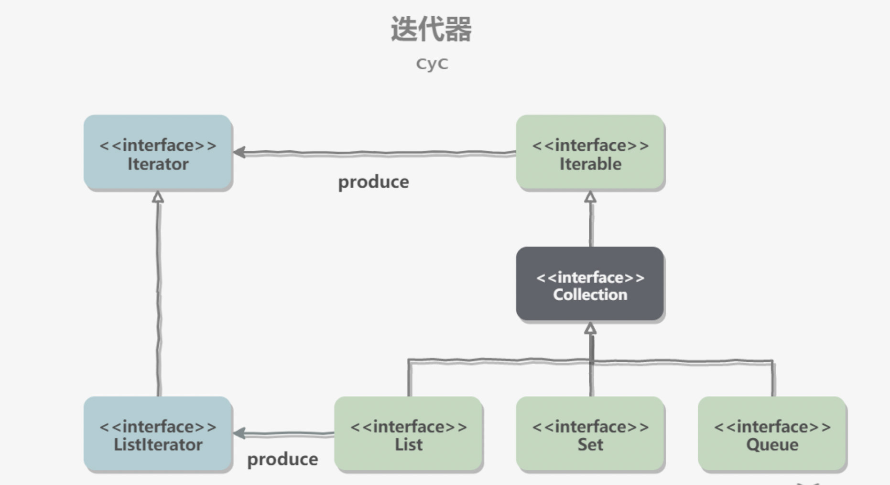


Collection继承了Iterable接口，其中的iterator()方法能够产生一个Iterator对象，通过这个对象就可以迭代遍历Collection中的元素。从JDK1.5之后可以使用foreach方法来遍历Iterable借口的聚合对象。

```java
List<String> list = new ArrayList<>();
list.add("a");
list.add("b");
for(String item : list){
    System.out.println(item);
}
```

### 适配器模式

java.util.Arrays#asList()可以把数组类型转换为List类型。

```java
@SafeVarargs
public static <T> List<T> asList(T...a)
```

应该注意的是asList()的参数为**泛型**的变长参数，不能使用基本类型数组作为参数，只能使用相应的包装类型数组。

```java
integer[] arr = {1, 2, 3};
List list = Array.asList(arr);
```

也可以使用以下方式调用asList():

```java
List list = Arrays.asList(1,2,3);
```

## 三、源码分析

在IDEA中double shift调出Search EveryWhere，查找源码文件，找到后可以阅读源码。

### ArrayList

#### 1. 概览

因为ArrayList是基于数组实现的，所以支持快速随机访问。RandomAccess接口标识着该类支持快速随机访问。

```java
public class ArrayList<E> extends AbstractList<E> implements List<E>, RandomAccess, Cloneable, java.io.Serializable
```

数组的默认大小为10.

```java
private static final int DEFAULT_CAPACITY = 10;
```

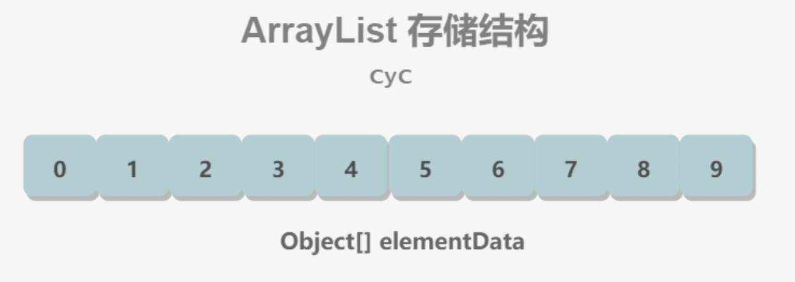


#### 2. 扩容

添加元素时使用ensureCapacityInternal()方法来保证容量足够，如果不够时，需要使用grow()方法进行扩容，新容量的大小为oldCapacity + (oldCapacity >> 1)， 即oldCapacity + oldCapacity/2。其中oldCapacity >> 1 需要取整，所以新的容量大约是旧的容量的1.5倍（oldCapacity为偶数时就是1.5倍，为奇数是就是1.5倍-0.5倍之间）。

扩容操作需要调用Arrays.copyOf()把原数组整个数组复制到新数组中。

```java
public boolean add(E e) {
    ensureCapacityInternal(size + 1);  // Increments modCount!!
    elementData[size++] = e;
    return true;
}

private void ensureCapacityInternal(int minCapacity) {
    if (elementData == DEFAULTCAPACITY_EMPTY_ELEMENTDATA) {
        minCapacity = Math.max(DEFAULT_CAPACITY, minCapacity);
    }
    ensureExplicitCapacity(minCapacity);
}

private void ensureExplicitCapacity(int minCapacity) {
    modCount++;
    // overflow-conscious code
    if (minCapacity - elementData.length > 0)
        grow(minCapacity);
}

private void grow(int minCapacity) {
    // overflow-conscious code
    int oldCapacity = elementData.length;
    int newCapacity = oldCapacity + (oldCapacity >> 1);//形成新的数组的长度
    if (newCapacity - minCapacity < 0)
        newCapacity = minCapacity;
    if (newCapacity - MAX_ARRAY_SIZE > 0)
        newCapacity = hugeCapacity(minCapacity);
    // minCapacity is usually close to size, so this is a win:
    elementData = Arrays.copyOf(elementData, newCapacity);//把旧的数组的数组复制到新的数组里
}
```

#### 3. 删除元素

需要调用System.arraycopy()将index+1后面的元素都复制到index位置上，该操作的时间复杂度为O(n), 可以看到ArrayList删除元素的代价是非常高的。

```java
public E remove(int index){
    rangeCheak(index);
    modCount++;
    E oldValue = elementData(index);
    int numMoved = size - index - 1;
    if(numMoved > 0){
        System.arraycopy(elementData, index+1, elementData, index, numMoved);
    }
    elementData[--size] = null;
    return oldValue;
}
```

#### 4. 序列化？？？什么是序列化？？？

ArrayList


#### 5. Fail-Fast


### Vector

#### 1. 同步

它的实现与ArrayList类似，但是使用了synchronized进行同步。

```java
public synchronized boolean add(E e) {
    modCount++;
    ensureCapacityHelper(elementCount + 1);
    elementData[elementCount++] = e;
    return true;
}

public synchronized E get(int index) {
    if (index >= elementCount)
        throw new ArrayIndexOutOfBoundsException(index);

    return elementData(index);
}
```

#### 2. 扩容

Vector 的构造函数可以传入 capacityIncrement 参数，它的作用是在扩容时使容量 capacity 增长 capacityIncrement。如果这个参数的值小于等于 0，扩容时每次都令 capacity 为原来的两倍。

```java
public Vector(int initialCapacity, int capacityIncrement) {
    super();
    if (initialCapacity < 0)
        throw new IllegalArgumentException("Illegal Capacity: "+
                                           initialCapacity);
    this.elementData = new Object[initialCapacity];
    this.capacityIncrement = capacityIncrement;
}
```

```java
private void grow(int minCapacity) {
    // overflow-conscious code
    int oldCapacity = elementData.length;
    int newCapacity = oldCapacity + ((capacityIncrement > 0) ?
                                     capacityIncrement : oldCapacity);
    if (newCapacity - minCapacity < 0)
        newCapacity = minCapacity;
    if (newCapacity - MAX_ARRAY_SIZE > 0)
        newCapacity = hugeCapacity(minCapacity);
    elementData = Arrays.copyOf(elementData, newCapacity);
}
```

调用没有 capacityIncrement 的构造函数时，capacityIncrement 值被设置为 0，也就是说默认情况下 Vector 每次扩容时容量都会翻倍。

#### 3. 与ArrayList的比较

- Vector是同步的，因此开销就比ArrayList要大，访问速度更慢。最好使用ArrayList而不是Vector，因为同步操作完全可以由程序员自己来控制
- Vector每次扩容默认是其大小的2倍，而ArrayList是1.5倍

### CopyOnWriteArrayList


### LinkedList

#### 1. 概览

基于双向链表实现，使用Node存储链表节点信息

```java
private static class Node<E>{
    E item;
    Node<E> next;
    Node<E> prev;
}
```

每个链表存储了first和last指针：

```java
transient Node<E> first;
transient Node<E> last;
```

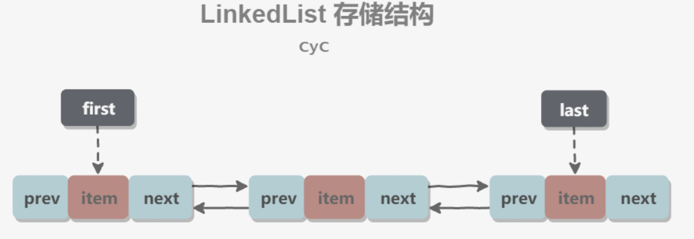

#### 2. 与ArrayList的比较

ArrayList基于动态数组实现，LinkedList基于双向链表实现。ArrayList和LinkeList的区别可以归结于数组和链表的区别：

- 数组支持随机访问，但插入删除的代价很高，需要移动大量元素
- 链表不支持随机访问，但插入删除只需要改变指针

### HashMap

#### 1. 存储结构

内部包含了一个Entry类型的数组table。Entry存储着键值对。它包含了四个字段，从next字段我们可以看出Entry是一个链表。即数组中的每个位置被当成一个桶，一个桶存放一个链表。HashMap使用拉链法来解决冲突，同一个链表中存放哈希值和散列桶取模运算结果相同的Entry。 **？？？什么是拉链法？？？**

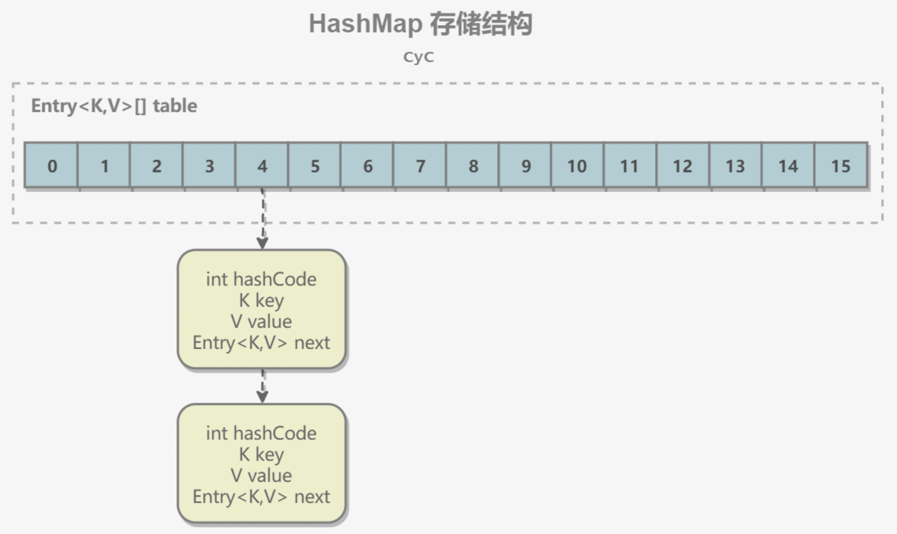


```java
transient Entry[] table;
```

```java
static class Entry<K, V> implements Map.Entry<K, V>{
    final K key;
    V value;
    Entry<K, V> next;
    int hash;
  
    Entry(int h, K k, V v, Entry<K, V> n){
        value = v;
        next = n;
        key = k;
        hash = h;
    }
  
    public final K getKet(){
        return key;
    }
  
    public final V getValue(){
        return value;
    }
  
    public final V setValue(V newValue){
        V oldValue = value;
        value = new Value;
        return oldValue;
    }
  
    public final boolean equals(Object o){
        if(!(o instanceof Map.Entry))
            return false;
        Map.Entry e = (Map.Entry)o;
        Object k1 = getKey();
        Object k2 = e.getKey();
        if(k1 == k2 || (k1 != null && k1.equals(k2))){
            Object v1 = getValue();
            Object v2 = e.getValue();
            if(v1 == v2 || (v1 != null && v1.equals(v2)))
                retur true;
        }
        return false;
    }
  
    public final int hashCode(){
        return Objects.hashCode(getKey())^Objects.hashCode(getValue());
    }
  
    public final String toString(){
        return getKey() + "=" + getValue();
    }
}
```

#### 2. 拉链法的工作原理

```java
HashMap<String, String> map = new HashMap<>();
map.put("K1", "V1");
map.put("K2", "V2");
map.put("K3", "V3");
```

- 新建了一个HashMap，默认大小为16
- 插入<K1, V1>键值对，先计算K1的 hashCode为115，使用除留余数法的到所在桶下标115%16 = 3
- 插入<K2, V2>键值对，先计算K2的 hashCode为118，使用除留余数法的到所在桶下标118%16 = 6
- 插入<K3, V3>键值对，先计算K3的 hashCode为118，使用除留余数法的到所在桶下标118%16 = 6，插在<K2, V2>**前面**。

应该注意到链表的插入是以头插法方式进行的，例如上面的<K3, V3>不是插在<K2，V2>后面，而是插在链表头部。

查找需要分为两步进行：

- 计算键值对所在的桶；
- 在链表上顺序查找，时间复杂度显然和链表的长度成正比

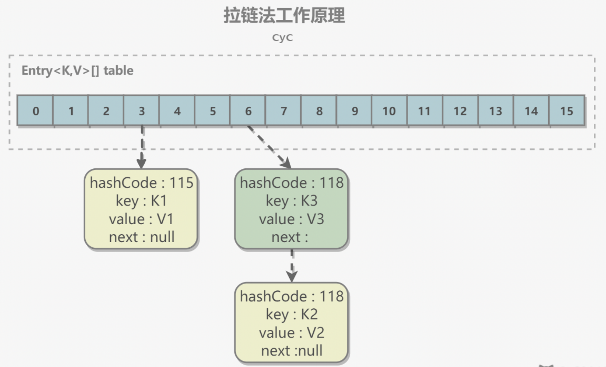

#### 3. put操作

```java
public V put(K key, V value){
    if(table == EMPTY_TABLE){
        inflateTable(threshold);
    }
    //键为null单独处理
    if(key == null){
        return putForNullKey(value);
    }
    int hash = hash(key);
    //确定桶下标
    int i = indexFor(hash, table.length);
    //先找出是否已经存在键为key的键值对，如果存在的话就更新这个键值对的值为value
    for(Entry<K, V> e = table[i]; e != null; e = e.next){
        Object k;
        if(e.hash == hash && ((k = e.key) == key || key.equals(k))){
            V oldValue = e.value;
            e.value = value;
            e.recordAccess(this);
            return oldValue;
        }
    }
    
    modCount++;
    //插入新键值对
    addEntry(hash, key, value, i);
    return null;
}
```

HashMap允许插入键为null的键值对。但是因为无法调用null的hashCode()方法，也就无法确定该键值对下的桶下标，只能通过强制制定一个桶下标来存放。HashMap使用第0个桶存放键null的键值对。

```java
private V putForNullKey(V value){
    for(Entry<K, V> e = table[0]; e != null; e = e.next){
        if(e.key == null){
            V oldValue = e.value;
            e.value = value;
            e.recordAccess(this);
            return oldValue;
        }
    }
    modCount++;
    addEntry(0, null, value, 0);
    return null;
}
```

使用链表的头插法，也就是新的键值对插在链表的头部，而不是链表的尾部。

```java
void addEntry(int hash, K key, V value, int bucketIndex) {
    if ((size >= threshold) && (null != table[bucketIndex])) {
        resize(2 * table.length);
        hash = (null != key) ? hash(key) : 0;
        bucketIndex = indexFor(hash, table.length);
    }

    createEntry(hash, key, value, bucketIndex);
}

void createEntry(int hash, K key, V value, int bucketIndex) {
    Entry<K,V> e = table[bucketIndex];
    // 头插法，链表头部指向新的键值对
    table[bucketIndex] = new Entry<>(hash, key, value, e);
    size++;
}
```

```java
Entry(int h, K k, V v, Entry<K,V> n) {
    value = v;
    next = n;
    key = k;
    hash = h;
}
```

#### 4. 确定桶下标

很多操作都需要先确定一个键值对所在的桶下标

```java
int hash = hash(key);
int i = indexFor(hash, table.length);
```

##### 4.1 计算hash值

```java
final int hash(Object k) {
    int h = hashSeed;
    if (0 != h && k instanceof String) {
        return sun.misc.Hashing.stringHash32((String) k);
    }

    h ^= k.hashCode();

    // This function ensures that hashCodes that differ only by
    // constant multiples at each bit position have a bounded
    // number of collisions (approximately 8 at default load factor).
    h ^= (h >>> 20) ^ (h >>> 12);
    return h ^ (h >>> 7) ^ (h >>> 4);
}
```

```java
public final int hashCode() {
    return Objects.hashCode(key) ^ Objects.hashCode(value);
}
```

##### 4.2 取模

另 x = 1 << 4, 即x为2的4次方，它具有以下性质

```java
x    : 00010000
x-1  : 00001111
```

另一个数y与x-1做与运算，可以去除y位级表示的第4位以上数：

```java
x       : 10110010
x-1     : 00001111
y&(x-1) : 00000010
```

这个性质和y对x取模效果是一样的：

```java
x       : 10110010
x-1     : 00010000
y%x     : 00000010
```

我们知道，位运算的代价比求模运算小的多，因此用这个计算时用位运算的话可以带来更高的性能。

```java
static int indexFor(int h, int length){
    return h & (length-1);
}
```

#### 5. 扩容-基本内容

设HashMap的table长度为M，需要存储的数值对数量为N，如果哈希函数满足均匀性的要求，那么每条链表的长度大约为N/M，因此查找的复杂度为O(N/M)。？？？？

为了让查找的成本降低，应该使N/M尽可能小，因此需要保证M尽可能大，也就是table尽可能大。HashMap采用动态扩容来根据当前的N值来调整M值，使得空间效率和时间效率都能得到保证。

| 参数       | 含义                                                         |
| ---------- | ------------------------------------------------------------ |
| capacity   | table的容量大小，默认为16。需要注意的是capacity必须保证为2的n次方。 |
| size       | 键值对数量                                                   |
| threshold  | size的临界值，当size大于等于threshold就必须进行扩容操作      |
| loadFactor | 装载因子，table能够使用的比例，threshold = (int) (capacity * loadFactor) |

```java
static final int DEFAULT_INITIAL_CAPACITY = 16;
static final int MAXIMUM_CAPACITY = 1 << 30;
static final float DEFAULT_LOAD_FACTOR = 0.75f;
transient Entry[] table;
transient int size;
int threshold;
final float loadFactor;
transient int modCount;
```

从下面的添加元素代码中可以看出，当需要扩容时，令capacity为原来的两倍。

```java
void addEntry(int hash, K key, V value, int bucketIndex){
    Entry<K, V> e = table[bucketIndex];
    table[bucketIndex] = new Entry<>(hash, key, value, e);
    if(size++ >= threshold){
        resize(2*table.length);
    }
}
```

扩容使用resize()实现，需要注意的是，扩容操作同样把oldTable的所有键值对重新插入newTable中，因此这一步是很费时的。

```java
void resize(int newCapacity) {
    Entry[] oldTable = table;
    int oldCapacity = oldTable.length;
    if (oldCapacity == MAXIMUM_CAPACITY) {
        threshold = Integer.MAX_VALUE;
        return;
    }
    Entry[] newTable = new Entry[newCapacity];
    transfer(newTable);
    table = newTable;
    threshold = (int)(newCapacity * loadFactor);
}

void transfer(Entry[] newTable) {
    Entry[] src = table;
    int newCapacity = newTable.length;
    for (int j = 0; j < src.length; j++) {
        Entry<K,V> e = src[j];
        if (e != null) {
            src[j] = null;
            do {
                Entry<K,V> next = e.next;
                int i = indexFor(e.hash, newCapacity);
                e.next = newTable[i];
                newTable[i] = e;
                e = next;
            } while (e != null);
        }
    }
}
```

#### 6. 扩容-重新计算桶下标

在进行扩容时，需要把键值对重新计算桶下标，从而放到对应的桶上。在前面提到，HashMap使用hash%capaity来确定桶下标。HashMap capactiy为2的n次方这一特点能够极大降低重新计算桶下操作的复杂度。

假设原数组长度capacit为16，扩容为new capacity为32:

```java
capacity      : 00010000
new capacity  : 00100000
```

对于一个Key，他的哈希值hash在第5位：

- 为0，那么桶位置和原来一致
- 为1， hash%00010000 = hash%00100000 + 16，同位置是原位置 + 16

#### 7. 计算数组容量

HashMap 构造函数允许用户传入的容量不是 2 的 n 次方，因为它可以自动地将传入的容量转换为 2 的 n 次方。

//先考虑如何求一个数的掩码，对于 10010000，它的掩码为 11111111，可以使用以下方法得到：

#### 8. 链表转红黑树

从JDK1.8开始，一个桶存储的链表长度大于等于8时会将链表转换为红黑树。

#### 9. 与HashTable的比较

- HashTable使用synchronized来进行同步
- HashMap可以插入键为null的Entry
- HashMap的迭代器是fail-fast迭代器
- HashMap不能保证随着时间的推移Map中的元素次序是不变的 ？？？为什么？？？

### ConcurrentHashMap

#### 1. 存储结构

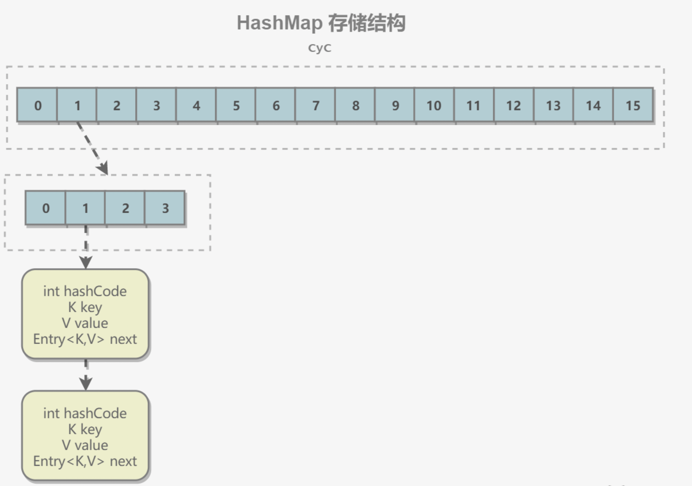

```java
static final class HashEntry<K, V>{
    final int hash;
    final K key;
    volatile V value;
    volatile HashEntry<K, V> next;
}
```

ConcurrentHashMap和HashMap实现上类似，主要的差别是ConcurrentHashMap采用了分段锁（segment），每个分段锁维护者几个桶（HashEntry），多个线程可以同时访问不同分段锁上的桶，从而使其并发度更高（并发度就是Segment的个数）。

```java
static final class Segment<K,V> extends ReentrantLock implements Serializable {

    private static final long serialVersionUID = 2249069246763182397L;

    static final int MAX_SCAN_RETRIES =
        Runtime.getRuntime().availableProcessors() > 1 ? 64 : 1;

    transient volatile HashEntry<K,V>[] table;

    transient int count;

    transient int modCount;

    transient int threshold;

    final float loadFactor;
}
```

```java
final Segment<K,V>[] segments;
```

默认的并发级别为 16，也就是说默认创建 16 个 Segment。

```java
static final int DEFAULT_CONCURRENCY_LEVEL = 16;
```

#### 2. size操作

每个 Segment 维护了一个 count 变量来统计该 Segment 中的键值对个数。

```java
/**
 * The number of elements. Accessed only either within locks
 * or among other volatile reads that maintain visibility.
 */
transient int count;
```

在执行 size 操作时，需要遍历所有 Segment 然后把 count 累计起来。

ConcurrentHashMap 在执行 size 操作时先尝试不加锁，如果连续两次不加锁操作得到的结果一致，那么可以认为这个结果是正确的。

尝试次数使用 RETRIES_BEFORE_LOCK 定义，该值为 2，retries 初始值为 -1，因此尝试次数为 3。

如果尝试的次数超过 3 次，就需要对每个 Segment 加锁。

```java

/**
 * Number of unsynchronized retries in size and containsValue
 * methods before resorting to locking. This is used to avoid
 * unbounded retries if tables undergo continuous modification
 * which would make it impossible to obtain an accurate result.
 */
static final int RETRIES_BEFORE_LOCK = 2;

public int size() {
    // Try a few times to get accurate count. On failure due to
    // continuous async changes in table, resort to locking.
    final Segment<K,V>[] segments = this.segments;
    int size;
    boolean overflow; // true if size overflows 32 bits
    long sum;         // sum of modCounts
    long last = 0L;   // previous sum
    int retries = -1; // first iteration isn't retry
    try {
        for (;;) {
            // 超过尝试次数，则对每个 Segment 加锁
            if (retries++ == RETRIES_BEFORE_LOCK) {
                for (int j = 0; j < segments.length; ++j)
                    ensureSegment(j).lock(); // force creation
            }
            sum = 0L;
            size = 0;
            overflow = false;
            for (int j = 0; j < segments.length; ++j) {
                Segment<K,V> seg = segmentAt(segments, j);
                if (seg != null) {
                    sum += seg.modCount;
                    int c = seg.count;
                    if (c < 0 || (size += c) < 0)
                        overflow = true;
                }
            }
            // 连续两次得到的结果一致，则认为这个结果是正确的
            if (sum == last)
                break;
            last = sum;
        }
    } finally {
        if (retries > RETRIES_BEFORE_LOCK) {
            for (int j = 0; j < segments.length; ++j)
                segmentAt(segments, j).unlock();
        }
    }
    return overflow ? Integer.MAX_VALUE : size;
}
```

#### 3. JDK 1.8的操作

JDK 1.7 使用分段锁机制来实现并发更新操作，核心类为 Segment，它继承自重入锁 ReentrantLock，并发度与 Segment 数量相等。

JDK 1.8 使用了 CAS 操作来支持更高的并发度，在 CAS 操作失败时使用内置锁 synchronized。

并且 JDK 1.8 的实现也在链表过长时会转换为红黑树。

### LinkedHashMap

#### 1. 存储结构

继承HashMap，因此具有和HashMap一样的快速查找特性。

```java
public class LinkedHashMap<K,V> extends HashMap<K,V> implements Map<K,V>
```

内部维护了一个双向链表，用来维护插入顺序或者LRU顺序

```java
transient LinkedHashMap.Entry<K, V> head;
transient LinkedHashMap.Entry<K, V> tail;
```


# Java 并发

## 一、使用线程

- 实现Runnable接口
- 实现Callable接口
- 继承Thread类

实现Runnable和Callable接口的类只能当作一个可以在线程中运行的任务，不是真正意义上的线程，因此最后还需要通过Thread来调用。可以理解为任务是通过线程驱动从而执行的。

### 实现Runnable接口

需要实现接口中的run()方法

```java
public class MyRunnable implements Runnable{
    @Override
    public void run(){
        //...
    }
}
```

使用Runnable实例再创建一个Thread实例，然后调用Thread实例的start()方法来启动线程

```java
public static void main(String[] args){
    MyRunnable instance = new MyRunnalbe();
    Thread thread = new Thread(instance);
    thread.start();
}
```

## 

## 四、互斥同步

Java提供了两种锁机制来控制多个线程对共享资源的互斥访问，第一个是JVM实现的synchronized，而另一个是JDK实现的ReentrantLock。

### synchronized

#### 1. 同步一个代码块

```java
public void func(){
    synchronized(this){
        ///...
    }
}
```

它只作用于同一个对象，如果调用两个对象上的同步代码块，就不会进行同步。

对于以下代码，使用 ExecutorService 执行了两个线程，由于调用的是同一个对象的同步代码块，因此这两个线程会进行同步，当一个线程进入同步语句块时，另一个线程就必须等待。

```java
public class SynchronizedExample {

    public void func1() {
        synchronized (this) {
            for (int i = 0; i < 10; i++) {
                System.out.print(i + " ");
            }
        }
    }
}
```

```java
public static void main(String[] args) {
    SynchronizedExample e1 = new SynchronizedExample();
    ExecutorService executorService = Executors.newCachedThreadPool();
    executorService.execute(() -> e1.func1());
    executorService.execute(() -> e1.func1());
}
```

```java
0 1 2 3 4 5 6 7 8 9 0 1 2 3 4 5 6 7 8 9
```

对于以下代码，两个线程调用了不同对象的同步代码块，因此这两个线程就不需要同步。从输出结果可以看出，两个线程交叉执行。

```java
public static void main(String[] args) {
    SynchronizedExample e1 = new SynchronizedExample();
    SynchronizedExample e2 = new SynchronizedExample();
    ExecutorService executorService = Executors.newCachedThreadPool();
    executorService.execute(() -> e1.func1());
    executorService.execute(() -> e2.func1());
}
```

```java
0 0 1 1 2 2 3 3 4 4 5 5 6 6 7 7 8 8 9 9
```

#### 2. 同步一个方法

```java
public synchronized void func(){
    //...
}
```

它和同步代码一样，作用于同一个对象。

#### 3. 同步一个类

```java
public void func() {
    synchronized (SynchronizedExample.class) {
        // ...
    }
}
```

作用于整个类，也就是说两个线程调用同一个类的不同对象的这种同步语句，也会进行同步。

```java
public class SynchronizedExample {

    public void func2() {
        synchronized (SynchronizedExample.class) {
            for (int i = 0; i < 10; i++) {
                System.out.print(i + " ");
            }
        }
    }
}
```

```java
public static void main(String[] args) {
    SynchronizedExample e1 = new SynchronizedExample();
    SynchronizedExample e2 = new SynchronizedExample();
    ExecutorService executorService = Executors.newCachedThreadPool();
    executorService.execute(() -> e1.func2());
    executorService.execute(() -> e2.func2());
}
```

```java
0 1 2 3 4 5 6 7 8 9 0 1 2 3 4 5 6 7 8 9
```

#### 4. 同步一个静态方法

```java
public synchronized static void fun(){
    //...
}
```

作用于整个类


# Java 虚拟机

## 一、运行时数据区域

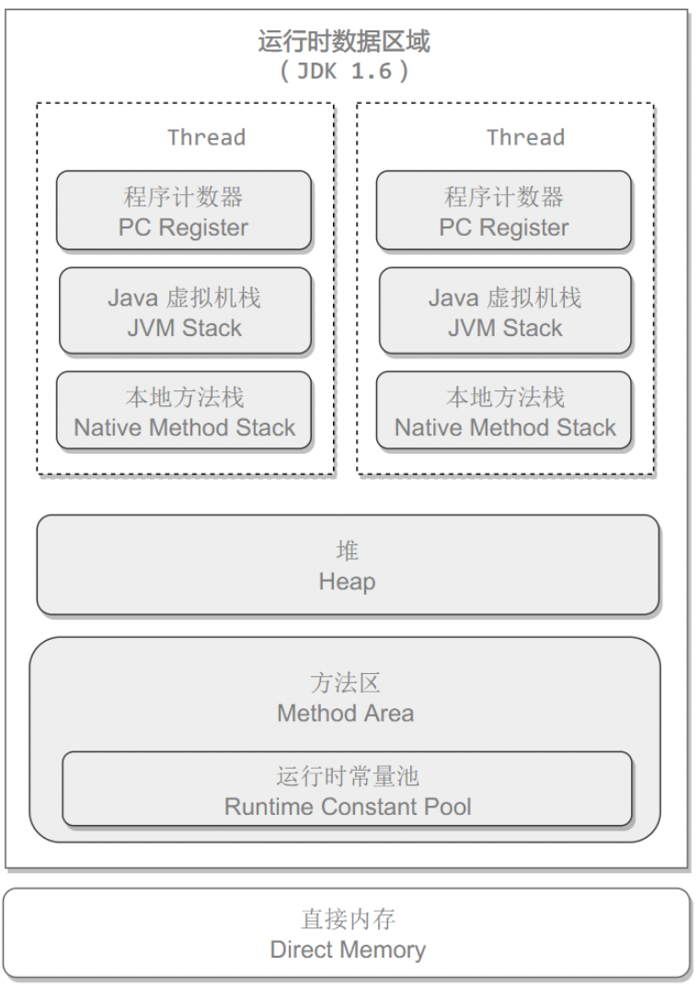

### 程序计数器

记录正在执行的虚拟机字节码指令的地址（如果执行的是本地方法则为空）

### Java虚拟机栈

每个Java方法在执行的同时会创建一个栈帧用于存储局部变量表，操作数栈，常量池引用等信息。从方法调用直至执行完成的过程，对应着一个栈帧在Java虚拟机栈中入栈和出栈的过程。


可以通过-Xss这个虚拟机参数来指定每个线程的Java虚拟机内存大小，在JDK1.4中默认为256K，而在JDK1.5之后为1M：

```java
java -Xss2M HackTheJava
```

该区域可能抛出以下异常：

- 当线程请求的栈深度超过最大值，会抛出StackOverflowError异常
- 栈进行动态扩展时如果无法申请到足够内存，会抛出OutOfMemoryError异常

### 本地方法栈

本地方法栈与Java虚拟机栈类似，它们之间的区别只不过是本地方法栈为本地方法服务。

本地方法栈一般是用其他语言（C，C++或汇编语言）编写的，并且被编译为基于本机硬件和操作系统的程序，对待这些方法需要特别处理。

### 堆

所有对象都在这里分配内存，是垃圾收集的主要区域（“GC堆”）。

现在的垃圾收集器基本都是采用分代收集算法，其主要的思想是针对不同类型的对象采用不同的垃圾回收算法，可以将堆分为两块：

- 新生代（Young Generation）
- 老年代（Old Generation）

堆不需要连续内存，并且可以动态增加其内存，增加失败会抛出OutOfMemoryError异常

可以通过-Xms和-Xmx这两个虚拟机参数来指定一个程序的堆内存大小，第一个参数设置初始值，第二个参数设置最大值。

```java
java -Xms1M -Xmx2M HackTheJava
```

### 方法区

用于存放已被加载的类信息，常量，静态变量，**即时编译器**编译后的代码等数据

和堆一样不需要连续的内存，并且可以动态扩展，动态扩展失败一样会抛出OutOfMemoryError异常。

对这块区域进行垃圾回收的主要目的是对常量池的回收和对类的卸载，但是一般比较难实现。

HotSpot虚拟机会把它当作永久代来进行垃圾回收。但是很难确定永久代的大小，因为它受到了很多因素影响，并且每次Full GC之后永久代的大小都会改变，所以经常抛出OutOfMemoryError异常。为了更容易管理方法区，从JDK1.8开始，移除永久代，把方法区移到元空间，它位于本地内存中，而不是虚拟机内存中。

JDK1.8之后，原本永久代中的数据分到了堆和元空间中。元空间存储类的元信息，静态变量和常量池等放入堆中。

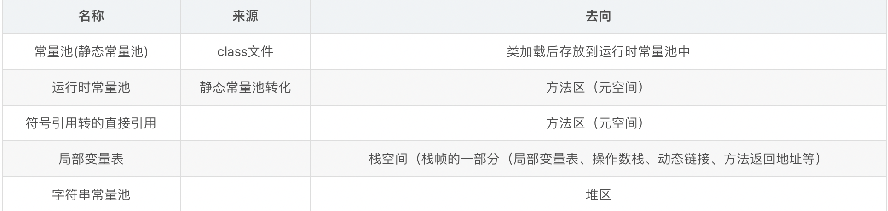

#### 运行时常量池

运行时常量池时方法区的一部分。

Class文件中的常量池（编译器生成的字面量和符号引用）会在类加载后被放入到这个区域。

除了在编译器生成的常量，还允许动态生成，例如String类的intern()。

## 二、垃圾收集

垃圾收集主要是针对堆和方法区进行。程序计数器，虚拟方法栈和本地方法栈这是三个区域属于线程私有，只存在线程的生命周期内，线程结束后就会消失，因此不需要对这三个区域进行垃圾回收。

### 判断一个对象是否可被回收

#### 1. 引用计数算法

为对象添加一个引用计数器，当对象增加一个引用时计数器加1，引用失效时计数器减1。引用计数器为0的对象可被回收。

在两个对象出现循环引用时，计数器永不为0。因此jvm不使用引用计数器。

```java
public class Test {

    public Object instance = null;

    public static void main(String[] args) {
        Test a = new Test();
        Test b = new Test();
        a.instance = b;
        b.instance = a;
        a = null;
        b = null;
        doSomething();
    }
}
```

#### 2. 可达性分析算法

以GC Roots为起始点进行搜索，可达的对象都是存活的，不可达的对象可被回收。

Java虚拟机一般是用该算法来判断是否可被回收，GC Roots一般包含以下内容：

- 虚拟机栈中局部变量中引用的对象
- 本地方法栈中JNI中引用的对象。？？？？
- 方法区中类静态属性引用的对象
- 方法区中的常量引用的对象

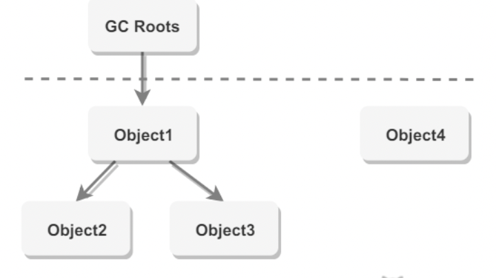

#### 3. 方法区的回收

因为方法区主要存放永久代对象，而永久代对象的回收率比新生代低很多，所以在方法区上进行回收性价比不高。

主要是对常量池的回收和对类的卸载。

为了避免内存溢出，在大量使用反射和动态代理的场景都需要虚拟机具备类卸载功能

类的卸载条件有很多，需要满足以下是那个条件，满足了也不一定会被卸载：

- 该类所有的实例都已经被回收，此时堆中不存在该类的任何实例
- 加载该类的ClassLoader已经被回收
- 该类对应的Class对象没有在任何地方被引用，也就无法在任何地方通过反射访问该类方法

#### 4. finalize()

类似 C++ 的析构函数，用于关闭外部资源。但是 try-finally 等方式可以做得更好，并且该方法运行代价很高，不确定性大，无法保证各个对象的调用顺序，因此最好不要使用。

当一个对象可被回收时，如果需要执行该对象的 finalize() 方法，那么就有可能在该方法中让对象重新被引用，从而实现自救。自救只能进行一次，如果回收的对象之前调用了 finalize() 方法自救，后面回收时不会再调用该方法。

### 引用类型

无论是通过引用计数算法判断对象的引用数量，还是通过可达性分析算法判断对象是否可达，判定对象是否可被回收都与引用有关。

Java 提供了四种强度不同的引用类型。

#### 1. 强引用

被强引用关联的对象不会被回收。

使用 new 一个新对象的方式来创建强引用。

```java
Object obj = new Object();
```

#### 2. 软引用

被软引用关联的对象只有在内存不够的情况下才会被回收。

```java
Object obj = new Object();
SoftReference<Object> sf = new SoftReference<Object>(obj);
obj = null;  // 使对象只被软引用关联
```

#### 3. 弱引用

被弱引用关联的对象一定会被回收，也就是说它只能存活到下一次垃圾回收发生之前。

使用 WeakReference 类来创建弱引用。

```java
Object obj = new Object();
WeakReference<Object> wf = new WeakReference<Object>(obj);
obj = null;
```

#### 4. 虚引用

又称为幽灵引用或者幻影引用，一个对象是否有虚引用的存在，不会对其生存时间造成影响，也无法通过虚引用得到一个对象。

为一个对象设置虚引用的唯一目的是能在这个对象被回收时收到一个系统通知。

使用 PhantomReference 来创建虚引用。

```java
Object obj = new Object();
PhantomReference<Object> pf = new PhantomReference<Object>(obj, null);
obj = null;
```

### 垃圾收集算法

#### 1. 标记-清除

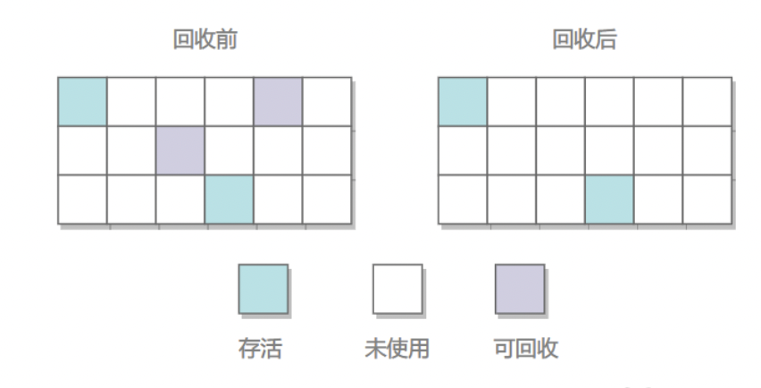

在标记阶段，程序会检查每个对象是否为活动对象，如果是活动对象，则程序会在对象头部打上标记。

在清除阶段，会进行对象回收并取消标志位，另外，还会判断回收后的分块与前一个空闲分块是否连续，若连续，会合并这两个分块。回收对象就是把对象作为分块，连接到被称为 “空闲链表” 的单向链表，之后进行分配时只需要遍历这个空闲链表，就可以找到分块。

在分配时，程序会搜索空闲链表寻找空间大于等于新对象大小 size 的块 block。如果它找到的块等于 size，会直接返回这个分块；如果找到的块大于 size，会将块分割成大小为 size 与 (block - size) 的两部分，返回大小为 size 的分块，并把大小为 (block - size) 的块返回给空闲链表。 （有一个空闲链表的东西）

不足：

- 标记和清除过程效率都不高
- 会产生大量不连续的内存碎片，导致无法给大对象分配内存

#### 2. 标记-整理

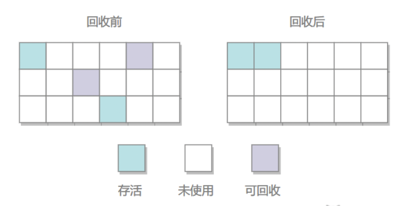

让所有存活的对象都向一端移动，然后直接清理掉端边界以外的内存

优点：

- 不会产生内存碎片

不足

- 需要移动大量的对象，处理效率比较低

#### 3. 复制

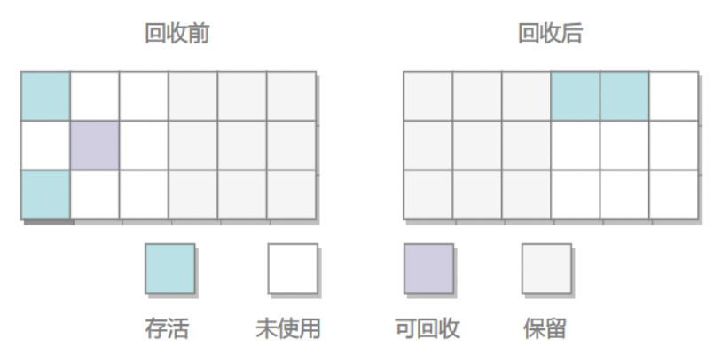

将内存划分为大小相等的两块，每次只使用其中一块，当这一块内存用完了就将还存活的对象复制到另一块上面，然后再把使用过的内存空间进行一次清理。

主要不足是只使用了内存的一半。

现在的商业虚拟机都采用这种收集算法回收新生代，但是并不是划分为大小相等的两块，而是一块较大的 Eden 空间和两块较小的 Survivor 空间，每次使用 Eden 和其中一块 Survivor。在回收时，将 Eden 和 Survivor 中还存活着的对象全部复制到另一块 Survivor 上，最后清理 Eden 和使用过的那一块 Survivor。

HotSpot 虚拟机的 Eden 和 Survivor 大小比例默认为 8:1，保证了内存的利用率达到 90%。如果每次回收有多于 10% 的对象存活，那么一块 Survivor 就不够用了，此时需要依赖于老年代进行空间分配担保，也就是借用老年代的空间存储放不下的对象。

#### 4. 分代收集

现在的商业虚拟机采用分代收集算法，它根据对象存活周期将内存划分为几块，不同块采用适当的收集算法。

一般将堆分为新生代和老年代。

- 新生代使用：复制算法
- 老年代使用：标记-清除或者标记-整理 算法

### 垃圾收集器


# 计算机操作系统

## 进程管理

### 进程与线程

#### 1. 进程

进程是资源分配的基本单位。

进程控制块（process control block, PCB）描述进程的基本信息和运行状态，所谓的创建进程和撤销进程，都是指对PCB的操作

#### 2. 线程

线程是独立调度的基本单位。

一个进程中可以有多个线程，它们共享进程资源。

QQ和浏览器是两个进程，浏览器进程里面有很多线程，例如HTTP请求线程、事件响应线程、渲染线程等等，线程的并发执行是的在浏览器点击一个新链接从而发起HTTP请求时，浏览器还可以响应用户的其他事件。

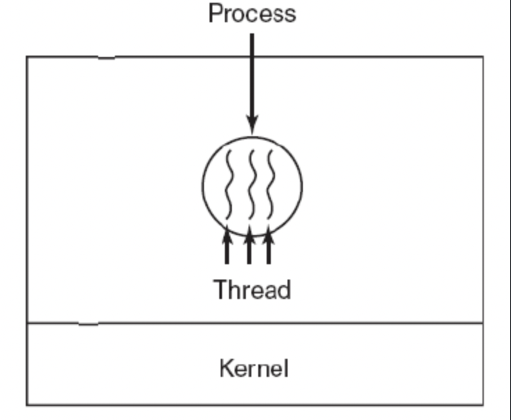

#### 3. 区别

｜拥有资源

进程是资源分配的基本单位，但是线程不拥有资源，线程可以访问隶属于进程的资源

｜｜调度

线程是独立调度的基本单位，在同一进程中，线程的切换不会引起进程切换，从一个进程中的线程切换到另一个进程中的线程时，会引起进程切换

｜｜｜系统开销

由于创建或撤销进程时，系统都要为之分配或着回收资源，例如内存空间，I/O设备等，所付出的开销远大于创建或撤销线程时的开销。类似地，在进行进程切换时，涉及当前执行进程 CPU 环境的保存及新调度进程 CPU 环境的设置，而线程切换时只需保存和设置少量寄存器内容，开销很小。

｜V通信方面

线程间可以通过直接读写同一进程中的数据进行通信，但是进程通信需要借助 IPC。

### 进程状态的切换

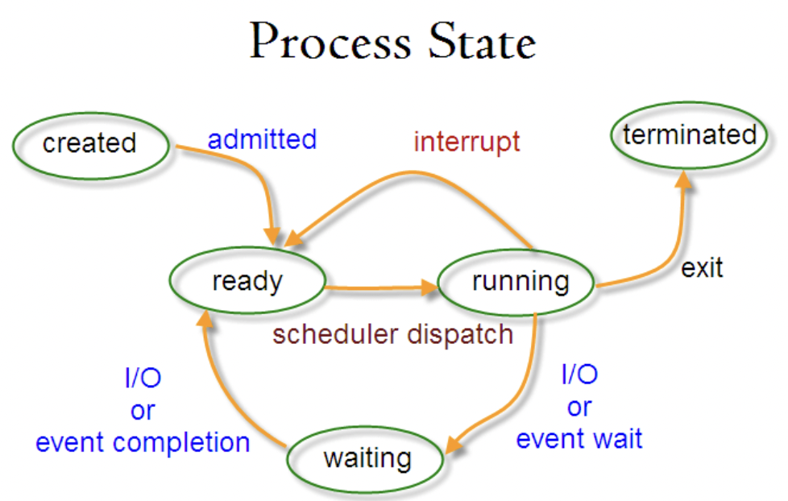

- 就绪状态（ready）：等待被调度
- 运行状态（running）
- 阻塞状态（waiting）：等待资源

应该注意：

- 只有就绪态和运行态可以相互转换，其它的都是单向转换。就绪状态的进程通过调度算法从而获得 CPU 时间，转为运行状态；而运行状态的进程，在分配给它的 CPU 时间片用完之后就会转为就绪状态，等待下一次调度。
- 阻塞状态是缺少需要的资源从而由运行状态转换而来，但是该资源不包括 CPU 时间，缺少 CPU 时间会从运行态转换为就绪态。

### 进程调度算法

不同环境的调度算法目标不同，因此需要针对不同的环境来讨论调度算法

#### 1. 批处理系统

批处理系统没有太多的用户操作，在系统中，调度算法目标时保证吞吐量和周转时间（从提交到中终止的时间）

##### 1.1 先来先服务 first-come first-serverd(FCFS)

非抢占式的调度算法，按照请求的顺序进行调度。

有利于长作业，但不利于短作业，因为短作业必须一直等待前面的长作业执行完毕才能执行，而长作业又需要执行很长时间，造成了短作业等待时间过长。

##### 1.2 短作业优先 shortest job first （SJF）

非抢占式的调度算法，按估计运行时间最短的顺序进行调度。

长作业有可能会饿死，处于一直等待短作业执行完毕的状态。因为如果一直有短作业到来，那么长作业永远得不到调度。

##### 1.3 最短剩余时间优先 shortest remaining time next (SRTN)

最短作业优先的抢占式版本，按剩余运行时间的顺序进行调度。 当一个新的作业到达时，其整个运行时间与当前进程的剩余时间作比较。如果新的进程需要的时间更少，则挂起当前进程，运行新的进程。否则新的进程等待。

#### 2. 交互式系统

交互式系统有大量的用户交互操作，在该系统中调度算法的目标时快速的响应

##### 2.1 时间片轮转

将所有就绪进程按 FCFS 的原则排成一个队列，每次调度时，把 CPU 时间分配给队首进程，该进程可以执行一个时间片。当时间片用完时，由计时器发出时钟中断，调度程序便停止该进程的执行，并将它送往就绪队列的末尾，同时继续把 CPU 时间分配给队首的进程。

时间片轮转算法的效率和时间片的大小有很大关系：

- 因为进程切换都要保存进程的信息并且载入新进程的信息，如果时间片太小，会导致进程切换得太频繁，在进程切换上就会花过多时间。
- 而如果时间片过长，那么实时性就不能得到保证。

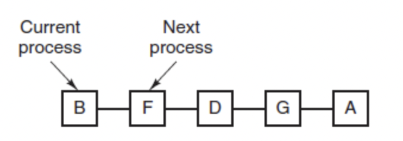

##### 2.2 优先级调度

为每个进程分配一个优先级，按优先级进行调度。

为了防止低优先级的进程永远等不到调度，可以随着时间的推移增加等待进程的优先级。

##### 2.3 多集反馈队列

一个进程需要执行 100 个时间片，如果采用时间片轮转调度算法，那么需要交换 100 次。

多级队列是为这种需要连续执行多个时间片的进程考虑，它设置了多个队列，每个队列时间片大小都不同，例如 1,2,4,8,..。进程在第一个队列没执行完，就会被移到下一个队列。这种方式下，之前的进程只需要交换 7 次。

每个队列优先权也不同，最上面的优先权最高。因此只有上一个队列没有进程在排队，才能调度当前队列上的进程。

可以将这种调度算法看成是时间片轮转调度算法和优先级调度算法的结合。

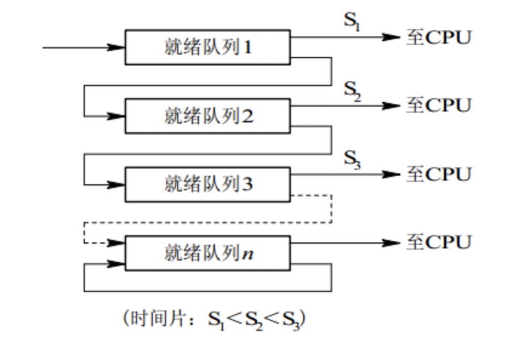

## 死锁

### 必要条件

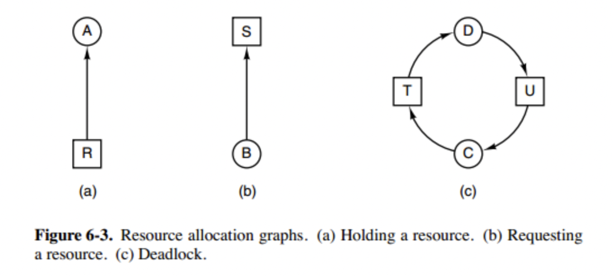

- 互斥：每个资源同时只能被一个进程使用
- 占有和等待：已经得到了某个资源的进程可以再请求新的资源
- 不可抢占：已经分配给一个进程的资源不能强制性地被抢占，它只能被占有它的进程显示地释放
- 环路等待：有两个或者两个以上的进程组成了一条环路，该环路的每个进程都在等待下一个进程所占有的资源

### 处理方法

主要有以下四种方法：

- 鸵鸟策略
- 死锁检测和死锁恢复
- 死锁预防
- 死锁避免

### 鸵鸟策略

把头埋在沙子里，假装根本没发生问题。

因为解决死锁问题的代价很高，因此鸵鸟策略这种不采取任务措施的方案会获得更高的性能。

当发生死锁时不会对用户造成多大影响，或发生死锁的概率很低，可以采用鸵鸟策略。

大多数操作系统，包括 Unix，Linux 和 Windows，处理死锁问题的办法仅仅是忽略它。

### 死锁检测和死锁恢复

不试图阻止死锁，而是当检测到死锁发生时，采取措施进行恢复。

#### 1. 每种类型一个资源的死锁检测

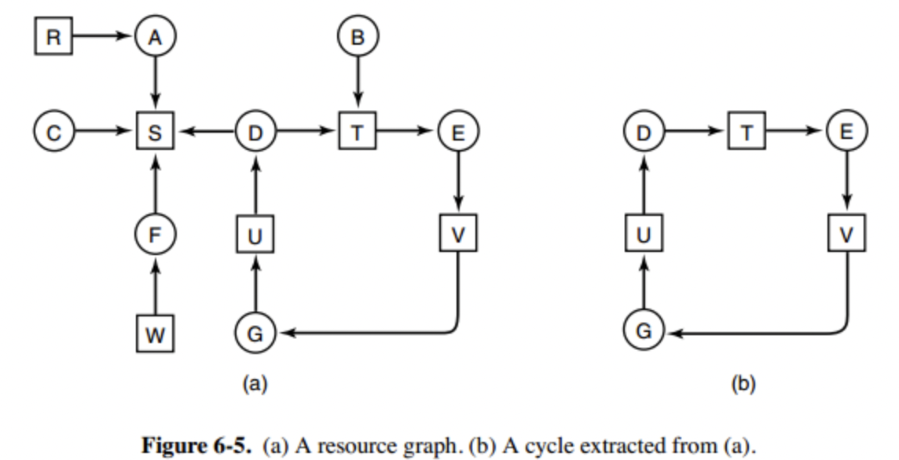

上图为资源分配图，其中方框表示资源，圆圈表示进程。资源指向进程表示该资源已经分配给该进程，进程指向资源表示进程请求获取该资源。

图 a 可以抽取出环，如图 b，它满足了环路等待条件，因此会发生死锁。

每种类型一个资源的死锁检测算法是通过检测有向图是否存在环来实现，从一个节点出发进行深度优先搜索，对访问过的节点进行标记，如果访问了已经标记的节点，就表示有向图存在环，也就是检测到死锁的发生。

#### 2. 每种类型多个资源的死锁检测

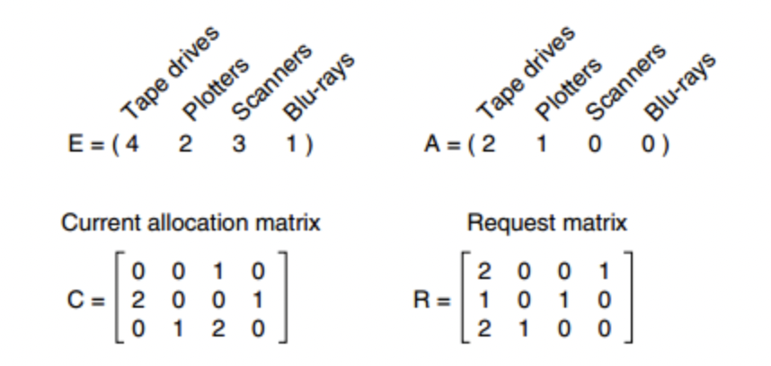

- E向量：资源总量
- A向量：资源剩余量
- C矩阵：每个进程所拥有的资源数量，每一行都代表一个进程拥有资源的数量
- R矩阵：每个进程请求的资源数量

进程 P1 和 P2 所请求的资源都得不到满足，只有进程 P3 可以，让 P3 执行，之后释放 P3 拥有的资源，此时 A = (2 2 2 0)。P2 可以执行，执行后释放 P2 拥有的资源，A = (4 2 2 1) 。P1 也可以执行。所有进程都可以顺利执行，没有死锁。

算法总结如下：

每个进程最开始时都不被标记，执行过程有可能被标记。当算法结束时，任何没有被标记的进程都是死锁进程。

1. 寻找一个没有标记的进程 Pi，它所请求的资源小于等于 A。
2. 如果找到了这样一个进程，那么将 C 矩阵的第 i 行向量加到 A 中，标记该进程，并转回 1。
3. 如果没有这样一个进程，算法终止。

#### 3. 死锁恢复

- 利用抢占恢复
- 利用回滚恢复 ？？？这是什么？？？
- 通过杀死进程恢复

### 死锁预防

在程序运行之前预防发生死锁

#### 1. 破坏互斥条件

例如假脱机打印机技术允许若干个进程同时输出，唯一真正请求物理打印机的进程是打印机守护进程。

#### 2. 破坏占有和等待条件

一种实现方式是规定所有进程在开始执行前请求所需要的全部资源。

#### 3. 破坏不可抢占条件

#### 4. 破坏环路等待

给资源统一编号，进程只能按编号顺序来请求资源。

### 死锁避免

在程序运行时避免发生死锁

#### 1. 安全状态

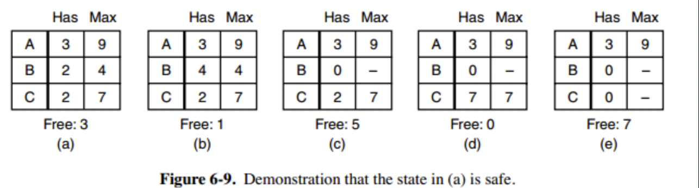

图 a 的第二列 Has 表示已拥有的资源数，第三列 Max 表示总共需要的资源数，Free 表示还有可以使用的资源数。从图 a 开始出发，先让 B 拥有所需的所有资源（图 b），运行结束后释放 B，此时 Free 变为 5（图 c）；接着以同样的方式运行 C 和 A，使得所有进程都能成功运行，因此可以称图 a 所示的状态时安全的。

定义：如果没有死锁发生，并且即使所有进程突然请求对资源的最大需求，也仍然存在某种调度次序能够使得每一个进程运行完毕，则称该状态是安全的。

安全状态的检测与死锁的检测类似，因为安全状态必须要求不能发生死锁。下面的银行家算法与死锁检测算法非常类似，可以结合着做参考对比。

#### 2. 单个资源的银行家算法

一个小城镇的银行家，他向一群客户分别承诺了一定的贷款额度，算法要做的是判断对请求的满足是否会进入不安全状态，如果是，就拒绝请求；否则予以分配。

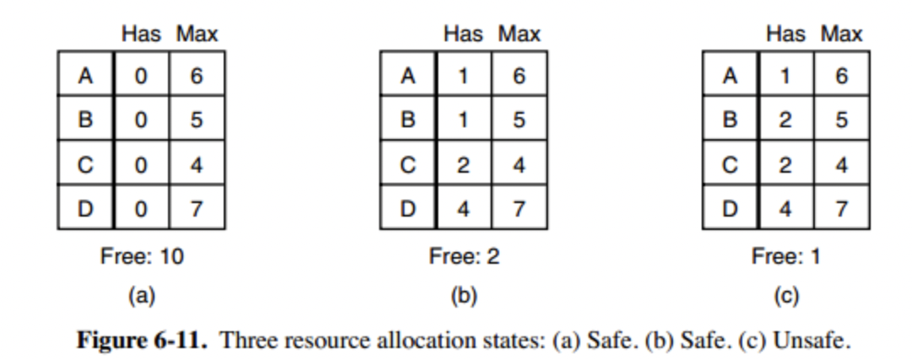

上图 c 为不安全状态，因此算法会拒绝之前的请求，从而避免进入图 c 中的状态。

#### 3. 多个资源的银行家算法

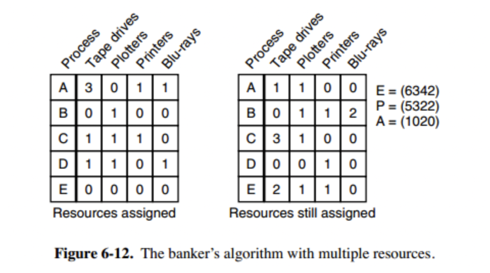

上图中有五个进程，四个资源。左边的图表示已经分配的资源，右边的图表示还需要分配的资源。最右边的 E、P 以及 A 分别表示：总资源、已分配资源以及可用资源，注意这三个为向量，而不是具体数值，例如 A=(1020)，表示 4 个资源分别还剩下 1/0/2/0。

检查一个状态是否安全的算法如下：

- 查找右边的矩阵是否存在一行小于等于向量 A。如果不存在这样的行，那么系统将会发生死锁，状态是不安全的。
- 假若找到这样一行，将该进程标记为终止，并将其已分配资源加到 A 中。
- 重复以上两步，直到所有进程都标记为终止，则状态时安全的。

如果一个状态不是安全的，需要拒绝进入这个状态。


# 计算机网络

