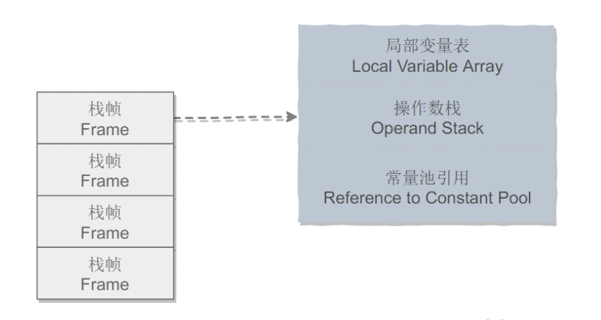
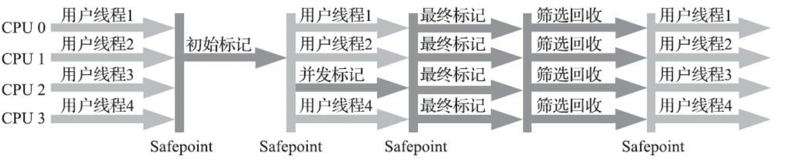
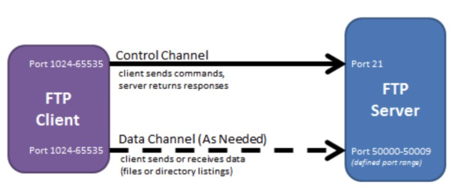

# Java面向有哪一些特征

## 封装：说明一个类行为和属性和其他类的关系

封装（encapsulation。有时称为数据隐藏）是处理对象的一个重要概念。从形式上看，封装就是将数据和行为组合在一个包中，并对对象的使用者隐藏具体的实现方式。对象中的数据成为实例字段（instance field），操作数据的过程称为方法（method）。作为一个类的实例，特定对象都有一组特定的实例字段值。这些值就是这个对象的当前状态（state）。无论何时，只要在对象上调用一个方法，它的状态就有可能发生改变。

实现封装的关键在于，绝对不能让类中的方法直接访问其他类的实例字段。程序只能通过对象的方法对对象数据进行交互。使用者按照既定的方法调研方法，不必关心方法的内部实现，便于使用；便于修改，增强代码的可维护性。封装给对象赋予了“黑盒”特征，这是提高重用性和可靠性的关键。这意味着一个类可以完全改变存储数据的方式，只要依旧使用同样的方法操作数据，其他对象就不会直到也不用关心这个类所发生的变化。

## 继承：是父类和子类的关系

可以基于已有的类创建新的类。创建已经存在的类就是复用(继承)这些类的方法，而且可以增加一些新的方法和字段，使新类能够适应新的情况。在本质上是一般～特殊的关系。使用extends关键字继承了父类之后，实现类就具备了这些相同的属性。

父类通过private定义的变量和方法不会被继承，不能在子类中直接操作父类通过private定义的变量以及方法。继承避免了对一般类和特殊类之间共同特征进行的重复描述，通过继承可以清晰地表达每一项共同特征所适应的概念范围，在一般类中定义的属性和操作适应于这个类本身已经它以下的每一层特殊类的全部对象。

## 多态：是类与类之间的关系

封装和继承最后归于多态，多态指的是类与类之间的关系，两个类由继承，存在有方法的重写，故而可以在调用时有父类引用指向子类对象。多态必备三个要素：继承，重写和父类引用指向子类对象。


# Java 容器

## 一、概览

容器主要包括Collection和Map两种，Collection存储着对象的集合，而Map存储着键值对（key-value）的映射表。

### Collection


#### 1. Set

- TreeSet：基于红黑树实现，支持有序操作。但是查找效率不如HashSet，HashSet查找的时间复杂度为O(1), TreeSet则为O(logN)。**线程不同步**。？？？为什么HashSet时间复杂度为O（1）？？？怎么用红黑树实现的？？？
- HashSet：基于哈希表实现，支持快速查找，但不支持有序性操作。并且失去了元素的插入顺序信息，也就是说使用Iterator遍历HashSet的到的结果是不确定的。**线程不同步**。？？？怎么用哈希表实现？？？
- LinkedHashSet：具有HashSet的查找效率，并且内部使用双向链表维护元素的插入顺序。？？？具体怎么实现的

#### 2. List

- ArrayList：基于动态数组实现，支持随机访问。**线程不同步**。默认初始容量为10，当数组大小不足时容量扩大为1.5倍。
- Vector：和ArrayList类似，但是它是线程安全的。
- LinedList：基于双向链表实现，只能顺序访问，但是可以快速的在链表中间插入和删除元素。不仅如此，LinkedList哈可以作为栈，队列和双向队列。**线程不同步**。

### Map


- TreeMap：基于红黑树实现。**线程不同步**。
- HashMap：基于哈希表实现。**线程不同步**。当发生Hash冲突时，采用拉链法（链表）。在JDK1.8中，当单个桶元素个数大于等于8时，链表实现改为红黑树实现；当元素个数小于6时，变回链表实现。
- HashTable：和HashMap类似，但是它是**线程安全**的，这意味着同一时刻多个线程同时写入HashTabe不回导致数据不一致。它是遗留类，不应该去使用它，而是使用ConcurrentHashMap来支持线程安全，ConcurrentHashMap的效率会更高，因为ConcurrentHashMap引入了分段锁。？？？具体怎么实现，锁又是什么，怎么保证线程安全？？？

## 二、容器中的设计模式

### 迭代器模式


Collection继承了Iterable接口，其中的iterator()方法能够产生一个Iterator对象，通过这个对象就可以迭代遍历Collection中的元素。从JDK1.5之后可以使用foreach方法来遍历Iterable借口的聚合对象。

```java
List<String> list = new ArrayList<>();
list.add("a");
list.add("b");
for(String item : list){
    System.out.println(item);
}
```

### 适配器模式

java.util.Arrays#asList()可以把数组类型转换为List类型。

```java
@SafeVarargs
public static <T> List<T> asList(T...a)
```

应该注意的是asList()的参数为**泛型**的变长参数，不能使用基本类型数组作为参数，只能使用相应的包装类型数组。

```java
integer[] arr = {1, 2, 3};
List list = Array.asList(arr);
```

也可以使用以下方式调用asList():

```java
List list = Arrays.asList(1,2,3);
```

## 三、源码分析

在IDEA中double shift调出Search EveryWhere，查找源码文件，找到后可以阅读源码。

### ArrayList

#### 1. 概览

因为ArrayList是基于数组实现的，所以支持快速随机访问。RandomAccess接口标识着该类支持快速随机访问。

```java
public class ArrayList<E> extends AbstractList<E> implements List<E>, RandomAccess, Cloneable, java.io.Serializable
```

数组的默认大小为10.

```java
private static final int DEFAULT_CAPACITY = 10;
```


#### 2. 扩容

添加元素时使用ensureCapacityInternal()方法来保证容量足够，如果不够时，需要使用grow()方法进行扩容，新容量的大小为oldCapacity + (oldCapacity >> 1)， 即oldCapacity + oldCapacity/2。其中oldCapacity >> 1 需要取整，所以新的容量大约是旧的容量的1.5倍（oldCapacity为偶数时就是1.5倍，为奇数是就是1.5倍-0.5倍之间）。

扩容操作需要调用Arrays.copyOf()把原数组整个数组复制到新数组中。

```java
public boolean add(E e) {
    ensureCapacityInternal(size + 1);  // Increments modCount!!
    elementData[size++] = e;
    return true;
}

private void ensureCapacityInternal(int minCapacity) {
    if (elementData == DEFAULTCAPACITY_EMPTY_ELEMENTDATA) {
        minCapacity = Math.max(DEFAULT_CAPACITY, minCapacity);
    }
    ensureExplicitCapacity(minCapacity);
}

private void ensureExplicitCapacity(int minCapacity) {
    modCount++;
    // overflow-conscious code
    if (minCapacity - elementData.length > 0)
        grow(minCapacity);
}

private void grow(int minCapacity) {
    // overflow-conscious code
    int oldCapacity = elementData.length;
    int newCapacity = oldCapacity + (oldCapacity >> 1);//形成新的数组的长度
    if (newCapacity - minCapacity < 0)
        newCapacity = minCapacity;
    if (newCapacity - MAX_ARRAY_SIZE > 0)
        newCapacity = hugeCapacity(minCapacity);
    // minCapacity is usually close to size, so this is a win:
    elementData = Arrays.copyOf(elementData, newCapacity);//把旧的数组的数组复制到新的数组里
}
```

#### 3. 删除元素

需要调用System.arraycopy()将index+1后面的元素都复制到index位置上，该操作的时间复杂度为O(n), 可以看到ArrayList删除元素的代价是非常高的。

```java
public E remove(int index){
    rangeCheak(index);
    modCount++;
    E oldValue = elementData(index);
    int numMoved = size - index - 1;
    if(numMoved > 0){
        System.arraycopy(elementData, index+1, elementData, index, numMoved);
    }
    elementData[--size] = null;
    return oldValue;
}
```

#### 4. 序列化？？？什么是序列化？？？

ArrayList


#### 5. Fail-Fast

**什么是fail-fast机制？**

fail-fast机制在遍历一个集合时，当集合结构被修改，会抛出Concurrent Modification Exception

Fail-fast 会在以下两种情况下抛出Concurrent Modification Exception

(1) 单线程环境

- 集合被创建后，在遍历它的过程中修改了结构
- 注意remove()方法会让expectModcount和modcount相等，所以是不会抛出这个异常的

(2) 多线程环境

- 当一个线程在遍历这个集合，而另一个线程对这个集合的结构进行了修改

modCount用来记录ArrayList结构发生变化的次数。结构发生变化时指添加或者删除至少一个元素的所有操作，或者调整内部数组的大小，仅仅只是设置元素的值不算结构发生变化。

在进行序列化或者迭代操作时，需要比较操作前后modCount是否发生改变，如果改变了需要抛出Count Modification Exception。

### Vector

#### 1. 同步

它的实现与ArrayList类似，但是使用了synchronized进行同步。

```java
public synchronized boolean add(E e) {
    modCount++;
    ensureCapacityHelper(elementCount + 1);
    elementData[elementCount++] = e;
    return true;
}

public synchronized E get(int index) {
    if (index >= elementCount)
        throw new ArrayIndexOutOfBoundsException(index);

    return elementData(index);
}
```

#### 2. 扩容

Vector 的构造函数可以传入 capacityIncrement 参数，它的作用是在扩容时使容量 capacity 增长 capacityIncrement。如果这个参数的值小于等于 0，扩容时每次都令 capacity 为原来的两倍。

```java
public Vector(int initialCapacity, int capacityIncrement) {
    super();
    if (initialCapacity < 0)
        throw new IllegalArgumentException("Illegal Capacity: "+
                                           initialCapacity);
    this.elementData = new Object[initialCapacity];
    this.capacityIncrement = capacityIncrement;
}
```

```java
private void grow(int minCapacity) {
    // overflow-conscious code
    int oldCapacity = elementData.length;
    int newCapacity = oldCapacity + ((capacityIncrement > 0) ?
                                     capacityIncrement : oldCapacity);
    if (newCapacity - minCapacity < 0)
        newCapacity = minCapacity;
    if (newCapacity - MAX_ARRAY_SIZE > 0)
        newCapacity = hugeCapacity(minCapacity);
    elementData = Arrays.copyOf(elementData, newCapacity);
}
```

调用没有 capacityIncrement 的构造函数时，capacityIncrement 值被设置为 0，也就是说默认情况下 Vector 每次扩容时容量都会翻倍。

#### 3. 与ArrayList的比较

- Vector是同步的，因此开销就比ArrayList要大，访问速度更慢。最好使用ArrayList而不是Vector，因为同步操作完全可以由程序员自己来控制
- Vector每次扩容默认是其大小的2倍，而ArrayList是1.5倍

### CopyOnWriteArrayList


### LinkedList

#### 1. 概览

基于双向链表实现，使用Node存储链表节点信息

```java
private static class Node<E>{
    E item;
    Node<E> next;
    Node<E> prev;
}
```

每个链表存储了first和last指针：

```java
transient Node<E> first;
transient Node<E> last;
```


#### 2. 与ArrayList的比较

ArrayList基于动态数组实现，LinkedList基于双向链表实现。ArrayList和LinkeList的区别可以归结于数组和链表的区别：

- 数组支持随机访问，但插入删除的代价很高，需要移动大量元素
- 链表不支持随机访问，但插入删除只需要改变指针

### HashMap

#### 1. 存储结构

内部包含了一个Entry类型的数组table。Entry存储着键值对。它包含了四个字段，从next字段我们可以看出Entry是一个链表。即数组中的每个位置被当成一个桶，一个桶存放一个链表。HashMap使用拉链法来解决冲突，同一个链表中存放哈希值和散列桶取模运算结果相同的Entry。 **？？？什么是拉链法？？？**


```java
transient Entry[] table;
```

```java
static class Entry<K, V> implements Map.Entry<K, V>{
    final K key;
    V value;
    Entry<K, V> next;
    int hash;
  
    Entry(int h, K k, V v, Entry<K, V> n){
        value = v;
        next = n;
        key = k;
        hash = h;
    }
  
    public final K getKet(){
        return key;
    }
  
    public final V getValue(){
        return value;
    }
  
    public final V setValue(V newValue){
        V oldValue = value;
        value = new Value;
        return oldValue;
    }
  
    public final boolean equals(Object o){
        if(!(o instanceof Map.Entry))
            return false;
        Map.Entry e = (Map.Entry)o;
        Object k1 = getKey();
        Object k2 = e.getKey();
        if(k1 == k2 || (k1 != null && k1.equals(k2))){
            Object v1 = getValue();
            Object v2 = e.getValue();
            if(v1 == v2 || (v1 != null && v1.equals(v2)))
                retur true;
        }
        return false;
    }
  
    public final int hashCode(){
        return Objects.hashCode(getKey())^Objects.hashCode(getValue());
    }
  
    public final String toString(){
        return getKey() + "=" + getValue();
    }
}
```

#### 2. 拉链法的工作原理

```java
HashMap<String, String> map = new HashMap<>();
map.put("K1", "V1");
map.put("K2", "V2");
map.put("K3", "V3");
```

- 新建了一个HashMap，默认大小为16
- 插入<K1, V1>键值对，先计算K1的 hashCode为115，使用除留余数法的到所在桶下标115%16 = 3
- 插入<K2, V2>键值对，先计算K2的 hashCode为118，使用除留余数法的到所在桶下标118%16 = 6
- 插入<K3, V3>键值对，先计算K3的 hashCode为118，使用除留余数法的到所在桶下标118%16 = 6，插在<K2, V2>**前面**。

应该注意到链表的插入是以头插法方式进行的，例如上面的<K3, V3>不是插在<K2，V2>后面，而是插在链表头部。

查找需要分为两步进行：

- 计算键值对所在的桶；
- 在链表上顺序查找，时间复杂度显然和链表的长度成正比


#### 3. put操作

```java
public V put(K key, V value){
    if(table == EMPTY_TABLE){
        inflateTable(threshold);
    }
    //键为null单独处理
    if(key == null){
        return putForNullKey(value);
    }
    int hash = hash(key);
    //确定桶下标
    int i = indexFor(hash, table.length);
    //先找出是否已经存在键为key的键值对，如果存在的话就更新这个键值对的值为value
    for(Entry<K, V> e = table[i]; e != null; e = e.next){
        Object k;
        if(e.hash == hash && ((k = e.key) == key || key.equals(k))){
            V oldValue = e.value;
            e.value = value;
            e.recordAccess(this);
            return oldValue;
        }
    }
    
    modCount++;
    //插入新键值对
    addEntry(hash, key, value, i);
    return null;
}
```

HashMap允许插入键为null的键值对。但是因为无法调用null的hashCode()方法，也就无法确定该键值对下的桶下标，只能通过强制制定一个桶下标来存放。HashMap使用第0个桶存放键null的键值对。

```java
private V putForNullKey(V value){
    for(Entry<K, V> e = table[0]; e != null; e = e.next){
        if(e.key == null){
            V oldValue = e.value;
            e.value = value;
            e.recordAccess(this);
            return oldValue;
        }
    }
    modCount++;
    addEntry(0, null, value, 0);
    return null;
}
```

使用链表的头插法，也就是新的键值对插在链表的头部，而不是链表的尾部。

```java
void addEntry(int hash, K key, V value, int bucketIndex) {
    if ((size >= threshold) && (null != table[bucketIndex])) {
        resize(2 * table.length);
        hash = (null != key) ? hash(key) : 0;
        bucketIndex = indexFor(hash, table.length);
    }

    createEntry(hash, key, value, bucketIndex);
}

void createEntry(int hash, K key, V value, int bucketIndex) {
    Entry<K,V> e = table[bucketIndex];
    // 头插法，链表头部指向新的键值对
    table[bucketIndex] = new Entry<>(hash, key, value, e);
    size++;
}
```

```java
Entry(int h, K k, V v, Entry<K,V> n) {
    value = v;
    next = n;
    key = k;
    hash = h;
}
```

#### 4. 确定桶下标

很多操作都需要先确定一个键值对所在的桶下标

```java
int hash = hash(key);
int i = indexFor(hash, table.length);
```

##### 4.1 计算hash值

```java
final int hash(Object k) {
    int h = hashSeed;
    if (0 != h && k instanceof String) {
        return sun.misc.Hashing.stringHash32((String) k);
    }

    h ^= k.hashCode();

    // This function ensures that hashCodes that differ only by
    // constant multiples at each bit position have a bounded
    // number of collisions (approximately 8 at default load factor).
    h ^= (h >>> 20) ^ (h >>> 12);
    return h ^ (h >>> 7) ^ (h >>> 4);
}
```

```java
public final int hashCode() {
    return Objects.hashCode(key) ^ Objects.hashCode(value);
}
```

##### 4.2 取模

另 x = 1 << 4, 即x为2的4次方，它具有以下性质

```java
x    : 00010000
x-1  : 00001111
```

另一个数y与x-1做与运算，可以去除y位级表示的第4位以上数：

```java
x       : 10110010
x-1     : 00001111
y&(x-1) : 00000010
```

这个性质和y对x取模效果是一样的：

```java
x       : 10110010
x-1     : 00010000
y%x     : 00000010
```

我们知道，位运算的代价比求模运算小的多，因此用这个计算时用位运算的话可以带来更高的性能。

```java
static int indexFor(int h, int length){
    return h & (length-1);
}
```

#### 5. 扩容-基本内容

设HashMap的table长度为M，需要存储的数值对数量为N，如果哈希函数满足均匀性的要求，那么每条链表的长度大约为N/M，因此查找的复杂度为O(N/M)。？？？？

为了让查找的成本降低，应该使N/M尽可能小，因此需要保证M尽可能大，也就是table尽可能大。HashMap采用动态扩容来根据当前的N值来调整M值，使得空间效率和时间效率都能得到保证。

| 参数       | 含义                                                         |
| ---------- | ------------------------------------------------------------ |
| capacity   | table的容量大小，默认为16。需要注意的是capacity必须保证为2的n次方。 |
| size       | 键值对数量                                                   |
| threshold  | size的临界值，当size大于等于threshold就必须进行扩容操作      |
| loadFactor | 装载因子，table能够使用的比例，threshold = (int) (capacity * loadFactor) |

```java
static final int DEFAULT_INITIAL_CAPACITY = 16;
static final int MAXIMUM_CAPACITY = 1 << 30;
static final float DEFAULT_LOAD_FACTOR = 0.75f;
transient Entry[] table;
transient int size;
int threshold;
final float loadFactor;
transient int modCount;
```

从下面的添加元素代码中可以看出，当需要扩容时，令capacity为原来的两倍。

```java
void addEntry(int hash, K key, V value, int bucketIndex){
    Entry<K, V> e = table[bucketIndex];
    table[bucketIndex] = new Entry<>(hash, key, value, e);
    if(size++ >= threshold){
        resize(2*table.length);
    }
}
```

扩容使用resize()实现，需要注意的是，扩容操作同样把oldTable的所有键值对重新插入newTable中，因此这一步是很费时的。

```java
void resize(int newCapacity) {
    Entry[] oldTable = table;
    int oldCapacity = oldTable.length;
    if (oldCapacity == MAXIMUM_CAPACITY) {
        threshold = Integer.MAX_VALUE;
        return;
    }
    Entry[] newTable = new Entry[newCapacity];
    transfer(newTable);
    table = newTable;
    threshold = (int)(newCapacity * loadFactor);
}

void transfer(Entry[] newTable) {
    Entry[] src = table;
    int newCapacity = newTable.length;
    for (int j = 0; j < src.length; j++) {
        Entry<K,V> e = src[j];
        if (e != null) {
            src[j] = null;
            do {
                Entry<K,V> next = e.next;
                int i = indexFor(e.hash, newCapacity);
                e.next = newTable[i];
                newTable[i] = e;
                e = next;
            } while (e != null);
        }
    }
}
```

#### 6. 扩容-重新计算桶下标

在进行扩容时，需要把键值对重新计算桶下标，从而放到对应的桶上。在前面提到，HashMap使用hash%capaity来确定桶下标。HashMap capactiy为2的n次方这一特点能够极大降低重新计算桶下操作的复杂度。

假设原数组长度capacit为16，扩容为new capacity为32:

```java
capacity      : 00010000
new capacity  : 00100000
```

对于一个Key，他的哈希值hash在第5位：

- 为0，那么桶位置和原来一致
- 为1， hash%00010000 = hash%00100000 + 16，同位置是原位置 + 16

#### 7. 计算数组容量

HashMap 构造函数允许用户传入的容量不是 2 的 n 次方，因为它可以自动地将传入的容量转换为 2 的 n 次方。

//先考虑如何求一个数的掩码，对于 10010000，它的掩码为 11111111，可以使用以下方法得到：

#### 8. 链表转红黑树

从JDK1.8开始，一个桶存储的链表长度大于等于8时会将链表转换为红黑树。

#### 9. 与HashTable的比较

- HashTable使用synchronized来进行同步
- HashMap可以插入键为null的Entry
- HashMap的迭代器是fail-fast迭代器
- HashMap不能保证随着时间的推移Map中的元素次序是不变的 ？？？为什么？？？

### ConcurrentHashMap

#### 1. 存储结构


```java
static final class HashEntry<K, V>{
    final int hash;
    final K key;
    volatile V value;
    volatile HashEntry<K, V> next;
}
```

ConcurrentHashMap和HashMap实现上类似，主要的差别是ConcurrentHashMap采用了分段锁（segment），每个分段锁维护者几个桶（HashEntry），多个线程可以同时访问不同分段锁上的桶，从而使其并发度更高（并发度就是Segment的个数）。

```java
static final class Segment<K,V> extends ReentrantLock implements Serializable {

    private static final long serialVersionUID = 2249069246763182397L;

    static final int MAX_SCAN_RETRIES =
        Runtime.getRuntime().availableProcessors() > 1 ? 64 : 1;

    transient volatile HashEntry<K,V>[] table;

    transient int count;

    transient int modCount;

    transient int threshold;

    final float loadFactor;
}
```

```java
final Segment<K,V>[] segments;
```

默认的并发级别为 16，也就是说默认创建 16 个 Segment。

```java
static final int DEFAULT_CONCURRENCY_LEVEL = 16;
```

#### 2. size操作

每个 Segment 维护了一个 count 变量来统计该 Segment 中的键值对个数。

```java
/**
 * The number of elements. Accessed only either within locks
 * or among other volatile reads that maintain visibility.
 */
transient int count;
```

在执行 size 操作时，需要遍历所有 Segment 然后把 count 累计起来。

ConcurrentHashMap 在执行 size 操作时先尝试不加锁，如果连续两次不加锁操作得到的结果一致，那么可以认为这个结果是正确的。

尝试次数使用 RETRIES_BEFORE_LOCK 定义，该值为 2，retries 初始值为 -1，因此尝试次数为 3。

如果尝试的次数超过 3 次，就需要对每个 Segment 加锁。

```java

/**
 * Number of unsynchronized retries in size and containsValue
 * methods before resorting to locking. This is used to avoid
 * unbounded retries if tables undergo continuous modification
 * which would make it impossible to obtain an accurate result.
 */
static final int RETRIES_BEFORE_LOCK = 2;

public int size() {
    // Try a few times to get accurate count. On failure due to
    // continuous async changes in table, resort to locking.
    final Segment<K,V>[] segments = this.segments;
    int size;
    boolean overflow; // true if size overflows 32 bits
    long sum;         // sum of modCounts
    long last = 0L;   // previous sum
    int retries = -1; // first iteration isn't retry
    try {
        for (;;) {
            // 超过尝试次数，则对每个 Segment 加锁
            if (retries++ == RETRIES_BEFORE_LOCK) {
                for (int j = 0; j < segments.length; ++j)
                    ensureSegment(j).lock(); // force creation
            }
            sum = 0L;
            size = 0;
            overflow = false;
            for (int j = 0; j < segments.length; ++j) {
                Segment<K,V> seg = segmentAt(segments, j);
                if (seg != null) {
                    sum += seg.modCount;
                    int c = seg.count;
                    if (c < 0 || (size += c) < 0)
                        overflow = true;
                }
            }
            // 连续两次得到的结果一致，则认为这个结果是正确的
            if (sum == last)
                break;
            last = sum;
        }
    } finally {
        if (retries > RETRIES_BEFORE_LOCK) {
            for (int j = 0; j < segments.length; ++j)
                segmentAt(segments, j).unlock();
        }
    }
    return overflow ? Integer.MAX_VALUE : size;
}
```

#### 3. JDK 1.8的操作

JDK 1.7 使用分段锁机制来实现并发更新操作，核心类为 Segment，它继承自重入锁 ReentrantLock，并发度与 Segment 数量相等。

JDK 1.8 使用了 CAS 操作来支持更高的并发度，在 CAS 操作失败时使用内置锁 synchronized。

并且 JDK 1.8 的实现也在链表过长时会转换为红黑树。

### LinkedHashMap

#### 1. 存储结构

继承HashMap，因此具有和HashMap一样的快速查找特性。

```java
public class LinkedHashMap<K,V> extends HashMap<K,V> implements Map<K,V>
```

内部维护了一个双向链表，用来维护插入顺序或者LRU顺序

```java
transient LinkedHashMap.Entry<K, V> head;
transient LinkedHashMap.Entry<K, V> tail;
```


# Java 并发

## 一、使用线程

- 实现Runnable接口
- 实现Callable接口
- 继承Thread类

实现Runnable和Callable接口的类只能当作一个可以在线程中运行的任务，不是真正意义上的线程，因此最后还需要通过Thread来调用。可以理解为任务是通过线程驱动从而执行的。

### 实现Runnable接口

需要实现接口中的run()方法

```java
public class MyRunnable implements Runnable{
    @Override
    public void run(){
        //...
    }
}
```

使用Runnable实例再创建一个Thread实例，然后调用Thread实例的start()方法来启动线程

```java
public static void main(String[] args){
    MyRunnable instance = new MyRunnalbe();
    Thread thread = new Thread(instance);
    thread.start();
}
```

## 

## 四、互斥同步

Java提供了两种锁机制来控制多个线程对共享资源的互斥访问，第一个是JVM实现的synchronized，而另一个是JDK实现的ReentrantLock。

### synchronized

#### 1. 同步一个代码块

```java
public void func(){
    synchronized(this){
        ///...
    }
}
```

它只作用于同一个对象，如果调用两个对象上的同步代码块，就不会进行同步。

对于以下代码，使用 ExecutorService 执行了两个线程，由于调用的是同一个对象的同步代码块，因此这两个线程会进行同步，当一个线程进入同步语句块时，另一个线程就必须等待。

```java
public class SynchronizedExample {

    public void func1() {
        synchronized (this) {
            for (int i = 0; i < 10; i++) {
                System.out.print(i + " ");
            }
        }
    }
}
```

```java
public static void main(String[] args) {
    SynchronizedExample e1 = new SynchronizedExample();
    ExecutorService executorService = Executors.newCachedThreadPool();
    executorService.execute(() -> e1.func1());
    executorService.execute(() -> e1.func1());
}
```

```java
0 1 2 3 4 5 6 7 8 9 0 1 2 3 4 5 6 7 8 9
```

对于以下代码，两个线程调用了不同对象的同步代码块，因此这两个线程就不需要同步。从输出结果可以看出，两个线程交叉执行。

```java
public static void main(String[] args) {
    SynchronizedExample e1 = new SynchronizedExample();
    SynchronizedExample e2 = new SynchronizedExample();
    ExecutorService executorService = Executors.newCachedThreadPool();
    executorService.execute(() -> e1.func1());
    executorService.execute(() -> e2.func1());
}
```

```java
0 0 1 1 2 2 3 3 4 4 5 5 6 6 7 7 8 8 9 9
```

#### 2. 同步一个方法

```java
public synchronized void func(){
    //...
}
```

它和同步代码一样，作用于同一个对象。

#### 3. 同步一个类

```java
public void func() {
    synchronized (SynchronizedExample.class) {
        // ...
    }
}
```

作用于整个类，也就是说两个线程调用同一个类的不同对象的这种同步语句，也会进行同步。

```java
public class SynchronizedExample {

    public void func2() {
        synchronized (SynchronizedExample.class) {
            for (int i = 0; i < 10; i++) {
                System.out.print(i + " ");
            }
        }
    }
}
```

```java
public static void main(String[] args) {
    SynchronizedExample e1 = new SynchronizedExample();
    SynchronizedExample e2 = new SynchronizedExample();
    ExecutorService executorService = Executors.newCachedThreadPool();
    executorService.execute(() -> e1.func2());
    executorService.execute(() -> e2.func2());
}
```

```java
0 1 2 3 4 5 6 7 8 9 0 1 2 3 4 5 6 7 8 9
```

#### 4. 同步一个静态方法

```java
public synchronized static void fun(){
    //...
}
```

作用于整个类


# Java 虚拟机

## 一、运行时数据区域


### 程序计数器

可以看作是当前线程所执行的字节码的行号执行器。字节码解释器工作就是通过改变这个计数器的值来选取下一个需要执行的字节码指令，它是程序控制流的指示器，分支，循环，跳转，异常处理，线程恢复等基础功能都要依靠这个计数器里啊完成。

由于Java虚拟机的多线程是通过线程轮流切换，分配处理器执行时间的方式实现的，在任何一个确定的时刻，一个处理器（对于多核处理器来说是一个内核）都只会执行一条线程的指令。因此，为了线程切换之后能恢复到正确的执行位置，每条线程都需要一条独立的程序计数器，各条线程之间计数器互不影响，独立存储，这是线程私有的内存。

如果线程执行的是一个java方法，这个计数器记录正在执行的虚拟机字节码指令的地址，如果执行的是本地方法则为空。此内存区域是唯一不会有OutOfMemoryError情况的区域。

### Java虚拟机栈

虚拟机栈的生命周期和线程相同。

它描述的是java方法执行的线程内存模型：每个Java方法在执行的同时会创建一个栈帧用于存储局部变量表，操作数栈，常量池引用等信息。从方法调用直至执行完成的过程，对应着一个栈帧在Java虚拟机栈中入栈和出栈的过程。



局部变量表存放了编译期可知的各种java虚拟机基本数据类型，对象引用和returnAddress（？？？这是啥）。

可以通过-Xss这个虚拟机参数来指定每个线程的Java虚拟机内存大小，在JDK1.4中默认为256K，而在JDK1.5之后为1M：

```java
java -Xss2M HackTheJava
```

该区域可能抛出以下异常：

- 当线程请求的栈深度超过最大值，会抛出StackOverflowError异常
- 栈进行动态扩展时如果无法申请到足够内存，会抛出OutOfMemoryError异常

### 本地方法栈

本地方法栈与Java虚拟机栈(字节码)类似，它们之间的区别只不过是本地方法栈为本地方法服务。

本地方法栈一般是用其他语言（C，C++或汇编语言）编写的，并且被编译为基于本机硬件和操作系统的程序，对待这些方法需要特别处理。

### 堆

Java堆事所有线程共享的一块内存区域，在虚拟机启动时创建。此内存区域唯一的目的就是存放对象实例。

所有对象都在这里分配内存，是垃圾收集的主要区域（“GC堆”）。

现在的垃圾收集器基本都是采用分代收集算法，其主要的思想是针对不同类型的对象采用不同的垃圾回收算法，可以将堆分为两块：

- 新生代（Young Generation）
- 老年代（Old Generation）

堆可以不需要连续内存但是在逻辑上被视为连续的，并且可以动态增加其内存，增加失败会抛出OutOfMemoryError异常

可以通过-Xms和-Xmx这两个虚拟机参数来指定一个程序的堆内存大小，第一个参数设置初始值，第二个参数设置最大值。

```java
java -Xms1M -Xmx2M HackTheJava
```

### 方法区

用于存放已被加载的类信息，常量，静态变量，**即时编译器**编译后的代码等数据

和堆一样不需要连续的内存，并且可以动态扩展，动态扩展失败一样会抛出OutOfMemoryError异常。

对这块区域进行垃圾回收的主要目的是对常量池的回收和对类的卸载，但是一般比较难实现。

HotSpot虚拟机会把它当作永久代来进行垃圾回收。但是很难确定永久代的大小，因为它受到了很多因素影响，并且每次Full GC之后永久代的大小都会改变，所以经常抛出OutOfMemoryError异常。为了更容易管理方法区，从JDK1.8开始，移除永久代，把方法区移到元空间，它位于本地内存中，而不是虚拟机内存中。

JDK1.8之后，原本永久代中的数据分到了堆和元空间中。元空间存储类的元信息，静态变量和常量池等放入堆中。


#### 运行时常量池

运行时常量池时方法区的一部分。

Class文件中的常量池（编译器生成的字面量和符号引用）会在类加载后被放入到这个区域。

除了在编译器生成的常量，还允许动态生成，例如String类的intern()。

### 对象的创建

Java事一门面对对象的编程语言。

当Java虚拟机遇到一条字节码new的时候，首先将去检查这个指令的参数是否能在常量池中定位到一个类的符号引用，并且检查这个符号引用代表的类是否已经被加载，解析和初始化过，如果没有，那么必须先执行相应的类加载过程。

在类加载器检查通过后，就要为新生对象分配内存。对象所要的内存的大小在类加载过程中就已经确定。对对象分配空间的任务实际上就是等同于把一块确定大小的内存块从java堆中划分出来。如果java堆的内存是绝对规整的，所有被使用过的内存都放在一边，空闲的内存放在一边，中间放着一个指针作为分界的指示器。那所分配内存就是吧那个指针向空闲空间方向挪动一段对象大小的距离，这种分配方式成为“指针碰撞”。

如果Java堆中的内存并不是规整的，已经使用的和空闲的被交错在一起，那么虚拟机需要维护一个列表，记录哪些是空用的，分配时从列表中找到一块足够大的空间划给对象实例。

接下来，Java虚拟机还要对对象进行必要的设置，例如这个对象是哪个类的实例，如果才能找到类的元数据信息，对象的哈希码，对象的GC分代年龄信息。这些是存放在对象的对象头（Object Header）中。根据虚拟机当前运行状态不同，如是否启用偏向锁，对象头都会有不同的设置方式。

### 对象的内存布局

在HotSpot虚拟机里，对象在堆内存中的存储布局可以划分为三个部分:对象头(Header)、实例

数据(Instance Data)和对齐填充(Padding)。

HotSpot虚拟机对象的对象头部分包括两类信息。第一类是用于存储对象自身的运行时数据，如哈 希码(HashCode)、GC分代年龄、锁状态标志、线程持有的锁、偏向线程ID、偏向时间戳等，这部 分数据的长度在32位和64位的虚拟机(未开启压缩指针)中分别为32个比特和64个比特，官方称它 为“Mark Word”。对象需要存储的运行时数据很多，其实已经超出了32、64位Bitmap结构所能记录的 最大限度，但对象头里的信息是与对象自身定义的数据无关的额外存储成本，考虑到虚拟机的空间效 率，Mark Word被设计成一个有着动态定义的数据结构，以便在极小的空间内存储尽量多的数据，根 据对象的状态复用自己的存储空间。


对象头的另外一部分是类型指针，即对象指向它的类型元数据的指针，Java虚拟机通过这个指针 来确定该对象是哪个类的实例。并不是所有的虚拟机实现都必须在对象数据上保留类型指针，换句话 说，查找对象的元数据信息并不一定要经过对象本身，这点我们会在下一节具体讨论。此外，如果对 象是一个Java数组，那在对象头中还必须有一块用于记录数组长度的数据，因为虚拟机可以通过普通 Java对象的元数据信息确定Java对象的大小，但是如果数组的长度是不确定的，将无法通过元数据中的 信息推断出数组的大小。

接下来实例数据部分是对象真正存储的有效信息，即我们在程序代码里面所定义的各种类型的字 段内容，无论是从父类继承下来的，还是在子类中定义的字段都必须记录起来。

对象的第三部分是对齐填充，这并不是必然存在的，也没有特别的含义，它仅仅起着占位符的作 用。由于HotSpot虚拟机的自动内存管理系统要求对象起始地址必须是8字节的整数倍，换句话说就是 任何对象的大小都必须是8字节的整数倍。

## 二、垃圾收集

垃圾收集主要是针对堆和方法区进行。程序计数器，虚拟方法栈和本地方法栈这是三个区域属于线程私有，只存在线程的生命周期内，线程结束后就会消失，因此不需要对这三个区域进行垃圾回收。

需要做三件事：

1. 哪些内存需要回收
2. 什么时候回收
3. 如何回收

### 判断一个对象是否可被回收

#### 1. 引用计数算法

为对象添加一个引用计数器，当对象增加一个引用时计数器加1，引用失效时计数器减1。引用计数器为0的对象可被回收。

在两个对象出现**循环引用**时，计数器永不为0。因此jvm不使用引用计数器。

```java
public class Test {

    public Object instance = null;

    public static void main(String[] args) {
        Test a = new Test();
        Test b = new Test();
        a.instance = b;
        b.instance = a;
        a = null;
        b = null;
        doSomething();
    }
}
```

#### 2. 可达性分析算法

以GC Roots为起始点根据引用关系向下搜索，可达的对象都是存活的，不可达的对象可被回收。

Java虚拟机一般是用该算法来判断是否可被回收，GC Roots一般包含以下内容：

- 虚拟机栈（栈帧中的本地变量表）中局部变量中引用的对象：例如参数，局部变量，临时变量。
- 本地方法栈中JNI（Native方法）中引用的对象。？？？？
- 方法区中类静态属性引用的对象，譬如Java类的引用类静态变量
- 方法区中的常量引用的对象，譬如字符串常量池中的引用
- 所有被同步锁（synchronized关键字）持有的对象


#### 3. 方法区的回收

因为方法区主要存放永久代对象，而永久代对象的回收率比新生代低很多，所以在方法区上进行回收性价比不高。

主要是对常量池的回收和对类的卸载。

为了避免内存溢出，在大量使用反射和动态代理的场景都需要虚拟机具备类卸载功能

类的卸载条件有很多，需要满足以下是那个条件，满足了也不一定会被卸载：

- 该类所有的实例都已经被回收，此时堆中不存在该类的任何实例
- 加载该类的ClassLoader已经被回收
- 该类对应的Class对象没有在任何地方被引用，也就无法在任何地方通过反射访问该类方法

#### 4. finalize()

类似 C++ 的析构函数，用于关闭外部资源。但是 try-finally 等方式可以做得更好，并且该方法运行代价很高，不确定性大，无法保证各个对象的调用顺序，因此最好不要使用。

当一个对象可被回收时，如果需要执行该对象的 finalize() 方法，那么就有可能在该方法中让对象重新被引用，从而实现自救。自救只能进行一次，如果回收的对象之前调用了 finalize() 方法自救，后面回收时不会再调用该方法。

### 引用类型

无论是通过引用计数算法判断对象的引用数量，还是通过可达性分析算法判断对象是否可达，判定对象是否可被回收都与引用有关。

Java 提供了四种强度不同的引用类型。

#### 1. 强引用

被强引用关联的对象不会被回收。只要强引用关系还存在，垃圾收集器永远不会回收掉被引用的对象。

使用 new 一个新对象的方式来创建强引用。

```java
Object obj = new Object();
```

#### 2. 软引用

被软引用关联的对象只有在内存不够的情况下才会被回收。

```java
Object obj = new Object();
SoftReference<Object> sf = new SoftReference<Object>(obj);
obj = null;  // 使对象只被软引用关联
```

#### 3. 弱引用

被弱引用关联的对象一定会被回收，也就是说它只能存活到下一次垃圾回收发生之前。

使用 WeakReference 类来创建弱引用。

```java
Object obj = new Object();
WeakReference<Object> wf = new WeakReference<Object>(obj);
obj = null;
```

#### 4. 虚引用

又称为幽灵引用或者幻影引用，一个对象是否有虚引用的存在，不会对其生存时间造成影响，也无法通过**虚引用得到一个对象**。

**为一个对象设置虚引用的唯一目的是能在这个对象被回收时收到一个系统通知。**

使用 PhantomReference 来创建虚引用。

```java
Object obj = new Object();
PhantomReference<Object> pf = new PhantomReference<Object>(obj, null);
obj = null;
```

### 垃圾收集算法

把分代收集理论具体放到现在的商用Java虚拟机中，设计者一般至少会把Java堆划分为新生代和老年代两个区域。顾名思义，在新时代中，每次垃圾收集时都会有大批对象死去，而每次回收之后存活的少量对象，会逐步晋升到老年代中存放。

#### 1. 标记-清除


在标记阶段，程序会检查每个对象是否为活动对象，如果是活动对象，则程序会在对象头部打上标记。

在清除阶段，会进行对象回收并取消标志位，另外，还会判断回收后的分块与前一个空闲分块是否连续，若连续，会合并这两个分块。回收对象就是把对象作为分块，连接到被称为 “空闲链表” 的单向链表，之后进行分配时只需要遍历这个空闲链表，就可以找到分块。

在分配时，程序会搜索空闲链表寻找空间大于等于新对象大小 size 的块 block。如果它找到的块等于 size，会直接返回这个分块；如果找到的块大于 size，会将块分割成大小为 size 与 (block - size) 的两部分，返回大小为 size 的分块，并把大小为 (block - size) 的块返回给空闲链表。 （有一个空闲链表的东西）

不足：

- 标记和清除过程效率都不稳定，如果Java堆中包含大量对象，而且其中大部分是需要被回收的，这是必须进行大量标记和清除的动作，导致标记和清除的两个大过程的执行效率都随着对象数量增长而降低
- 会产生大量不连续的内存碎片，导致无法给大对象分配内存，从而导致不得不提前触发垃圾收集动作。

#### 2. 标记-整理（针对老年代）


让所有存活的对象都向一端移动，然后直接清理掉端边界以外的内存

优点：

- 不会产生内存碎片

不足

- 需要移动大量的对象，处理效率比较低

#### 3. 复制（主要针对新生代）


将内存划分为大小相等的两块，每次只使用其中一块，当这一块内存用完了就将**还存活的对象**复制到另一块上面，然后再把使用过的内存空间进行一次清理。如果内存中多数对象都是存活的，这种算法需要产生大量的内存间复制的开销，但对于多数对象都是可回收的，算法只需要复制的就是占少数的存活对象。而且也不需要考虑空间碎片的问题，只要移动堆顶指针，按照顺序分配即可。

主要不足是只使用了内存的一半。

现在的商业虚拟机都采用这种收集算法回收新生代，但是并不是划分为大小相等的两块，而是一块较大的 Eden 空间和两块较小的 Survivor 空间，每次使用 Eden 和其中一块 Survivor。在回收时，将 Eden 和 Survivor 中还存活着的对象全部复制到另一块 Survivor 上，最后清理 Eden 和使用过的那一块 Survivor。

HotSpot 虚拟机的 Eden 和 Survivor 大小比例默认为 8:1，保证了内存的利用率达到 90%。如果每次回收有多于 10% 的对象存活，那么一块 Survivor 就不够用了，此时需要依赖于老年代进行空间分配担保，也就是借用老年代的空间存储放不下的对象。

#### 4. 分代收集

现在的商业虚拟机采用分代收集算法，它根据对象存活周期将内存划分为几块，不同块采用适当的收集算法。

一般将堆分为新生代和老年代。

- 新生代使用：复制算法
- 老年代使用：标记-清除或者标记-整理 算法

### 垃圾收集器


#### Serial收集器

Serial收集器是最基础、历史最悠久的收集器，曾经(在JDK 1.3.1之前)是HotSpot虚拟机新生代 收集器的唯一选择。大家只看名字就能够猜到，这个收集器是一个单线程工作的收集器，但它的“单线 程”的意义并不仅仅是说明它只会使用一个处理器或一条收集线程去完成垃圾收集工作，更重要的是强 调在它进行垃圾收集时，必须暂停其他所有工作线程，直到它收集结束。“Stop The World”这个词语也 许听起来很酷，但这项工作是由虚拟机在后台自动发起和自动完成的，在用户不可知、不可控的情况 下把用户的正常工作的线程全部停掉，这对很多应用来说都是不能接受的。读者不妨试想一下，要是 你的电脑每运行一个小时就会暂停响应五分钟，你会有什么样的心情?图3-7示意了Serial/Serial Old收 集器的运行过程。


#### ParNew收集器

ParNew收集器实质上是Serial收集器的多线程并行版本，除了同时使用多条线程进行垃圾收集之 外 ， 其 余 的 行 为 包 括 Se r i a l 收 集 器 可 用 的 所 有 控 制 参 数 ( 例 如 : - X X : Su r v i v o r R a t i o 、 - X X : PretenureSizeThreshold、-XX:HandlePromotionFailure等)、收集算法、Stop The World、对象分配规 则、回收策略等都与Serial收集器完全一致，在实现上这两种收集器也共用了相当多的代码。ParNew收 集器的工作过程如图3-8所示。


ParNew收集器除了支持多线程并行收集之外，其他与Serial收集器相比并没有太多创新之处，但它 却是不少运行在服务端模式下的HotSpot虚拟机，尤其是JDK 7之前的遗留系统中首选的新生代收集 器，其中有一个与功能、性能无关但其实很重要的原因是:**除了Serial收集器外，目前只有它能与CM S 收集器配合工作。**

#### Parallel Scavenge收集器

Parallel Scavenge收集器的特点是它的关注点与其他收集器不同，CM S等收集器的关注点是尽可能 地缩短垃圾收集时用户线程的停顿时间，而Parallel Scavenge收集器的目标则是达到一个可控制的吞吐 量(Throughput)。所谓吞吐量就是处理器用于运行用户代码的时间与处理器总消耗时间的比值， 即:


#### Serial Old收集器


#### Parallel Old收集器


#### CMS收集器（作用于老年代，新生代用复制算法）

CMS（Concurrent Mark Sweep）收集器是一种以获取最短回收停顿时间为目标的收集器。目前很 大一部分的Java应用集中在互联网网站或者基于浏览器的B/S系统的服务端上，这类应用通常都会较为 关注服务的响应速度，希望系统停顿时间尽可能短，以给用户带来良好的交互体验。CM S收集器就非 常符合这类应用的需求。

适用范围：

1. 不希望有长时间的停顿
2. CPU资源比较丰富
3. 碎片化严重后，需要用Full GC完成整理

整个过程分为四个步骤：

1. 初始标记（CMS initial mark）
2. 并发标记（CMS concurrent mark）
3. 重新标记（CMS remark）
4. 并发清除（CMS concurrent sweep）

其中，初始标记，重新标记这两个步骤都需要“Stop The World”。

初始标记仅仅只是标记一下GC Root能关联到的对象，速度很快；

并发标记阶段就是从GC Roots的关联对象开始遍历整个对象的过程，这个过程耗时较长但是不需要停顿用户线程，可以与垃圾收集线程一起并发运行：

而重新标记阶段则是为了修正并发标记期间，因为用户程序继续运作而导致标记产生变动的那一部分对象的标记记录，这个阶段的停顿时间通常会比初始标记阶段稍长一些，但是远比并发标记阶段的时间短；

最后是并发清除阶段，清理删除标记阶段判断的已经死亡的对象，由于不需要移动活动对象，所以这个阶段也是可以与用户线程同时并发的。

由于整个过程中耗时最长的并发标记和并发清除阶段中，垃圾收集器线程都可以用户线程一起工作，所以从总体上来说，CMS收集器的内存回收过程是与用户线程一起并发执行的。


缺点：

1. 对处理器资源非常敏感。如果处理器核心数量不足（4个）CMS对用户程序的影响会比较大。
2. 无法处理“浮动垃圾”。程序在运行自然会有新的垃圾对象不断产生，而这些是在标记之后，CMS收集器只能在下次垃圾收集时处理它们。
3. CMS是基于“标记-清除”算法实现的收集器，会有大量空间碎片产生。

#### G1收集器（？？？）

Garbage First(简称G1)收集器是垃圾收集器技术发展历史上的里程碑式的成果，它开创了收集器面向局部收集的设计思路和基于Region的内存布局形式。

G1收集器可以面向堆内存任何部分来进行回收，衡量标准不再是它属于哪一个分代，而是哪一块内存中存放的垃圾数量最多，回收收益最大，这就是G1收集器的Mixed GC模式。

G1开创的基于Region的堆内存布局是它能够实现这个目标的关键。虽然G1也仍是遵循分代收集理 论设计的，但其堆内存的布局与其他收集器有非常明显的差异:G1不再坚持固定大小以及固定数量的分代区域划分，而是把连续的Java堆划分为多个大小相等的独立区域(Region)，每一个Region都可以根据需要，扮演新生代的Eden空间、Survivor空间，或者老年代空间。收集器能够对扮演不同角色的 Region采用不同的策略去处理，这样无论是新创建的对象还是已经存活了一段时间、熬过多次收集的旧对象都能获取很好的收集效果。

Region中还有一类特殊的Humongous区域，专门用来存储大对象。G1认为只要大小超过了一个 Region容量一半的对象即可判定为大对象。

事实上，垃圾最多的小堆区，会被优先收集。这就是G1名字的由来。


##### G1垃圾回收的过程

1. 初始标记：仅仅只是标记一下GC Roots能直接关联到的对象，并且修改TAM S 指针的值，让下一阶段用户线程并发运行时，能正确地在可用的Region中分配新对象。这个阶段需要 停顿线程，但耗时很短，而且是借用进行Minor GC的时候同步完成的，所以G1收集器在这个阶段实际 并没有额外的停顿。
2. 并发标记：从GC Root开始对堆中对象进行可达性分析，递归扫描整个堆 里的对象图，找出要回收的对象，这阶段耗时较长，但可与用户程序并发执行。当对象图扫描完成以 后，还要重新处理SAT B记录下的在并发时有引用变动的对象。
3. 最终标记：对用户线程做另一个短暂的暂停，用于处理并发阶段结束后仍遗留 下来的最后那少量的SAT B记录。
4. 筛选回收：负责更新Region的统计数据，对各个Region的回收价值和成本进行排序，根据用户所期望的停顿时间来制定回收计划，可以自由选择任意多个Region 构成回收集，然后把决定回收的那一部分Region的存活对象复制到空的Region中，再清理掉整个旧 Region的全部空间。这里的操作涉及存活对象的移动，是必须暂停用户线程，由多条收集器线程并行 完成的。



毫无疑问，可以由用户指定期望的停顿时间是G1收集器很强大的一个功能，设置不同的期望停顿 时间，可使得G1在不同应用场景中取得关注吞吐量和关注延迟之间的最佳平衡。

## 三、类加载

一个类型从被加载到虚拟机内存中开始，到卸载出内存为之，它的整个生命周期将会经历加载，验证，准备，解析，初始化，使用和卸载七个阶段。其中验证，准备和解析三个部分统称为连接。


加载、验证、准备、初始化和卸载这五个阶段的顺序是确定的，类型的加载过程必须按 照这种顺序按部就班地开始，而解析阶段则不一定:它在某些情况下可以在初始化阶段之后再开始， 这是为了支持Java语言的运行时绑定特性(也称为动态绑定或晚期绑定)。请注意，这里笔者写的是 按部就班地“开始”，而不是按部就班地“进行”或按部就班地“完成”，强调这点是因为这些阶段通常都 是互相交叉地混合进行的，会在一个阶段执行的过程中调用、激活另一个阶段。

接口的加载过程与类加载过程稍有不同，针对接口需要做一些特殊说明:接口也有初始化过程， 这点与类是一致的，上面的代码都是用静态语句块“static{}”来输出初始化信息的，而接口中不能使用“static{}”语句块，但编译器仍然会为接口生成“<clinit>()”类构造器[2]，用于初始化接口中所定义的成员变量。

### 类加载的全过程

我们会详细了解Java虚拟机中类加载的全过程，即加载、验证、准备、解析和初始化这五 个阶段所执行的具体动作。

#### 1. 加载

“加载”(Loading)阶段是整个“类加载”(Class Loading)过程中的一个阶段，**主要作用是将外部的.class文件，加载到Java的方法区内。加载阶段主要是找到并加载类的二进制数据，比如jar包。**

这两个看起来很相似的名词。在加载阶段，Java虚拟机需要完成以下三件事情:

1. 通过一个类的全限定名来获取定义此类的二进制字节流。

2. 将这个字节流所代表的静态存储结构转化为方法区的运行时数据结构。

3. 在内存中生成一个代表这个类的java.lang.Class对象，作为方法区这个类的各种数据的访问入口。

非数组类型的加载阶段(准确地说，是加载阶段中获取类的二进 制字节流的动作)是开发人员可控性最强的阶段。加载阶段既可以使用Java虚拟机里内置的引导类加 载器来完成，也可以由用户自定义的类加载器去完成，开发人员通过定义自己的类加载器去控制字节 流的获取方式(重写一个类加载器的findClass()或loadClass()方法)，实现根据自己的想法来赋予应用 程序获取运行代码的动态性。

对于数组类而言，情况就有所不同，数组类本身不通过类加载器创建，它是由Java虚拟机直接在 内存中动态构造出来的。但数组类与类加载器仍然有很密切的关系，因为数组类的元素类型(Element Type, 指的是数组去掉所有维度的类型)最终还是要靠类加载器来完成加载，一个数组类(下面简称 为C)创建过程遵循以下规则:

1. 如果数组的组件类型(Component Type，指的是数组去掉一个维度的类型，注意和前面的元素类 型区分开来)是引用类型，那就递归采用本节中定义的加载过程去加载这个组件类型，数组C将被标 识在加载该组件类型的类加载器的类名称空间上(这点很重要，在7.4节会介绍，一个类型必须与类加 载器一起确定唯一性)。

2. 如果数组的组件类型不是引用类型(例如int[]数组的组件类型为int)，Java虚拟机将会把数组C 标记为与引导类加载器关联。

3. 数组类的可访问性与它的组件类型的可访问性一致，如果组件类型不是引用类型，它的数组类的 可访问性将默认为p ublic，可被所有的类和接口访问到。

#### 2. 验证

为了防止收到恶意代码的攻击。验证阶段是整个类加载过程中的很大一部分，不符合规范的会抛出java.lang.VerifyError错误。像一些低版本的JVM，是无法加载一些高版本的类库，就是在这里发生的。

1. 文件格式验证：第一阶段要验证字节流是否符合Class文件格式的规范，并且能被当前版本的虚拟机处理。
2. 元数据验证：第二阶段是对字节码描述的信息进行语义分析，以保证其描述的信息符合《Java语言规范》的要
   求。例如：a. 这个类是否有父类；b. 这个类的父类是否继承了不允许被继承的类；c. 如果这个类不是抽象类，是否实现了其父类或接口之中要求实现的所有方法; d. 类中的字段、方法是否与父类产生矛盾
3. 字节码验证: 第三阶段是整个验证过程中最复杂的一个阶段，主要目的是通过数据流分析和控制流分析，确定 程序语义是合法的、符合逻辑的。在第二阶段对元数据信息中的数据类型校验完毕以后，这阶段就要 对类的方法体(Class文件中的Code属性)进行校验分析，保证被校验类的方法在运行时不会做出危害 虚拟机安全的行为。
4. 符号引用验证： 最后一个阶段的校验行为发生在虚拟机将符号引用转化为直接引用的时候，这个转化动作将在 连接的第三阶段——解析阶段中发生。符号引用验证可以看作是对类自身以外(常量池中的各种符号引用)的各类信息进行匹配性校验，通俗来说就是，该类是否缺少或者被禁止访问它依赖的某些外部类、方法、字段等资源。

#### 3. 准备

准备阶段是正式为类中定义的变量(即静态变量，被static修饰的变量)分配内存并设置类变量初始值的阶段，从概念上讲，这些变量所使用的内存都应当在方法区中进行分配，但必须注意到方法区 本身是一个逻辑上的区域，在JDK 7及之前，HotSpot使用永久代来实现方法区时，实现是完全符合这 种逻辑概念的;而在JDK 8及之后，类变量则会随着Class对象一起存放在Java堆中，这时候“类变量在方法区”就完全是一种对逻辑概念的表述了。

例如：

```java
public static int value = 123;
```

那变量value在准备阶段过后的初始值为0而不是123，因为这时尚未开始执行任何Java方法，而把 value赋值为123的putstatic指令是程序被编译后，存放于类构造器<clinit>()方法之中，所以把value赋值为123的动作要到类的初始化阶段才会被执行。

#### 4. 解析

解析阶段是Java虚拟机将常量池内的符号引用替换为直接引用的过程。

符号引用以一组符号来描述所引用的目标，符号可以是任何 形式的字面量，只要使用时能无歧义地定位到目标即可。符号引用与虚拟机实现的内存布局无关，引 用的目标并不一定是已经加载到虚拟机内存当中的内容。

直接引用是可以直接指向目标的指针、相对偏移量或者是一个能间接定位到目标的句柄。直接引用是和虚拟机实现的内存布局直接相关的，同一个符号引用在不同虚 拟机实例上翻译出来的直接引用一般不会相同。如果有了直接引用，那引用的目标必定已经在虚拟机 的内存中存在。

1. 类或者接口的解析
2. 类方法解析
3. 接口方法的解析
4. 字段解析

在这个阶段会发生的错误

1. java.lang.NoSuchFieldError 找不到相关字段
2. java.lang.illegalAccessError 找不到权限
3. java.lang.NoSuchMethodError 找不到相互方法

解析过程保证了相互引用的完整性，把继承和组合推进到运行时。

#### 5. 初始化

编译器自动收集类中的所有类变量的赋值动作和静态语句块(static{}块)中的语句合并产生的，编译器收集的顺序是由语句在源文件中出现的顺序决定的，**静态语句块中只能访问到定义在静态语句块之前的变量，定义在它之后的变量，在前面的静态语句块可以赋值，但是不能访问** ，如代码清单7-5所示。

```java
public class Test { 
    static {
        i = 0; // 给变量复制可以正常编译通过
        System.out.print(i); // 这句编译器会提示“非法向前引用” 
    }
    static int i = 1; 
}
```

static 字段和static代码块，是属于类的，在类的加载的初始化阶段就已经被执行。类信息会被放在方法区中，在同一个类加载器下，这些信息有一份就够了，所以static代码块只会执行一次，它对应的是方法。

对象初始化不一样，new一个新对象时，会调用它的构造方法来初始化对象的属性。每次新建对象，都会执行。

### 类加载器

1. 启动类加载器（bootstrap class loader）：用来加载Java的核心类，是用原生C++代码实现的。它可以看作是JVM自带的，
2. 扩展类加载器（extensions class loader）：它负责加载JRE的扩展目录，lib/ext或者有java.ext.dirs系统属性指定的目录中的JAR包的类。
3. 应用类加载器（app class loader）：它负责在jvm启动时加载来自Java命令的-classpath或者-cp选项，java.class.path系统属性指定的jar包和类路径。

JDK 9之前的Java应用都是由这三种类加载器互相配合来完成加载的，如果用户认为有必要，还可 以加入自定义的类加载器来进行拓展，典型的如增加除了磁盘位置之外的Class文件来源，或者通过类 加载器实现类的隔离、重载等功能。

类加载机制有三个特点：

1. 双亲委托：当一个自定义类加载器需要加载一个类，比如java.lang.String，它很懒，不会一上来就直接试图加载它，而是先委托自己的父加载器去加载，父加载器如果发现自己还有父加载器，会一直往前找，这样只要上级记载器，比如启动类加载器已经加载了某个类，比如java.lang.String，所有的子加载器都不需要自己加载了。如果几个类加载器都没有记载道指定名称的类，会抛出ClassNotFountException异常。
2. 负责以来：如果一个加载器在加载某个类的时候，发现这个类依赖另外几个类或接口，也会尝试加载这些依赖项。
3. 缓存加载：为了提升效率，消除重复加载，一旦某个类被一个类加载器加载， 那么它会缓存这个加载结果，不会重复加载。

#### 双亲委派机制

如果一个类加载器收到了类加载的请求，它首先不会自己去尝试加载这个类，而是把这个请求委派给父类加载器去完成，每一个层次的类加载器都是如此，因此所有的加载请求最终都应该传送到最顶层的启动类加载器中，只有当父加载器反馈自己无法完成这个加载请求(它的搜索范围中没有找到所需的类)时，子加载器才会尝试自己去完成加载。

使用双亲委派模型来组织类加载器之间的关系，一个显而易见的好处就是Java中的类随着它的类加载器一起具备了一种带 有优先级的层次关系。例如类java.lang.Object，它存放在rt. jar之中，无论哪一个类加载器要加载这个类，最终都是委派给处于模型最顶端的启动类加载器进行加载，因此Object类 在程序的各种类加载器环境中都能够保证是同一个类。反之，如果没有使用双亲委派模型，都由各个 类加载器自行去加载的话，如果用户自己也编写了一个名为java.lang.Object的类，并放在程序的 ClassPath中，那系统中就会出现多个不同的Object类，Java类型体系中最基础的行为也就无从保证，应用程序将会变得一片混乱。

这样的模式要有两个好处：

1. 避免重复加载
2. 避免核心类被篡改


## 四、高效并发


除了增加高效缓存之外，为了使处理器内部的运算单位尽可能被充分利用，处理器可能对输入代码进行乱序优化。Java虚拟机也

# 计算机操作系统

## 进程管理

### 进程与线程

#### 1. 进程

进程是资源分配的基本单位。

进程控制块（process control block, PCB）描述进程的基本信息和运行状态，所谓的创建进程和撤销进程，都是指对PCB的操作

#### 2. 线程

线程是独立调度的基本单位。

一个进程中可以有多个线程，它们共享进程资源。

QQ和浏览器是两个进程，浏览器进程里面有很多线程，例如HTTP请求线程、事件响应线程、渲染线程等等，线程的并发执行是的在浏览器点击一个新链接从而发起HTTP请求时，浏览器还可以响应用户的其他事件。


#### 3. 区别

｜拥有资源

进程是资源分配的基本单位，但是线程不拥有资源，线程可以访问隶属于进程的资源

｜｜调度

线程是独立调度的基本单位，在同一进程中，线程的切换不会引起进程切换，从一个进程中的线程切换到另一个进程中的线程时，会引起进程切换

｜｜｜系统开销

由于创建或撤销进程时，系统都要为之分配或着回收资源，例如内存空间，I/O设备等，所付出的开销远大于创建或撤销线程时的开销。类似地，在进行进程切换时，涉及当前执行进程 CPU 环境的保存及新调度进程 CPU 环境的设置，而线程切换时只需保存和设置少量寄存器内容，开销很小。

｜V通信方面

线程间可以通过直接读写同一进程中的数据进行通信，但是进程通信需要借助 IPC。

### 进程状态的切换


- 就绪状态（ready）：等待被调度
- 运行状态（running）
- 阻塞状态（waiting）：等待资源

应该注意：

- 只有就绪态和运行态可以相互转换，其它的都是单向转换。就绪状态的进程通过调度算法从而获得 CPU 时间，转为运行状态；而运行状态的进程，在分配给它的 CPU 时间片用完之后就会转为就绪状态，等待下一次调度。
- 阻塞状态是缺少需要的资源从而由运行状态转换而来，但是该资源不包括 CPU 时间，缺少 CPU 时间会从运行态转换为就绪态。

### 进程调度算法

不同环境的调度算法目标不同，因此需要针对不同的环境来讨论调度算法

#### 1. 批处理系统

批处理系统没有太多的用户操作，在系统中，调度算法目标时保证吞吐量和周转时间（从提交到中终止的时间）

##### 1.1 先来先服务 first-come first-serverd(FCFS)

非抢占式的调度算法，按照请求的顺序进行调度。

有利于长作业，但不利于短作业，因为短作业必须一直等待前面的长作业执行完毕才能执行，而长作业又需要执行很长时间，造成了短作业等待时间过长。

##### 1.2 短作业优先 shortest job first （SJF）

非抢占式的调度算法，按估计运行时间最短的顺序进行调度。

长作业有可能会饿死，处于一直等待短作业执行完毕的状态。因为如果一直有短作业到来，那么长作业永远得不到调度。

##### 1.3 最短剩余时间优先 shortest remaining time next (SRTN)

最短作业优先的抢占式版本，按剩余运行时间的顺序进行调度。 当一个新的作业到达时，其整个运行时间与当前进程的剩余时间作比较。如果新的进程需要的时间更少，则挂起当前进程，运行新的进程。否则新的进程等待。

#### 2. 交互式系统

交互式系统有大量的用户交互操作，在该系统中调度算法的目标时快速的响应

##### 2.1 时间片轮转

将所有就绪进程按 FCFS 的原则排成一个队列，每次调度时，把 CPU 时间分配给队首进程，该进程可以执行一个时间片。当时间片用完时，由计时器发出时钟中断，调度程序便停止该进程的执行，并将它送往就绪队列的末尾，同时继续把 CPU 时间分配给队首的进程。

时间片轮转算法的效率和时间片的大小有很大关系：

- 因为进程切换都要保存进程的信息并且载入新进程的信息，如果时间片太小，会导致进程切换得太频繁，在进程切换上就会花过多时间。
- 而如果时间片过长，那么实时性就不能得到保证。


##### 2.2 优先级调度

为每个进程分配一个优先级，按优先级进行调度。

为了防止低优先级的进程永远等不到调度，可以随着时间的推移增加等待进程的优先级。

##### 2.3 多集反馈队列

一个进程需要执行 100 个时间片，如果采用时间片轮转调度算法，那么需要交换 100 次。

多级队列是为这种需要连续执行多个时间片的进程考虑，它设置了多个队列，每个队列时间片大小都不同，例如 1,2,4,8,..。进程在第一个队列没执行完，就会被移到下一个队列。这种方式下，之前的进程只需要交换 7 次。

每个队列优先权也不同，最上面的优先权最高。因此只有上一个队列没有进程在排队，才能调度当前队列上的进程。

可以将这种调度算法看成是时间片轮转调度算法和优先级调度算法的结合。


## 死锁

### 必要条件


- 互斥：每个资源同时只能被一个进程使用
- 占有和等待：已经得到了某个资源的进程可以再请求新的资源
- 不可抢占：已经分配给一个进程的资源不能强制性地被抢占，它只能被占有它的进程显示地释放
- 环路等待：有两个或者两个以上的进程组成了一条环路，该环路的每个进程都在等待下一个进程所占有的资源

### 处理方法

主要有以下四种方法：

- 鸵鸟策略
- 死锁检测和死锁恢复
- 死锁预防
- 死锁避免

### 鸵鸟策略

把头埋在沙子里，假装根本没发生问题。

因为解决死锁问题的代价很高，因此鸵鸟策略这种不采取任务措施的方案会获得更高的性能。

当发生死锁时不会对用户造成多大影响，或发生死锁的概率很低，可以采用鸵鸟策略。

大多数操作系统，包括 Unix，Linux 和 Windows，处理死锁问题的办法仅仅是忽略它。

### 死锁检测和死锁恢复

不试图阻止死锁，而是当检测到死锁发生时，采取措施进行恢复。

#### 1. 每种类型一个资源的死锁检测


上图为资源分配图，其中方框表示资源，圆圈表示进程。资源指向进程表示该资源已经分配给该进程，进程指向资源表示进程请求获取该资源。

图 a 可以抽取出环，如图 b，它满足了环路等待条件，因此会发生死锁。

每种类型一个资源的死锁检测算法是通过检测有向图是否存在环来实现，从一个节点出发进行深度优先搜索，对访问过的节点进行标记，如果访问了已经标记的节点，就表示有向图存在环，也就是检测到死锁的发生。

#### 2. 每种类型多个资源的死锁检测


- E向量：资源总量
- A向量：资源剩余量
- C矩阵：每个进程所拥有的资源数量，每一行都代表一个进程拥有资源的数量
- R矩阵：每个进程请求的资源数量

进程 P1 和 P2 所请求的资源都得不到满足，只有进程 P3 可以，让 P3 执行，之后释放 P3 拥有的资源，此时 A = (2 2 2 0)。P2 可以执行，执行后释放 P2 拥有的资源，A = (4 2 2 1) 。P1 也可以执行。所有进程都可以顺利执行，没有死锁。

算法总结如下：

每个进程最开始时都不被标记，执行过程有可能被标记。当算法结束时，任何没有被标记的进程都是死锁进程。

1. 寻找一个没有标记的进程 Pi，它所请求的资源小于等于 A。
2. 如果找到了这样一个进程，那么将 C 矩阵的第 i 行向量加到 A 中，标记该进程，并转回 1。
3. 如果没有这样一个进程，算法终止。

#### 3. 死锁恢复

- 利用抢占恢复
- 利用回滚恢复 ？？？这是什么？？？
- 通过杀死进程恢复

### 死锁预防

在程序运行之前预防发生死锁

#### 1. 破坏互斥条件

例如假脱机打印机技术允许若干个进程同时输出，唯一真正请求物理打印机的进程是打印机守护进程。

#### 2. 破坏占有和等待条件

一种实现方式是规定所有进程在开始执行前请求所需要的全部资源。

#### 3. 破坏不可抢占条件

#### 4. 破坏环路等待

给资源统一编号，进程只能按编号顺序来请求资源。

### 死锁避免

在程序运行时避免发生死锁

#### 1. 安全状态


图 a 的第二列 Has 表示已拥有的资源数，第三列 Max 表示总共需要的资源数，Free 表示还有可以使用的资源数。从图 a 开始出发，先让 B 拥有所需的所有资源（图 b），运行结束后释放 B，此时 Free 变为 5（图 c）；接着以同样的方式运行 C 和 A，使得所有进程都能成功运行，因此可以称图 a 所示的状态时安全的。

定义：如果没有死锁发生，并且即使所有进程突然请求对资源的最大需求，也仍然存在某种调度次序能够使得每一个进程运行完毕，则称该状态是安全的。

安全状态的检测与死锁的检测类似，因为安全状态必须要求不能发生死锁。下面的银行家算法与死锁检测算法非常类似，可以结合着做参考对比。

#### 2. 单个资源的银行家算法

一个小城镇的银行家，他向一群客户分别承诺了一定的贷款额度，算法要做的是判断对请求的满足是否会进入不安全状态，如果是，就拒绝请求；否则予以分配。


上图 c 为不安全状态，因此算法会拒绝之前的请求，从而避免进入图 c 中的状态。

#### 3. 多个资源的银行家算法


上图中有五个进程，四个资源。左边的图表示已经分配的资源，右边的图表示还需要分配的资源。最右边的 E、P 以及 A 分别表示：总资源、已分配资源以及可用资源，注意这三个为向量，而不是具体数值，例如 A=(1020)，表示 4 个资源分别还剩下 1/0/2/0。

检查一个状态是否安全的算法如下：

- 查找右边的矩阵是否存在一行小于等于向量 A。如果不存在这样的行，那么系统将会发生死锁，状态是不安全的。
- 假若找到这样一行，将该进程标记为终止，并将其已分配资源加到 A 中。
- 重复以上两步，直到所有进程都标记为终止，则状态时安全的。

如果一个状态不是安全的，需要拒绝进入这个状态。


# 计算机网络

## 计算机网络概述

### 网络的网络


网络把主机连接起来，而互联网（internet）是把多种不同的网络连接起来，因此互联网是网络的网络。而互联网（Internet）是全球范围的互连网。

### ISP （Internet Server Provider）

互联网服务提供商ISP可以从互联网管理机构获得许多IP地址，同时拥有通信线路以及路由器等联网设备，个人或机构向ISP缴纳一定的费用就可以接入互联网。


目前的互联网是一种多层次ISP结构，ISP根据覆盖面积的大小分为第一层ISP，区域ISP和接入ISP。互联网交换点IXP允许两个ISP直接相连而不用经过第三个ISP。

### 

### 主机之间的通信方式

- 客户-服务器（C/S）：客户是服务的请求方，服务器是服务的提供方。


- 对等（P2P）：不区分客户和服务器


### 电路交换和分组交换

#### 1. 电路交换

电路交换用于电话通行系统，两个用户要通信之前需要建立一条专用的物理链路，并且在整个通信过程中，始终占用该链路。由于通信的过程中不可能一直在是使用传输线路，因此电路交换对线路的利用率很低，往往不到10%。

#### 2. 分组交换

每个分组都有首部和尾部，包含了源地址和目的地等控制信息，在同一个传输线路上同时传输多个分组互相不会影响，因此在同一条传输线路上允许传输多个分组，也就是说分组交换不需要占用传输线路。

在一个邮局通信中，邮局收到一份邮件后，先存储下来，然后把相同目的地的邮件一起转发到下一个目的地，这个过程就是存储转发过程，分组交换也使用了存储转发过程。

### 时延

总时延 = 排队时延 + 处理时延 + 传输时延 + 传播时延


#### 1. 排队时延

分组在路由器的输入队列和输出队列中排队等待的时间，取决于网络当前的通信量

#### 2. 处理时延

主机或路由器收到分组时进行处理所需要的时间，例如分析首部，从分组中提取数据，进行差错检验或查找适当的路由等

#### 3. 传输时延

主机或路由器传输数据帧所需要的时间。


其中l表示数据帧的长度，v表示传输速率

#### 4. 传播时延

电磁波在信道中传播所需要花费的时间，电磁波传播的速度接近光速


其中l表示信道长度，v表示电磁波在信道上的传播速度

### 计算机网络体系结构


#### 1. 五层协议

- 应用层：为特定应用程序提供数据传输服务，例如HTTP、DNS等协议。数据单位为报文
- 传输层：为进程提供通用数据传输服务。由于应用层协议很多，通用的传输层协议就可以不断支持增多的应用层协议。运输层包括两种协议：传输控制协议TCP， 提供面向连接、可靠的数据传输服务，数据单位为报文段；用户数据保协议UDP，提供无连接，尽最大努力数据传输服务，数据单位为用户数据报。TCP主要提供完整性服务，UDP主要提供及时性服务。
- 网络层：为主机提供数据传输服务，而传输层是为主机中的进程提供数据传输服务。？？？有啥区别？？？网络层把传输层传递下来的报文段或者用户数据报分装为分组
- 数据链路层：网络层针对的还是主机之间的数据传输服务，而主机之间可以有很多链路，链路层协议就是为了同一链路的主机提供数据传输服务。数据链路层把网络层传下来的分组封装成帧。
- 物理层：考虑是怎么样在传输媒体上传输数据比特流，而不是指具体的传输媒体。物理层的作用是将可能屏蔽传输媒体和通信手段的差异，使数据链路层感觉不到这些差异。

#### 2. OSI

表示层和会话层用途如下：

- 表示层：数据压缩，加密以及数据描述，这使得应用程序不必关心在各台主机中数据内部格式不同的问题
- 会话层：建立及管理会话

五层协议中没有这两层，而是将这些功能留给应用程序开发者处理

#### 3. TCP/IP

它只有四层，相当于五层协议中数据链路层和物理层合并为网络接口层。

TCP/IP 体系结构不严格遵循 OSI 分层概念，应用层可能会直接使用 IP 层或者网络接口层。


#### 4. 数据在各层之间的传递过程

在向下的过程中，需要添加下层协议所需要的首部或者尾部，而在向上的过程中不断拆开首部和尾部。

路由器只有下面三层协议，因为路由器位于网络核心中，不需要为进程或者应用程序提供服务，因此也就不需要传输层和应用层。

## 应用层

### 域名系统

DNS 是一个分布式数据库，提供了主机名和 IP 地址之间相互转换的服务。这里的分布式数据库是指，每个站点只保留它自己的那部分数据。

域名具有层次结构，从上到下依次为：根域名、顶级域名、二级域名。


DNS可以使用UDP或者TCP进行传输，使用的端口号都是53。大多数情况下使用DNS使用UDP进行传输，这就要求域名解析器和域名服务器都必须自己处理超时和重传从而保证可靠性。在两种情况下会使用TCP进行传输：

- 如果返回的响应超过512字节（UDP最大只支持512字节的数据）
- 区域传送（区域传送时主域名服务器向辅助服务器传送变化的那部分数据）


### 文件传输系统

FTP 使用 TCP 进行连接，它需要两个连接来传送一个文件：

- 控制连接：服务器打开端口号 21 等待客户端的连接，客户端主动建立连接后，使用这个连接将客户端的命令传送给服务器，并传回服务器的应答。
- 数据连接：用来传送一个文件数据。

根据数据连接是否是服务器端主动建立，FTP 有主动和被动两种模式：

- 主动模式：服务器端主动建立数据连接，其中服务器端的端口号为 20，客户端的端口号随机，但是必须大于 1024，因为 0~1023 是熟知端口号。


- 被动模式：客户端主动建立数据连接，其中客户端的端口号由客户端自己指定，服务器端的端口号随机。



主动模式要求客户端开放端口号给服务器端，需要去配置客户端的防火墙。被动模式只需要服务器端开放端口号即可，无需客户端配置防火墙。但是被动模式会导致服务器端的安全性减弱，因为开放了过多的端口号。

### 动态主机配置系统

DHCP (Dynamic Host Configuration Protocol) 提供了即插即用的连网方式，用户不再需要手动配置 IP 地址等信息。

DHCP 配置的内容不仅是 IP 地址，还包括子网掩码、网关 IP 地址。

DHCP 工作过程如下：

1. 客户端发送 Discover 报文，该报文的目的地址为 255.255.255.255:67，源地址为 0.0.0.0:68，被放入 UDP 中，该报文被广播到同一个子网的所有主机上。如果客户端和 DHCP 服务器不在同一个子网，就需要使用中继代理。
2. DHCP 服务器收到 Discover 报文之后，发送 Offer 报文给客户端，该报文包含了客户端所需要的信息。因为客户端可能收到多个 DHCP 服务器提供的信息，因此客户端需要进行选择。
3. 如果客户端选择了某个 DHCP 服务器提供的信息，那么就发送 Request 报文给该 DHCP 服务器。
4. DHCP 服务器发送 Ack 报文，表示客户端此时可以使用提供给它的信息。

### 远程登录协议

TELNET 用于登录到远程主机上，并且远程主机上的输出也会返回。

TELNET 可以适应许多计算机和操作系统的差异，例如不同操作系统系统的换行符定义。

### 电子邮件协议

一个电子邮件系统由三部分组成：用户代理、邮件服务器以及邮件协议。

邮件协议包含发送协议和读取协议，发送协议常用 SMTP，读取协议常用 POP3 和 IMAP。


#### 1. SMTP

SMTP 只能发送 ASCII 码，而互联网邮件扩充 MIME 可以发送二进制文件。MIME 并没有改动或者取代 SMTP，而是增加邮件主体的结构，定义了非 ASCII 码的编码规则。


#### 2. POP3

POP3 的特点是只要用户从服务器上读取了邮件，就把该邮件删除。但最新版本的 POP3 可以不删除邮件。

#### 3. IMAP

IMAP 协议中客户端和服务器上的邮件保持同步，如果不手动删除邮件，那么服务器上的邮件也不会被删除。IMAP 这种做法可以让用户随时随地去访问服务器上的邮件。

### 常用端口


### Web页面请求过程

#### 1. DHCP配置主机信息

- 假设主机最开始没有 IP 地址以及其它信息，那么就需要先使用 DHCP 来获取。
- 主机生成一个 DHCP 请求报文，并将这个报文放入具有目的端口 67 和源端口 68 的 UDP 报文段中。
- 该报文段则被放入在一个具有广播 IP 目的地址(255.255.255.255) 和源 IP 地址（0.0.0.0）的 IP 数据报中。
- 该数据报则被放置在 MAC 帧中，该帧具有目的地址 FF:<zero-width space>FF:<zero-width space>FF:<zero-width space>FF:<zero-width space>FF:FF，将广播到与交换机连接的所有设备。
- 连接在交换机的 DHCP 服务器收到广播帧之后，不断地向上分解得到 IP 数据报、UDP 报文段、DHCP 请求报文，之后生成 DHCP ACK 报文，该报文包含以下信息：IP 地址、DNS 服务器的 IP 地址、默认网关路由器的 IP 地址和子网掩码。该报文被放入 UDP 报文段中，UDP 报文段有被放入 IP 数据报中，最后放入 MAC 帧中。
- 该帧的目的地址是请求主机的 MAC 地址，因为交换机具有自学习能力，之前主机发送了广播帧之后就记录了 MAC 地址到其转发接口的交换表项，因此现在交换机就可以直接知道应该向哪个接口发送该帧。
- 主机收到该帧后，不断分解得到 DHCP 报文。之后就配置它的 IP 地址、子网掩码和 DNS 服务器的 IP 地址，并在其 IP 转发表中安装默认网关。

#### 2. ARP解析MAC地址

- 主机通过浏览器生成一个 TCP 套接字，套接字向 HTTP 服务器发送 HTTP 请求。为了生成该套接字，主机需要知道网站的域名对应的 IP 地址。
- 主机生成一个 DNS 查询报文，该报文具有 53 号端口，因为 DNS 服务器的端口号是 53。
- 该 DNS 查询报文被放入目的地址为 DNS 服务器 IP 地址的 IP 数据报中。
- 该 IP 数据报被放入一个以太网帧中，该帧将发送到网关路由器。
- DHCP 过程只知道网关路由器的 IP 地址，为了获取网关路由器的 MAC 地址，需要使用 ARP 协议。
- 主机生成一个包含目的地址为网关路由器 IP 地址的 ARP 查询报文，将该 ARP 查询报文放入一个具有广播目的地址（FF:<zero-width space>FF:<zero-width space>FF:<zero-width space>FF:<zero-width space>FF:FF）的以太网帧中，并向交换机发送该以太网帧，交换机将该帧转发给所有的连接设备，包括网关路由器。
- 网关路由器接收到该帧后，不断向上分解得到 ARP 报文，发现其中的 IP 地址与其接口的 IP 地址匹配，因此就发送一个 ARP 回答报文，包含了它的 MAC 地址，发回给主机。

#### 3. DNS解析域名

- 知道了网关路由器的 MAC 地址之后，就可以继续 DNS 的解析过程了。
- 网关路由器接收到包含 DNS 查询报文的以太网帧后，抽取出 IP 数据报，并根据转发表决定该 IP 数据报应该转发的路由器。
- 因为路由器具有内部网关协议（RIP、OSPF）和外部网关协议（BGP）这两种路由选择协议，因此路由表中已经配置了网关路由器到达 DNS 服务器的路由表项。
- 到达 DNS 服务器之后，DNS 服务器抽取出 DNS 查询报文，并在 DNS 数据库中查找待解析的域名。
- 找到 DNS 记录之后，发送 DNS 回答报文，将该回答报文放入 UDP 报文段中，然后放入 IP 数据报中，通过路由器反向转发回网关路由器，并经过以太网交换机到达主机。

#### 4. HTTP请求页面

- 有了 HTTP 服务器的 IP 地址之后，主机就能够生成 TCP 套接字，该套接字将用于向 Web 服务器发送 HTTP GET 报文。
- 在生成 TCP 套接字之前，必须先与 HTTP 服务器进行三次握手来建立连接。生成一个具有目的端口 80 的 TCP SYN 报文段，并向 HTTP 服务器发送该报文段。
- HTTP 服务器收到该报文段之后，生成 TCP SYN ACK 报文段，发回给主机。
- 连接建立之后，浏览器生成 HTTP GET 报文，并交付给 HTTP 服务器。
- HTTP 服务器从 TCP 套接字读取 HTTP GET 报文，生成一个 HTTP 响应报文，将 Web 页面内容放入报文主体中，发回给主机。
- 浏览器收到 HTTP 响应报文后，抽取出 Web 页面内容，之后进行渲染，显示 Web 页面。

## 传输层

网络层只把分组发送到目的主机，但是真正通信的并不是主机而是主机中的进程。传输层提供了进程间的逻辑通信，传输层向高层用户屏蔽了下面网络层的核心细节，使应用程序看起来像是在两个传输层实体之间有一条端到端的逻辑通信信道。

### UDP和TCP的特点

- 用户数据报协议 UDP（User Datagram Protocol）是无连接的，尽最大可能交付，没有拥塞控制，面向报文（对于应用程序传下来的报文不合并也不拆分，只是添加 UDP 首部），支持一对一、一对多、多对一和多对多的交互通信。
- 传输控制协议 TCP（Transmission Control Protocol）是面向连接的，提供可靠交付，有流量控制，拥塞控制，提供全双工通信，面向字节流（把应用层传下来的报文看成字节流，把字节流组织成大小不等的数据块），每一条 TCP 连接只能是点对点的（一对一）。

### UDP首部格式


首部字段只有 8 个字节，包括源端口、目的端口、长度、检验和。12 字节的伪首部是为了计算检验和临时添加的。

### TCP首部格式


- **序号** ：用于对字节流进行编号，例如序号为 301，表示第一个字节的编号为 301，如果携带的数据长度为 100 字节，那么下一个报文段的序号应为 401。
- **确认号** ：期望收到的下一个报文段的序号。例如 B 正确收到 A 发送来的一个报文段，序号为 501，携带的数据长度为 200 字节，因此 B 期望下一个报文段的序号为 701，B 发送给 A 的确认报文段中确认号就为 701。
- **数据偏移** ：指的是数据部分距离报文段起始处的偏移量，实际上指的是首部的长度。
- **确认 ACK** ：当 ACK=1 时确认号字段有效，否则无效。TCP 规定，在连接建立后所有传送的报文段都必须把 ACK 置 1。
- **同步 SYN** ：在连接建立时用来同步序号。当 SYN=1，ACK=0 时表示这是一个连接请求报文段。若对方同意建立连接，则响应报文中 SYN=1，ACK=1。
- **终止 FIN** ：用来释放一个连接，当 FIN=1 时，表示此报文段的发送方的数据已发送完毕，并要求释放连接。
- **窗口** ：窗口值作为接收方让发送方设置其发送窗口的依据。之所以要有这个限制，是因为接收方的数据缓存空间是有限的。

### TCP三次握手


假设 A 为客户端，B 为服务器端。

- 首先 B 处于 LISTEN（监听）状态，等待客户的连接请求。

- A 向 B 发送连接请求报文，SYN=1，ACK=0，选择一个初始的序号 x。

- B 收到连接请求报文，如果同意建立连接，则向 A 发送连接确认报文，SYN=1，ACK=1，确认号为 x+1，同时也选择一个初始的序号 y。

- A 收到 B 的连接确认报文后，还要向 B 发出确认，确认号为 y+1，序号为 x+1。

- B 收到 A 的确认后，连接建立。

- **三次握手的原因**

  第三次握手是为了防止失效的连接请求到达服务器，让服务器错误打开连接。

  客户端发送的连接请求如果在网络中滞留，那么就会隔很长一段时间才能收到服务器端发回的连接确认。客户端等待一个超时重传时间之后，就会重新请求连接。但是这个滞留的连接请求最后还是会到达服务器，如果不进行三次握手，那么服务器就会打开两个连接。如果有第三次握手，客户端会忽略服务器之后发送的对滞留连接请求的连接确认，不进行第三次握手，因此就不会再次打开连接。

### TCP四次握手


以下描述不讨论序号和确认号，因为序号和确认号的规则比较简单。并且不讨论 ACK，因为 ACK 在连接建立之后都为 1。

- A 发送连接释放报文，FIN=1。
- B 收到之后发出确认，此时 TCP 属于半关闭状态，B 能向 A 发送数据但是 A 不能向 B 发送数据。
- 当 B 不再需要连接时，发送连接释放报文，FIN=1。
- A 收到后发出确认，进入 TIME-WAIT 状态，等待 2 MSL（最大报文存活时间）后释放连接。
- B 收到 A 的确认后释放连接。

**四次挥手的原因**

客户端发送了 FIN 连接释放报文之后，服务器收到了这个报文，就进入了 CLOSE-WAIT 状态。这个状态是为了让服务器端发送还未传送完毕的数据，传送完毕之后，服务器会发送 FIN 连接释放报文。

**TIME_WAIT**

客户端接收到服务器端的 FIN 报文后进入此状态，此时并不是直接进入 CLOSED 状态，还需要等待一个时间计时器设置的时间 2MSL。这么做有两个理由：

- 确保最后一个确认报文能够到达。如果 B 没收到 A 发送来的确认报文，那么就会重新发送连接释放请求报文，A 等待一段时间就是为了处理这种情况的发生。
- 等待一段时间是为了让本连接持续时间内所产生的所有报文都从网络中消失，使得下一个新的连接不会出现旧的连接请求报文。

### TCP可靠传输

TCP 使用超时重传来实现可靠传输：如果一个已经发送的报文段在超时时间内没有收到确认，那么就重传这个报文段。

一个报文段从发送再到接收到确认所经过的时间称为往返时间 RTT，加权平均往返时间 RTTs 计算如下：


其中，0 ≤ a ＜ 1，RTTs 随着 a 的增加更容易受到 RTT 的影响。

超时时间 RTO 应该略大于 RTTs，TCP 使用的超时时间计算如下：


其中 RTTd 为偏差的加权平均值。

### TCP滑动窗口

窗口是缓存的一部分，用来暂时存放字节流。发送方和接收方各有一个窗口，接收方通过 TCP 报文段中的窗口字段告诉发送方自己的窗口大小，发送方根据这个值和其它信息设置自己的窗口大小。

发送窗口内的字节都允许被发送，接收窗口内的字节都允许被接收。如果发送窗口左部的字节已经发送并且收到了确认，那么就将发送窗口向右滑动一定距离，直到左部第一个字节不是已发送并且已确认的状态；接收窗口的滑动类似，接收窗口左部字节已经发送确认并交付主机，就向右滑动接收窗口。

接收窗口只会对窗口内最后一个按序到达的字节进行确认，例如接收窗口已经收到的字节为 {31, 34, 35}，其中 {31} 按序到达，而 {34, 35} 就不是，因此只对字节 31 进行确认。发送方得到一个字节的确认之后，就知道这个字节之前的所有字节都已经被接收。


### TCP流量控制

流量控制是为了控制发送方发送速率，保证接收方来得及接收。

接收方发送的确认报文中的窗口字段可以用来控制发送方窗口大小，从而影响发送方的发送速率。将窗口字段设置为 0，则发送方不能发送数据。

### TCP拥塞控制

如果网络出现拥塞，分组将会丢失，此时发送方会继续重传，从而导致网络拥塞程度更高。因此当出现拥塞时，应当控制发送方的速率。这一点和流量控制很像，但是出发点不同。流量控制是为了让接收方能来得及接收，而拥塞控制是为了降低整个网络的拥塞程度。


TCP 主要通过四个算法来进行拥塞控制：慢开始、拥塞避免、快重传、快恢复。

发送方需要维护一个叫做拥塞窗口（cwnd）的状态变量，注意拥塞窗口与发送方窗口的区别：拥塞窗口只是一个状态变量，实际决定发送方能发送多少数据的是发送方窗口。

为了便于讨论，做如下假设：

- 接收方有足够大的接收缓存，因此不会发生流量控制；
- 虽然 TCP 的窗口基于字节，但是这里设窗口的大小单位为报文段。


#### 1. 慢开始与拥塞避免

发送的最初执行慢开始，令 cwnd = 1，发送方只能发送 1 个报文段；当收到确认后，将 cwnd 加倍，因此之后发送方能够发送的报文段数量为：2、4、8 ...

注意到慢开始每个轮次都将 cwnd 加倍，这样会让 cwnd 增长速度非常快，从而使得发送方发送的速度增长速度过快，网络拥塞的可能性也就更高。设置一个慢开始门限 ssthresh，当 cwnd >= ssthresh 时，进入拥塞避免，每个轮次只将 cwnd 加 1。

如果出现了超时，则令 ssthresh = cwnd / 2，然后重新执行慢开始。

#### 2. 快重传与快恢复

在接收方，要求每次接收到报文段都应该对最后一个已收到的有序报文段进行确认。例如已经接收到 M1 和 M2，此时收到 M4，应当发送对 M2 的确认。

在发送方，如果收到三个重复确认，那么可以知道下一个报文段丢失，此时执行快重传，立即重传下一个报文段。例如收到三个 M2，则 M3 丢失，立即重传 M3。

在这种情况下，只是丢失个别报文段，而不是网络拥塞。因此执行快恢复，令 ssthresh = cwnd / 2 ，cwnd = ssthresh，注意到此时直接进入拥塞避免。

慢开始和快恢复的快慢指的是 cwnd 的设定值，而不是 cwnd 的增长速率。慢开始 cwnd 设定为 1，而快恢复 cwnd 设定为 ssthresh。


