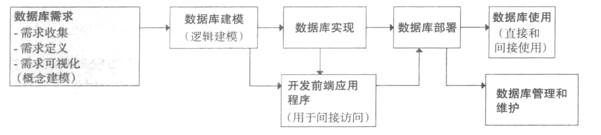

# 1. 引言

## 1.1 基本术语

数据（data）指已记录或可获取的事实

信息（information）指用户以某种目的获取的数据

元数据（metadata）描述数据结构和数据属性的数据

数据库（database）是指在计算媒介上按结构存储的相关数据。数据库的目的是将数据组织起来，以便用户直接从数据中获得信息。

数据库元数据（database metadata）常常被定义为关于数据或者数据库的内容而不是数据本身，一般包括数据结构名称（表名，列名），数据类型

数据库管理系统（DBMS）是用来完成数据库创建，增删改查数据库中的数据

## 1.2 数据库系统开发流程

**概念建模**：概念数据库模型（conceptual data base model），即实体-联系（ER）建模

数据库需求阶段的步骤和方法应该是个循环迭代的过程。刚开始收集，定义及可视化得到一个比较小的需求集合，进而数据库开发人员与系统的潜在终端用户针对这个集合进行讨论。这些讨论可以形成另一个需求的收集，定义及可视化的循环过程，进而逐渐扩大最初的需求集合。

**数据库建模：**由DBMS软件执行的数据库模型创建过程。这个是和特定的DBMS有关的。关系数据库建模是将ER模型直接映射到关系模型的过程。

# 2. 数据库需求与ER建模

## 2.2 ER建模基本构件

ER建模后得到的ER图是整个数据库的蓝图。实体（entity）和联系（relationship）是ER图的两个基本构件。

## 2.3 实体

实体用于描述数据库所记录的内容。实体可以表示现实世界中的众多概念，如人，地点，对象，事件，项目等。

## 2.4 属性（唯一和非唯一）

ER图中每个实体都有属性，实体的一个属性描述该实体的一种特征。由于实体表示的是数据库所记录内容的组件，因而实体属性表示每个实例需要记录的细节。***唯一属性（unique attribute）***是指

